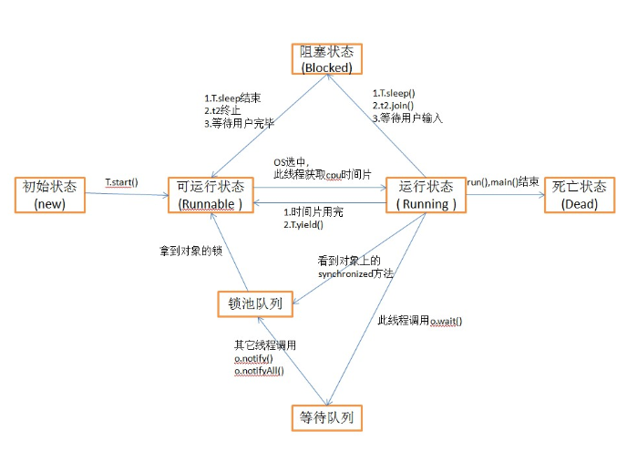

# 概述
衡量一个服务性能的高低好坏，每秒事务处理数是最重要的指标之一，它代表着一秒内服务端平均能响应的请求总数，而TPS值与程序的并发能力又有非常密切的联系。  
# 内存模型
可以理解为在特定的操作协议下，对特定的内存或高速缓存进行读写访问的过程抽象。  
Java内存模型的主要目标是定义程序中各个变量的访问规则，即在虚拟机中将变量存储到内存和从内存中取出变量这样的底层细节。此处的变量包括了实例字段、静态字段和构成数组对象的元素，但不包括局部变量与方法参数。因为后者是线程私有的，不会被共享。  
Java内存模型并没有限制执行引擎使用处理器的特定寄存器或缓存来和主内存进行交互，也没有限制即时编译器进行调整代码执行顺序这类优化措施。  
Java内存模型规定了所有的变量都存储在主内存中，每条线程还有自己的工作内存，线程的工作内存中保存了被该线程使用到的变量的主内存副本拷贝，线程对变量的所有操作都必须在工作内存中进行，而不能直接读写主内存中的变量。不同的线程之间也无法直接访问对方工作内存中的变量，线程间变量值的传递均需要通过主内存来完成。
# 内存间的交互操作
关于主内存与工作内存之间的具体的交互协议，即一个变量如何从主内存拷贝到工作内存、如何从工作内存同步回主内存之类的实现细节，Java内存模型中定义了8种操作来完成:
+ lock(锁定)：作用于主内存的变量，他是把一个变量标识为一条线程独占的状态；
+ unlock(解锁)：作用于主内存的变量，它把一个处于锁定状态的变量释放出来，释放后的变量才可以被其他线程锁定；
+ read(读取)：作用于主内存的变量，他把一个变量的值从主内存传输到线程的工作内存中，以便随后的Load动作使用；
+ load(载入)：作用于工作内存的变量，它把read操作从主内存中得到的变量值放入工作内存的变量副本中；
+ use(使用)：作用于工作内存的变量，它把工作内存中一个变量的值传递给执行引擎，每当虚拟机遇到一个需要使用到变量的值的字节码指令时执行这个操作；
+ assign(赋值)：作用于工作内存的变量，他把一个从执行引擎接收到的值赋给工作内存的变量，每当虚拟机遇到一个给变量赋值的字节码指令时执行这个操作；
+ store(存储)：作用于工作内存的变量，它把工作内存中一个变量的值传送到主内存中，以便随后的write操作使用；
+ write(写入)：作用于主内存的变量，他把store操作从工作内存中得到的变量的值放入主内存的变量中。  
如果要把一个变量从主内存复杂到工作内存，那就要顺序地执行read和load操作，如果要把工作内存同步回主内存，就要顺序的执行store和write操作。Java内存模型只要求上述两个操作顺序执行，而没有保证是连续执行的。也就是说read和load之间、store和write之间是可插入其他指令的。除此之外，Java内存模型还规定了在执行上述8种基本操作时必须满足如下规则：
+ 不允许read和load、store和write操作之一单独出现，即不允许一个变量从主内存读取了但工作内存不接受，或者从工作内存发起了回写但主存内存不接受的情况出现；
+ 不允许一个线程丢弃它的最近的assign操作，即变量在工作内存中改变了之后必须把该变化同步回主内存；
+ 不允许一个线程无原因(没有进行过assign操作)的把数据从线程的工作内存同步回主内存；
+ 一个新的变量只能在主内存中"诞生"，不允许工作内存中直接使用一个未被初始化(load或assign)的变量，换句话说，就是对一个变量实施use、store操作之前，必须先执行过了load或assign操作；
+ 一个变量在同一时刻只允许一条线程对其进行Lock操作，但lock操作可以被同一条线程重复执行多次，多次执行lock后，只有执行相同次数的unlock操作，变量才会被解锁；
+ 如果对一个变量执行lock操作，那将会清空工作内存中此变量的值，在执行引擎使用这个变量前，需要重新执行load或assign操作初始化变量的值；
+ 如果一个变量事先没有被lock操作锁定，那就不允许对他执行unlock操作，也不允许去unlock一个被其他线程锁定住的变量。
+ 对一个变量执行unlock操作之前，必须先把此变量同步回主内存中
# 对于volatile型变量的特殊规则
当一个变量定义为volatile之后，它将具备两种特性：
+ 第一是保证此变量对所有线程的可见性，可见性是指：当一条线程修改了这个变量的值，新值对其他线程来说是立即可知的。而普通内存不能做到这一点，普通变量的值在线程间传递均需要通过主内存来完成。
+ 第二个语义是禁止指令重排序优化。普通的变量仅仅会保证在该方法执行过程中所有依赖赋值结果的地方都能获取到正确的结果，而不能保证变量赋值操作的顺序与程序代码中的执行顺序一致。  
禁止重排序：是指CPU采用了允许将多条指令不按程序规定的顺序分开发送给各相应电路单元处理。但并不是说指令任意重排，CPU需要能正确处理指令依赖情况以保障程序能得出正确的执行结果。  
由于volatile变量只能保证可见性，在不符合以下两条规则的运算场景中，仍然要通过加锁(synchronized和java.util.concurrent中的原子类)来保证原子类：
+ 运算结果并不依赖变量的当前值，或者能够确保只有单一的线程修改变量的值；
+ 变量不需要与其他的状态变量共同参与不变约束。  
对于volatile修饰的变量，多执行了一个lock addl $0x0,(%esp)操作，这个操作相当于一个内存屏障(指重排序时不能把后面的指令重排序到内存屏障之前的位置)，只有一个CPU访问时，并不需要内存屏障；但如果有两个或更多CPU访问同一块内存，且其中有一个正在观测另一个，就需要一个内存屏障来保证一致性。
# 关于long和double型变量的特殊规则
long和double的非原子性协定：  
Java内存模型要求lock、unlock、read、load、assign、use、store、write这8个操作都具有原子性，但是对于64位的数据类型，在模型中特别定义了一条相对宽松的规定：允许虚拟机将没有被volatile修饰的64位数据的读写操作划分为两次32位的操作来进行，即允许虚拟机实现选择可以不保证64位数据类型的load、store、read和write这4个操作的原子性。  
如果有多个线程共享一个并未声明volatile的long或double类型的变量，并且同时对他们进行读取和修改操作，那么某些线程可能会读取到一个既非原值，也不是其他线程修改值的代表了"半个变量"的数值。  
# 原子性、可见性、有序性
### 原子性：
由Java内存模型来直接保证原子性变量操作包括read、load、assign、use、store和write,我们大致可以认为基本数据类型的访问读写是具备原子性的。
### 可见性：
是指当一个线程修改了共享变量的值，其他线程能够立即得到这个修改。Java内存模型是通过在变量修改后将新值同步到回主内存，在变量读取前从主内存刷新变量值这种依赖主内存作为传递媒介的方式来实现可见性的。  
除了violatile以外，还有synchronized和final能实现可见性。
+ 同步块的可见性是指：由“一个变量执行unlock操作之前，必须先把此变量同步回主内存中(执行store、write操作)”这条规则获得的；  
+ final的可见性是指：被final修饰的字段在构造器中一旦初始化完成，并且构造器没有把"this"的引用传递出去，那再其他线程就能看到final字段的值。
### 有序性：
如果在本线程内观察，所有的操作都是有序的；如果在一个线程中观察另一个线程，所有的操作都是无序的。  
Java语言提供了volatile和synchronized两个关键字来保证线程之间操作的有序性。  
+ volatile本身就包含了禁止指令重排序的语义；
+ synchronized则是由"一个变量在同一时刻只允许一条线程对其进行lock操作"这条规则获得的。这条规则决定了持有同一个锁的两个同步块只能串行的进入。
# 先行发生规则
是数据是否存在竞争、线程是否安全的主要依据。  
先行发生是Java内存模型中定义的两项操作之间的偏序关系。  
+ 程序次序规则：在一个线程内，按照程序代码顺序，书写在前面的操作先行发生于书写在后面的操作。(应该是控制流，而不是程序代码，因为要考虑分支、循环等结构)
+ 管城锁定规则：一个unlock操作先行发生于后面对同一个锁的Lock操作。
+ volatile变量规则：对一个volatile变量的写操作先行发生于此线程的每一个动作；
+ 线程启动规则：Thread()对象的start()方法先行发生于此线程的每一个动作；
+ 线程终止规则：线程中所有的操作都先行发生于对此线程的终止检测，可以通过Thread.join()方法结束、Thread.isAlive()的返回值等手段检测到是否有中断发生；
+ 线程中断规则：对线程interrupt()方法的调用先行发生于被中断线程的代码检测到中断事件的发生，可以通过Thread.interrupt()方法检测到是否有中断发生；
+ 对象终结规则：一个对象的初始化完成先行发生于它的finalize()方法的开始；
+ 传递性：A先行于B，B先行于C，可得出A先行于C。  
时间先后顺序与先行发生原则之间之间基本没有太大的关系，所以我们衡量并发安全问题的时候不要受到时间顺序的干扰，一切必须以先行发生规则为准。
# Java与线程
## 线程的实现
线程是比进程更轻量级的调度执行单位，线程的引入，可以把一个进程的资源分配和执行调度分开，各个线程既可以共享进程资源，又可以独立调度(线程是CPU的基本单位)。  
Java中，一个Native方法往往意味着这个方法没有使用或无法使用平台无关的手段来实现。  
实现线程主要有3种方法：使用内核线程来实现、使用用户线程实现、使用用户线程加轻量级进程混合实现。
+ 使用内核线程实现：内核线程就是由操作系统内核支持的线程，这种线程由内核来完成线程切换，内核通过操纵调度器对线程进行调度，并负责将线程的任务映射到各个处理器上。每个内核线程可以视为内核的一个分身，这样操作系统就有能力同时处理多件事情，支持多线程的内核就叫做多线程内核。  
程序一般不会直接使用内核线程，而是会使用内核的一种轻量级接口--轻量级进程(即线程)。  
由于内核线程的支持，每个轻量级进程都成为一个独立的调度单元，即使有一个轻量级进程在系统调用种阻塞了，也不会影响整个进程继续工作，  
一对一的线程模型  
但是轻量级进程有局限性：
    + 由于是基于内核线程实现的，所以各种线程操作，如创建、析构及同步，都需要进行系统调用，代价较高；
    + 每个轻量级进程都需要一个内核线程的支持，要消耗一定的内核资源，因此一个系统支持轻量级进程的数量是有限的。 
+ 使用用户线程实现：广义上，除内核线程以外的线程。狭义上，完全建立在用户空间的线程库上，系统内核不能感知线程存在的实现。用户线程的建立、同步、销毁和调用完全在用户态中完成，不需要内核的帮助。  
一对N的线程模型  
使用用户线程的优势在于不需要系统内核支援，劣势也在于没有系统内核的支援，所有的线程操作都需要用户程序自己处理。
+ 使用用户线程加轻量级进程混合实现：  
M对N的线程模型  
## Java线程调度
线程调度是指系统为线程分配处理器使用权的过程，只要调度方式有两种：协同式线程调度和抢占式线程调度。  
+ 使用协同式线程调度的多线程系统，线程的执行时间由线程本身来控制，线程把自己的工作执行完了之后，要主动通知系统切换到另外一个线程上。
    + 好处：实现简单，没有什么线程同步问题；
    + 坏处：线程执行时间不可控制。
+ 抢占式线程调度种，每个线程将由系统来分配执行时间，线程的切换不由线程本身来决定。在这种实现下，线程的执行时间是系统可控的，也不会有一个线程导致整个进程阻塞的问题。
## 状态转换
Java语言中的5种线程状态：（一个线程只能有且只有其中一种状态）
+ 新建(new)：新建后尚未启动的线程；
+ 运行(Runable)：Runable包括了操作系统线程状态中的Running和Ready，也就是处于此状态的线程有可能正在执行，也有可能正在等待着CPU为它分配执行时间；
+ 无期限等待(Waiting)：不会被CPU分配执行时间，要等待被其他线程显式的唤醒。让线程处于无期限等待的方法：
    + 没有设置Timeout参数的Object.wait()方法；
    + 没有设置Timeout参数的Thread.join()方法；
    + LockSupport.park()方法；
+ 期限等待(Timed Waiting)：不会被CPU分配执行时间，无需等待被其他线程显式的唤醒，在一定时间之后他们会由系统自动唤醒。让线程处于期限等待的方法：
    + Thread.sleep()方法；
    + 设置了Timeout参数的Object.wait()方法；
    + 设置了Timeout参数的Thread.join()方法；
    + LockSupport.parkNanos()方法；
    + LockSupport.parkUntil()方法；
+ 阻塞(Blocked)：“线程状态”与“阻塞状态”的区别是：“阻塞状态”在等待着获取到一个排它锁，这个事件将在另外一个线程放弃这个锁的时候发生；而“等待状态”则是在等待一段时间，或者唤醒动作的发生，在程序等待进入同步区域的时候，线程将进入这种状态。
+ 结束(Terminated)：线程已经结束执行。

