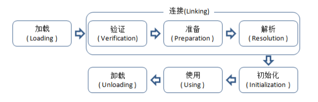
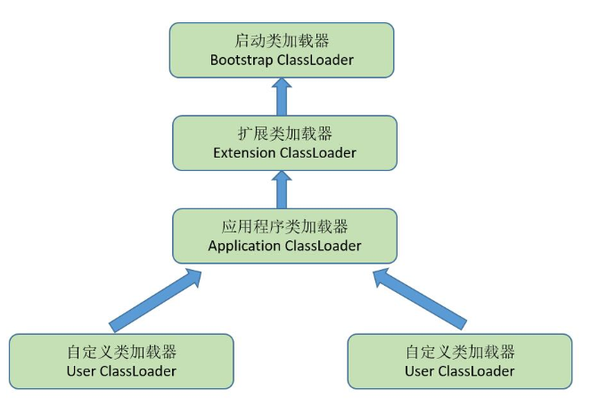

# 概述
虚拟机把描述类的数据从Class文件加载到内存，并对数据进行校验、转换解析和初始化，最终形成可以被虚拟机直接使用的Java类型。  
在Java语言中，类型的加载、连接和初始化过程都是在程序运行期间完成。  
这种策略会令类加载时稍微增加一些性能开销，但是会为Java应用程序提供高度的灵活性，Java里天生可以动态扩展的语言特性就是依赖运行期动态加载和动态连接的特点实现。  
# 类加载的时机
类的生命周期：  
  
类从被加载到虚拟机内存中开始，到卸载出内存为止，它的整个生命周期包括：加载、验证、准备、解析、初始化、使用、卸载7个阶段。其中验证、准备、解析3个阶段统称为连接。  
除解析阶段外的其余阶段都是按照顺序执行，解析阶段在某些情况下可以在初始化之后在开始。  
## 需要开始立即对类进行初始化的情况：
1. 遇到new、getstatic、putstatic或invokestatic这4条字节码指令时，如果类没有进行过初始化，则需要先触发其初始化。生成这4条指令的最常见的Java代码场景是：使用new关键字实例化对象，读取或设置一个类的静态字段(被final修饰、已在编译期把结果放入常量池的静态字段除外)的时候，调用一个类的静态方法的时候。
2. 使用java.lang.reflect包的方法对类进行反射调用的时候；
3. 当初始化一个类的时候，如果发现其父类还没有进行过初始化，则需要先触发其父类的初始化；
4. 当虚拟机启动时，用户需要指定一个要执行的主类(包括main()方法的那个类)，虚拟机会先初始化这个主类；
5. 当使用IDK1.7的动态语言支持时，如果一个java.lang.invoke.MethodHandle实例最后的解析结果REF_getStatic、REF_putStatic、REF_invokeStatic的方法句柄，并且这个方法句柄所对应的类没有进行过初始化。
# 类加载过程
### 1、加载
在加载阶段，虚拟机需要完成以下三件事：
1. 通过一个类的全限定名来获取定义此类的二进制字节流；
2. 将这个字节流所代表的静态存储结构转换为方法区的运行时数据结构；
3. 在内存中生成一个代表这个类的java.lang.Class对象，作为方法区这个类的各种数据的访问入口。  
一个非数组类的加载阶段既可以使用系统提供的引导类加载器来完成，也可以由用户自定义的累加载器来完成。  
对于数组类而言，情况有所不同，原因是：数组类本身不通过类加载器来创建，它是由Java虚拟机直接创建的。一个数组类创建过程遵循的规则：  
+ 如果数组的组件类型(指的是数组去掉一个维度的类型)是引用类型，那就递归采用类的加载过程去加载这个组建类型，数组C将在加载该组件类型的类加载器的类名称空间上被标识。
+ 如果数组的组建类型不是引用类型，Java虚拟机会把数组C标记为与引导类加载器关联。
+ 数组类的可见性与他的组件类型的可见性一致，如果组件类型不是引用类型，那数组类的可见性将默认为public.  
加载阶段完成后，虚拟机外部的二进制字节流就按照虚拟机所需的格式存储在方法区之中，方法区中的数据存储格式由虚拟机实现自行定义，然后在内存中实例化一个java.lang.Class类的对象(虽然是对象，但是存放在Java堆中)，这个对象将作为程序访问方法区中的这些数据类型的外部接口。  
加载阶段与连接阶段的部分内容是交叉进行的，加载阶段尚未完成，连接阶段可能已经开始，但这些夹在加载阶段之中进行的动作，仍然属于连接阶段的内容，这两个阶段的开始时间仍然保持着固定的先后顺序。
### 2、验证
验证是连接阶段的第一步，这一阶段的目的是为了确保Class文件的字节流中包含的信息符合当前虚拟机的要求，并且不会危害虚拟机自身的安全。  
验证阶段大致上会完成4个阶段的检验动作：文件格式验证、元数据验证、字节码验证、符号引用验证；
+ 文件格式验证：验证字节流是否符合Class文件格式的规范，并且能被当前版本的虚拟机处理，这一阶段可能包括下面的验证点：
    + 是否以魔数0xCAFEBABE开头；
    + 主、次版本号是否在当前虚拟机处理范围之内；
    + 常量池的常量中是否有不被支持的常量类型(检查常量tag标志)；
    + 指向常量的各种索引值中是否有指向不存在的常量或者不符合类型的常量；
    + CONSTANT_UTF8_info型的常量中是否有不符合utf8编码的数据；
    + Class文件中各个部分及文件本身是否有被删除的或附加的其他信息。  
该阶段验证的目的是保证输入的字节流能正确的解析并存储于方法区之内，格式上符合描述一个Java类型信息的要求，这阶段的验证是基于二进制字节流进行的，只有通过了这个阶段的验证后，字节流才会进入内存的方法区中进行存储。此后的验证都是基于方法区的存储结构进行的，不会再直接操作字节流。
+ 元数据验证
    + 是对字节码描述的信息进行语义分析，以保证其描述的信息符合Java语言规范的要求。验证点如下：
        + 这个类是否有父类(除了java.lang.Object外，所有的类都应当有父类);
        + 这个类的父类是否继承了不允许被继承的类(被final修饰的类)；
        + 如果这个类不是抽象类，是否实现了其父类或接口中所要求实现的所有方法；
        + 类中的字段、方法是否与父类产生矛盾。  
这一阶段主要是对类的元数据信息进行语义校验，保证不存在不符合Java语言规范的元数据信息。
+ 字节码验证  
    主要目的是通过数据流和控制流分析，确定程序语义是合法的、符合逻辑的。对类的方法体进行检验分析，保证被校验类的方法再运行时不会做出危害虚拟机安全的事件。
+ 符号引用验证 
    + 最后一个阶段的检验发生在虚拟机将符号引用转化为直接引用的时候。符号引用验证可以看作是对类自身以外(常量池中的各种符号引用)的信息进行匹配性验证。通常需要校验的内容：
        + 符号引用中通过字符串描述的全限定名是否能找到对应的类；
        + 再指定类中是否存在符合方法的字段描述符以及简单名称所描述的方法和字段；
        + 符号引用中的类、字段、方法的访问性是否可被当前类访问。  
主要目的是确保解析动作能正常执行。
### 3、准备
是正式为类变量分配内存并设置类变量初始值的阶段，这些变量所使用的内存都将在方法区中进行分配。  
这时候进行内存分配的仅包括类变量(被static修饰的变量)，而不包括实例变量，实例变量将会在对象实例化时随着对象一起分配在Java堆中。
### 4、解析
是虚拟机将常量池内的符号引用替换为直接引用的过程。
+ 符号引用：以一组符号来描述所引用的目标，符号可以是任何形式的字面量，只要使用时能无歧义的定位到目标即可。符号引用与虚拟机实现的内存布局无关，引用的目标并不一定已经加载到内存中。
+ 直接引用：可以是直接指向目标的指针、相对偏移量或是一个能间接定位目标的句柄。直接引用是和虚拟机实现的内存布局相关的，同一个符号引用在不同虚拟机实例上翻译出来的直接引用一般不会相同。如果有了直接引用，那引用的目标必定已经在内存中存在。  
虚拟机实现可以根据需要来判断到底是在类被记载器加载时就对常量池中的符号引用进行解析，还是等到一个符号引用将要被使用前才去解析。  
解析动作主要针对类或接口、字段、类方法、接口方法、方法类型、方法句柄和调用点限定符等7类符号引用进行。
### 5、初始化
真正开始执行类中的Java程序代码。
# 类加载器
类加载器用于实现类的加载动作。  
对于任意一个类，都需要由加载它的类加载器和这个类本身一同确立其在Java虚拟机中的唯一性，每一个类加载器，都拥有一个独立的类名称空间。
## 双亲委派模型
从Java虚拟机的角度来讲，只存在两种不同的类加载器：一种是启动类加载器，这个类加载器使用C++语言实现，是虚拟机自身的一部分；零一种就是所有其他的类加载器，这些类加载器都由Java语言实现，独立于虚拟机外部，并且全都继承自抽象类(java.lang.ClassLoader)。 
  
双亲委派模型要求除了顶层的启动类加载器外，其余的类加载器都应当有自己的父类加载器。这里的类加载器之间的父子关系一般不会以继承的关系来实现，而是使用组合关系来复用父加载器的代码。  
双亲委派的工作过程：如果一个类加载器收到了类加载的请求，它首先不会自己去尝试加载这个类，而是把这个请求委派给父类加载器去完成，每一个层次的类加载器都是如此，因此所有的加载请求最终都应该传送到顶层的启动类加载器中，只有当父加载器反馈自己无法完成这个加载请求(它的搜索范围中没有找到所需的类)时，子加载器才会尝试自己去加载。  
使用双亲委派模型来组织加载器之间的关系的一个好处就是：Java类随着它的类加载器一起具备了一种带有优先级的层次关系。  
双亲委派模型用于保证Java程序的稳定运作很重要。
## 破坏双亲委派模型  
双亲委派模型并不是一个强制性的约束模型，而是Java设计者推荐给开发者的类加载器实现方式。  
 
