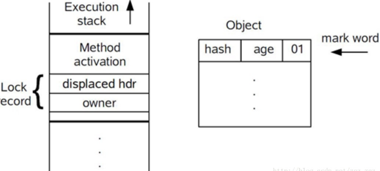
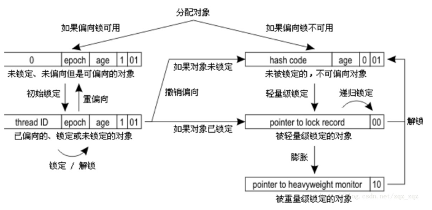

# Java中的线程安全
线程安全：当多个线程访问一个对象时，如果不用考虑这些线程在运行时环境下的调度和交替执行，也不需要额外的同步，或者在调用方进行任何其他的协调操作，调用这个对象的行为都可以获得正确的结果，那这个对象就是线程安全的。  
将Java语言中各种操作共享的数据分为5类：不可变、绝对线程安全、相对线程安全、线程兼容和线程对立。
## 不可变
不可变的对象一定是线程安全的，无论是对象的方法实现还是方法的调用者，都不需要再采取任何的线程安全保障措施。  
在Java中，如果共享数据是一个基本数据类型，那么只要在定义时使用final关键字修饰它就可以保证它是不可变的。如果共享数据是一个对象，那就需要保证对象的行为不会对其状态产生任何影响。
## 线程绝对安全
## 相对线程安全
需要保证对这个对象单独的操作是线程安全的，我们再调用的时候不需要做一些额外的保障措施，但是对于一些特定顺序的连续调用，就可能需要在调用端使用额外的同步手段来保证调用的正确性。
## 线程兼容
是指对象本身并不是线程安全的，但是可以通过在调用端正确的使用同步手段来保证对象在并发环境中可以安全的使用。
## 线程对立
指无论在调用端是否采用了同步措施，都无法在多线程环境中并发使用的代码。
# 线程安全的实现
## 互斥同步
同步是指在多个线程并发访问共享数据时，保证共享数据在同一个时刻只被一个线程使用。互斥是实现同步的一种手段，临界区、互斥量和信号量都是主要的互斥实现方式。互斥是因，同步是果；互斥是方法，同步是目的。  
Java中，最基本的互斥同步手段就是synchronized关键字，synchronized关键字经过编译之后，会在同步块的前后形成monitorenetr和monitorexit这两个字节码指令，这两个字节码指令都需要一个reference类型的参数来指明要锁定和解锁的对象。如果Java程序中，synchronized明确指定了对象参数，那就是这个对象的reference；如果没有明确指定，那就根据synchronized修饰的是实例方法还是类方法，去取对应的对象实例或Class对象来作为锁对象。  
在执行monitorenter指令时，首先要尝试获取对象的锁，如果这个对象没被锁定，或者是当前线程已经拥有了那个对象的锁，把锁的计数器加1，相应的，在执行monitorexit指令时，会将锁计数器减1，当计数器为0时，锁就被释放。如果获取对象锁失败，那当前线程就要阻塞等待，直到对象锁被另外一个线程释放为止。  
在虚拟机对monitoreneter和monitorexit的行为描述中，注意事项：
+ synochronized同步块对同一条线程来说是可重入的，不会出现自己把自己锁死的问题；
+ 同步块在已进入的线程执行完之前，会阻塞后面其他线程的进入。  
synchronized是Java语言中的一个重量级操作。：Java的线程是映射到操作系统的原生线程之上的，如果要阻塞或唤醒一个线程，都需要操作系统来帮忙完成。这些需要从用户态转换到和心态中，因此状态转换需要耗费很多的处理器时间。对于代码简单的同步块，状态转换消耗的时间比用户代码执行的时间还要长。   
除了synchronized之外，还可以使用java.util.concurrent包中的重入锁(ReentrantLock)来实现同步。  
synchronized和ReentrantLock的比较：  
+ 基本用法上，都具备一样的线程重入特性；
+ 代码写法上，ReentrantLock是API层面的互斥锁(lock和unlock方法配合try/finally语句块来完成)。synchronized是原生语法层面的互斥锁。  
相比synchronized，ReentrantLock增加了一些高级功能，主要有等待可中断、可实现公平锁、锁可以绑定多个条件。  
+ 等待可中断是指当持有锁的线程长期不释放锁的时候，正在等待的现程可以选择放弃等待，改为处理其他事情。
+ 公平锁是指多个线程在等待同一个锁时，必须按照申请锁的时间顺序来依次获得锁。ReetrantLock默认情况下是非公平的，但可以通过带布尔值的构造函数要求使用公平锁；
+ 锁绑定多个条件是指一个ReetrantLock对象可以同时绑定多个Condution对象，而在synchronized中，锁对象的wait()和notify()或notifyAll()方法可以实现一个隐含的条件，如果要和多于一个的条件关联时，就不得不额外添加一个锁。ReetrantLock则需要多次调用new Condition()方法。  1gua
## 非阻塞同步
互斥同步最主要的问题就是进行线程阻塞和唤醒所带来的性能问题。  
互斥同步属于一种悲观的并发策略，总是认为不去做正确的同步策略，那就肯定会出现问题。无论共享数据是否真的会出现竞争，它都要进行加锁、用户态核心态转换、维护锁计数器和检查是否有被阻塞的线程需要唤醒等操作。  
非阻塞同步：基于冲突检测的乐观并发策略。先进行操作，如果没有其他线程争用共享数据，那操作就成功；如果有争用，产生了冲突，那就再采取其他的补偿措施。实现不需要把线程挂起。
### CAS(比较并交换)

## 无同步方案
+ 可重入代码（纯代码）：可以在代码执行的任何时刻中断它，转而去执行另外一段代码（包括递归调用它本身），而在控制权返回后，原来的程序不会出现任何错误。
+ 线程本地存储：如果一段代码中所需要的数据必须与其他代码共享，那就看看共享数据的代码是否能保证在同一个线程中执行，如果能保证，就可以把共享数据的可见范围限制在同一个线程之内。
# 锁优化
## 自旋锁和自适应锁
互斥同步对性能最大的影响是阻塞的实现、挂起和恢复线程都需要转入内核态中完成。  
自旋等待不能代替阻塞。自旋等待本身虽避免了线程切换的开销，但它是要占用处理器时间的。  
自旋等待的时间必须有一定的限度，如果自旋超过了限定的次数仍然没有成功获得锁，就应当使用传统的方式挂起线程。  
自适应的自旋锁：由前一次在同一个锁上的自旋时间及锁的拥有者的状态来决定。
## 锁消除
是指虚拟机即时编译器在运行时，对一些代码上要求同步，但是检测到不可能存在共享数据竞争的锁进行消除。锁消除的主要判定依据来源于逃逸分析的数据支持，如果判断在一段代码中，堆上的所有数据都不会逃逸出去从而被其他线程访问到，就可以把他们当作栈上数据对待，认为他们是线程私有的。
## 锁粗化
如果虚拟机探测到有一串零碎的操作都对同一个对象进行加锁，将会把加锁同步的范围扩展（粗化）到整个操作序列的外部。
## 轻量级锁
在没有多线程竞争的前提下，减少传统的重量级锁使用操作系统互斥量产生的性能消耗。  
HotSpot的对象的内存布局：(分为两部分信息)
+ 用于存储对象运行自身的运行时数据。（Mark Word）
+ 用于存储指向方法区对象类型数据的指针。（如果时数组对象，还会有一个额外的部分用于存储数组长度） 
<table border="2" align="center">
<h4 align="center">HotSpot虚拟机对象头</h4>
<tr>
    <th>存储内容</th>
    <th>标志位</th>
    <th>状态</th>
</tr>
<tr>
    <td align="center">对象哈希码、对象分代年龄</td>
    <td align="center">01</td>
    <td align="center">未锁定</td>
</tr>
<tr>
    <td align="center">指向锁记录的指针</td>
    <td align="center">00</td>
    <td align="center">轻量级锁定</td>
</tr>
<tr>
    <td align="center">指向重量级锁的指针</td>
    <td align="center">10</td>
    <td align="center">膨胀(重量级锁定)</td>
</tr>
<tr>
    <td align="center">空，不需要记录信息</td>
    <td align="center">11</td>
    <td align="center">GC标记</td>
</tr>
<tr>
    <td align="center">偏向线程ID、偏向时间戳、对象分代年龄</td>
    <td align="center">01</td>
    <td align="center">可偏向</td>
</tr>
</table>  

### 轻量级锁的执行过程：  
在代码进入同步块的时候，如果此同步对象没有被绑定，虚拟机首先将在当前线程的栈帧中建立一个名为锁记录的空间，用于存储锁对象目前的Mark Word的拷贝。

然后，虚拟机将使用CAS操作尝试将对象的Mark Word更新为指向Lock Record的指针。如果这个更新动作成功了，那么这个线程就拥有了该对象的锁，并且对象Mark Word的锁标志位将转变为“00”，即表示此对象处于轻量级锁定状态。如果这个更新失败了，虚拟机首先会检查对象的Mark Word是否指向当前线程的栈帧，如果只说明当前线程已经拥有了这个对象的锁，那就可以直接进入同步块继续执行，否则说明这个锁对象已经被其他线程抢占了。如果有两个以上的线程争用同一个锁，轻量级锁就不再有效。  
  
### 轻量级锁的解锁过程
通过CAS操作来进行的。如果对象的Mark Word仍然指向着线程的锁记录，那就用CAS操作把对象当前的Mark Word和线程中复制的Displaced Mark Word替换回来，如果替换成功，整个同步过程就完成了。如果替换失败，说明有其他线程尝试过获取该锁，那就要在释放锁的同时，唤醒被挂起的线程。  
轻量级锁能提升程序同步性能的依据是：对于绝大部分的锁，在整个同步周期内都是不存在竞争的。
## 偏向锁
目的是消除数据在无竞争情况下的同步原语，进一步提高程序的运行性能。  
这个锁会偏向于第一个获得它的线程。 
偏向锁可以提高带有同步但无竞争的程序性能。但同时是一个带有效益权衡性质的优化。即并不一定总是对程序运行有利。 
