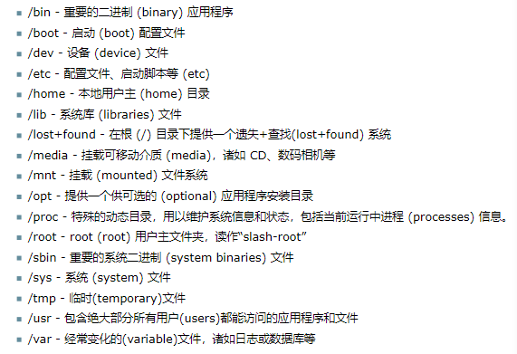

# 目录和文件系统
Linux和Unix文件系统被组织成一个有层次的属性结构。文件系统的最上层是/,或称为根目录。在Unix和Linux的设计理念中，一切皆文件--包括硬盘、分区和可插拔介质。这就意味着所有其它文件和目录(包括其它硬盘和分区)都位于根目录中。  
常见目录列表：

# 权限
Linux系统上的所有文件都有权限，以允许或者阻止其它用户查阅、修改或者执行。超级用户"root"可以访问系统上的任意文件。每个文件都有访问限制、用户限制以及隶属于某个用户/组。所有文件皆有如下三组权限加以保护，按重要性依次排列：
+ 用户(user):适用于该文件的所有者；
+ 组(group):适用于该文件所属的组
+ 其它(other):适用于其它用户  
以上三组权限信息的每一组都包含了实际权限。这些权限信息，连同它们对文件和目录具有的不同含义，概述：
+ 读：允许显示/打开该文件，可以显示目录内容
+ 写：可以编辑或删除该文件，可以更改目录内容
+ 可执行：可执行文件可以作为程序运行，进入该目录
