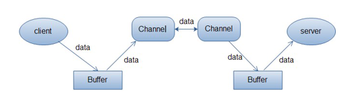
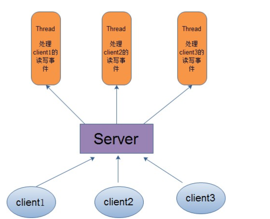
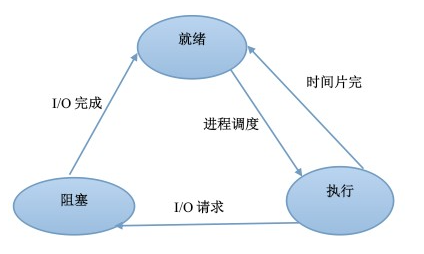

+ java没有保存形参的记录。
# 关于IO 
+ 分类：
    + 同步阻塞的BIO
    + 同步非阻塞的NIO
    + 异步非阻塞的AIO
+ I/O解析
    + 同步？异步？
        + 同步：当用户发出I/O请求操作之后，如果数据没有就绪，需要通过用户线程或者内核不断地去轮询数据是否就绪，当数据就绪时，再将数据从内核拷贝到用户线程。
        + 异步：只有I/O请求操作的发出是由用户线程来进行的，IO操作的两个阶段都是由内核自动完成，然后发送通知告知用户线程IO操作已经完成。也就是说，在异步IO中，不会对用户线程产生任何阻塞。
        + 同步和异步IO的关键区别反映在数据拷贝阶段是由用户线程完成还是内核自动完成。所以说异步IO必须要有操作系统的底层支持。
    + 阻塞和非阻塞？
        + 阻塞：当某个事件或者任务在执行过程中，它发出一个请求操作，如果该请求操作需要的条件不满足，那么就会一直在那等待，直至条件满足。
        + 非阻塞：当某个事件或者任务在执行过程中，它发出一个请求操作，如果该请求操作需要的条件不满足，会立即返回一个标志信息告知条件不满足，不会一直在那等待。
        + 阻塞和非阻塞的区别关键在于当发出请求一个操作时，如果条件不满足，是会一直等待还是返回一个标志信息。
    + 阻塞I/O和非阻塞I/O
        + I/O操作过程
            + 通常来说，I/O操作包括：对硬盘的读写、对Socket的读写以及外设的读写
            + 一个完整的IO读请求操作包括两个阶段：
                + 查看数据是否就绪；
                + 进行数据拷贝(内核将数据拷贝到用户线程)
        + 阻塞I/O模型:最传统的一种IO模型，即在读写数据过程中会发生阻塞现象。
            + 当用户线程发生IO请求之后，内核会去查看数据是否就绪，如果没有就绪就会等待数据就绪，而用户线程就会处于阻塞状态，用户线程交出CPU。当数据就绪之后，内核会将数据拷贝到用户线程，并返回结果给用户线程，用户线程才block状态。
            + 典型的阻塞IO模型例子：
            ```
            data = socket.read();
            ```
            如果数据没有就绪，就会一直阻塞在read()方法。
        + 非阻塞IO模型：当用户线程发起一个read操作后，并不需要等待，而是马上就得到了一个结果。如果结果是一个error时，它就知道数据还没有准备好，于是它可以再次发送read操作。一旦内核中的数据准备好了，并且又再次收到了用户线程的请求，那么它马上就将数据拷贝到了用户线程，然后返回。
        + 所以事实上，在非阻塞IO模型中，用户线程需要不断地询问内核数据是否就绪，也就是说非阻塞IO不会交出CPU，而会一直占有CPU.
        + 典型的非阻塞IO模型一般如下：
        ```
        while(true) {
            data = socket.read();
            if(data != error) {
                处理数据
                break;
            }
        }
        ```
        但是对于非阻塞IO就有一个非常严重的问题，在while循环中需要不断地去询问内核数据是否就绪，这样会导致CPU占用率非常高，因此一般情况下，很少使用while循环这种方式来读取数据。
+ NIO(多路复用IO模型)：
    + 它可以使用Native函数库直接分配堆外内存，然后通过一个存储在Java堆中的DirectByteBuffer对象作为这块内存的引用进行操作。
    + 多路复用IO模型是目前使用的比较多的模型。Java NIO实际上就是多路复用IO.
    + 在多路复用IO模型中，会有一个线程不断去轮询多个socket的状态，只有当socket真正有读写事件时，才真正调用实际的IO读写操作。因为在多路复用IO模型中，只需要使用一个线程就可以管理多个socket,系统不需要建立新的线程或者进程，页不必维护这些线程和进程，并且只有在真正有socket读写事件进行时，才会使用IO资源，所以它大大减少了资源占用。
    + 在Java NIO中，是通过selector.select()去查询每个通道是否有到达事件，如果没有事件，则一直阻塞在那里，因此这种方式会导致用户线程的阻塞。
    + 多路复用IO模型，通过一个线程就可以管理多个socket，只有当socket真正有读写事件发生才会占用资源来进行实际的读写操作。因此，多路复用IO比较适合连接数比较多的情况。
    + 多路复用IO效率比非阻塞IO模型高是因为在非阻塞IO中，不断地询问socket状态时通过用户线程去进行的，而在多路复用IO中，轮询每个socket状态时内核在进行的，这个效率比用户线程要高的多。
    + <font color="red">注意：多路复用IO模型是通过轮询的方式来检测是否有事件到达，并且对到达的事件逐一进行响应。因此对于多路复用IO模型来说，一旦事件响应体很大，那么就会导致后续的事件迟迟得不到处理，并且会影响新的事件轮询。</font>
    + 概述(关键概念)
        + Channel(通道)：就是通向什么道路，为某个提供了渠道。传统IO中，文件内容的读取方式：
        ```java
        public class Test{
            public static void main(String[] arg0) throws IOException {
                File file = new File("文件名");
                //InputStream实际上就是为读取文件提供一个通道的
                InputStream inputStream = new FileInputStream(file);
                byte[] bytes = new byte[1024];
                inputStream.read(bytes);
                inputStream.close();
            }
        }
        ```
        + 因此可以将NIO中的Channel同传统IO中的Stream来类比，但是要注意的是，传统IO中，Stream是单向的，比如InputStream只能进行读取操作，OutputStream只能进行写操作。而Channel是双向的，既可用来进行读操作，又可用来进行写操作。
        + 常用的通道：
                + FileChannel:向文件读或者向文件写入数据(不支持阻塞)
                + SocketChannel：以TCP来向网络连接的两端读写数据
                + ServerSocketChannel：能够监听客户端发起的TCP连接，并为每个TCP连接创建一个新的SocketChannel来进行数据读写
                + DatagramChannel：以UDP协议来向网络连接的连段读写数据
         + 使用FileChannel的示例：
        ```java
        public class Test{
            public static void main(String[] args) throws IOException{
                File file = new File("文件名");
                FileOutputStream out = new FileOutputStream(file);
                FileChannel channel = out.getChannel();
                ByteBuffer buffer = ByteBuffer.allocate(1024);
                String string = "java nio";
                buffer.put(string.getBytes());
                buffer.flip();
                channel.write(buffer);
                channel.close();
                out.close();
            }
        }
        ```
        + Buffer(缓冲区)
            + <font color="red">buffer在多线程并发下并不是安全的。如果一个buffer会在多个线程使用，那么需要使用恰当的同步操作来访问buffer。也就是buffer本身并不是线程安全的。</font>
            + 实际上是一个容器，是一个连续数组。Channel提供从文件、网络读取数据的渠道，但是读取或写入的数据都必须经由Buffer。
            </img>
            客户端发送数据时，必须先将数据存入Buffer中，然后将Buffer中的内容写入通道。服务器这边接收数据必须通过Channel将数据读到Buffer中，然后再从Buffer中取出数据。
            + 在NIO中所有数据的读和写都离不开buffer.在传统的读文件操作中，读取的数据时放在byte数组中，而在NIO中，读取的数据只能放在buffer中。同样的，写入数据也先写入到Buffer中
            + 在NIO中，Buffer是一个顶级父类，是一个抽象类，常用的Buffer子类有：
                + ByteBuffer
                + InBuffer
                + CharBuffer
                + LongBuffer
                + DoubleBuffer
                + FloatBuffer
                + ShortBuffer
            + 重要属性和方法：
                + position:position的初始值是0，每往Buffer中写入一个值，position就自动加1，代表下一次的写入位置。读操作也是，每读一个值，position自动加1.从写操作模式到读操作模式切换的时候，用filp(),position会归零，从头重新读写。
                + limit:写操作模式下，limit代表的是最大能写入的数据，这个时候limit等于capacity。写结束后，切换到读模式，此时的limit等于Buffer中实际的数据大小，因为Buffer不一定被写满了。
                + capacity:代表这个缓冲区的容量，一旦设定就不可以更改。一旦Buffer的容量到达capacity，需要清空Buffer，才能重新写入值。
                ```java
                /**
                * 1、初始化
                */
                //初始化Buffer Buffer的实现类提供了一个静态方法allocate(int capacity)
                ByteBuffer byteBuffer = ByteBuffer.allocate(1024);
                //还可以使用wrap()方法来初始化
                public static ByteBuffer wrap(byte[] array) {

                }
                /**
                * 2、填充Buffer 以下的方法需要自己控制Buffer大小，不能超过capacity,超过会抛出java.nio.BufferOverflowException
                */
                //各个Buffer类都提供了一些put方法将数据填充到Buffer中。
                //填充一个值
                public abstract ByteBuffer put(...);
                //将数组中的值填充进去
                public final ByteBuffer put(byte[] src);
                //对于Buffer来说，最常见的操作就是将来自Channel的数据填充到Buffer中，在系统层面，我们称为读操作。因为数据是从外部(文件或网络等)读到内存中。
                int number = channel.read(buf);
                //返回的是从Channle中读入到Buffer的数据大小
                /**
                * 3、提取Buffer中的值
                */
                //调用Buffer的flip()方法，可以进行模式切换。
                public final Buffer flip() {
                    limit = position;
                    position = 0;
                    mark = -1;
                    return this;
                }
                //对应写入操作的put方法，读操作提供了一系列的get方法
                public abstract byte get();
                //常使用的一个方法
                new String(buffer.array()).trim();
                //写操作
                int num = channel.write(buf);
                ```
                + mark:用于临时保存position的值，每次调用mark()都会将mark的值设置为当前的position,便于后续需要的时候使用。
                ```java
                public final Buffer mark() {
                    mark = position;
                    return this;
                }
                //reset()方法的使用
                public final Buffer reset() {
                    int m = mark;
                    if(m < 0) {
                        throw new InvalidMarkException();
                    }
                    position = m;
                    return this;
                }
                ```
                + rewind():会重置position为0，通常用于重新从头读写Buffer
                ```java
                public final Buffer rewind() {
                    position = 0;
                    mark = -1;
                    return this;
                }
                ```
                + clear():重置Buffer,相当于重新实例化。通常会先填充Buffer,然后从Buffer读取数据，之后，再重新往里填充新的数据，一般会在重新填充之前先调用clear();
                ```java
                public final Buffer clear() {
                    position = 0;
                    limit = capacity;
                    mark = -1;
                    return this;
                }
                ```
                + compact():是在准备往Buffer填充新的数据之前调用。
                + clear()方法与compact()方法的比较：
                    + clear():重置几个属性,并不会将Buffer中的数据清空，只不过是后续的写入会覆盖掉原来的数据，也就相当于清空了数据。
                    + compact():调用该方法后，会先处理还没有读取的数据，也就是position1到limit之间的数据(即还没有读过的数据),会先将这些数据移到左边，然后再这个基础上再开始写入。此时，limit还是等于capacity,position指向原来数据的右边。
                + Scattering()和Gathering():实现了数据的分类
                    + Scattering():允许read的时候传递一个buffer[]数组，将一个Channel中的数据给读到了多个buffer当中，它是按照顺序依次读入buffer当中的，而且总是当当前buffer已经写满了才会写下一个buffer.
                    + Gathering():允许write的时候传递一个buffer[]数组。将多个buffer的数据写到一个Channel中，它会将第一个buffer中可读的数据都写入channel后，再将下一个Buffer中的数据写到channel中，依次将Buffer中可读取的数据写到channel中。

        + Selector(选择器)
            + Selector的作用就是用来轮询每个注册的Channel，一旦发生Channel有注册的事件发生，便获取事件然后进行处理。
            + Selector能够检测多个注册的通道上是否有事件发生，如果有事件发生，便获取事件，然后针对每个事件进行相应的响应处理。这样一来，只是用一个单线程就可以管理多个通道，也就是管理多个连接。这样使得只有在连接真正有读写事件发生时，才会调用函数来进行读写。就大大的减少了系统开销，并且不必为了每个连接都创建一个线程，不用去维护多个线程，并且避免了多线程之间的上下文切换导致的开销。
            + 与Selector有关的一个关键类：SelectionKey,一个SelectionKey表示一个到达的事件。
            + 使用Selector的原因：仅用单个线程来处理多个Channels的好处是：只需要更少的线程来处理通道。事实上，可以只用一个线程处理所有的通道，因为对于操作系统来说，线程之间上下文切换的开销很大，而且每个线程都要占用系统的一些资源。因此，使用的线程越少越好。
            + 非阻塞模式：与Selector一起使用时，Channel必须处于非阻塞模式下，这意味着不能将FileChannel与Selector一起使用，因为FileChannel不能切换到非阻塞模式。而套接字通道都可以。
        + Java NIO内存分配：
            + Heap buffer:堆栈的内存分配。堆栈就是Java内存模型当中内存的区域，位于堆上，堆是我们生成对象的区域。
            + Direct buffer:堆外内存分配。这个内存本身不是由JVM进行控制的，它是由操作系统进行统一的处理的。通过这种直接的缓冲就能实现zero-copy(零拷贝)的动作。
    + 信号驱动IO模型：在信号驱动IO模型中，当用户线程发起一个IO请求操作，会给对应的socket注册一个信号函数，然后用户线程会继续执行，当内核数据就绪时会发送一个信号给用户线程，用户线程接收到信号之后，便在信号函数中调用IO读写操作来进行实际的IO请求操作。
    + 异步IO模型：异步IO模型是最理想的IO模型，在异步IO模型中，当用户线程发起read操作之后，立刻就可以开始去做其他的事。而另一方面，从内核的角度来说，当它受到一个saynchronous read之后，它会立刻返回，说明read请求已经成功发起了，因此不会对用户线程产生任何block.然后，内核会等待数据准备完成，然后将数据拷贝到用户线程，当这一切都完成之后，内核会给用户线程发送一个信号，告诉他，read操作完成了。也就是说用户线程完全不需要实际的整个IO操作是如何进行的，只需要先发起一个请求，当接收内核返回的成功信号时表示IO操作已经完成，可以直接去使用数据了。
        + 也就是说，在异步IO模型中，IO操作的两个阶段都不会阻塞用户线程，这两个阶段都是由内核自动完成，然后发送一个信号告知用户线程操作已完成。用户线程不需要再次调用IO函数进行具体的读写，这点是和信号驱动模型有所不同的，在信号驱动模型中，当用户线程接收到信号表示数据已经就绪，然后需要用户线程调用IO函数进行实际的读写操作；而在异步IO模型中，收到信号表示IO操作已经完成，不需要再在用户线程中调用IO函数进行实际的读写操作。
        + 异步IO是需要操作系统的底层支持。
+ 两种高性能IO设计模式
    + 在传统的网络服务设计模式中，有两种比较经典的模式：
        + 多线程：也就是说来了client,服务器就会新建一个线程来处理该client的读写事件
        </img>
        
        + 线程池

# 关于Java中的程序、进程、线程
+ 程序：一段静态的代码,一组指令的有序集合，它本身没有任何运行的意义，只是一个静态的实体，是应用程序执行的蓝本。
+ 进程：是程序的一次动态执行，它对应着从代码加载、执行、执行完毕的一个完整的过程，是一个动态的实体，有自己的生命周期。它因创建而产生，因调度而运行，因等待资源或事件而被处于等待状态，因完成任务而被撤销。反映了一个程序在一定的数据集上运行的全部动态过程。通过进程控制块(PCB)唯一的标识某个进程。同时进程占据着相应的资源(例如包括cpu的使用，轮转时间以及一些其他设备的权限)。是系统进行资源分配和调度的一个独立单位。
+ 程序和进程主要区别：
  <table border="2">
    <tr>
        <th></th>
        <th align="center">状态</th>
        <th align="center">是否具有资源</th>
        <th align="center">是否具有唯一标识</th>
        <th align="center">是否具有并发性</th>
    </tr>
    <tr>
        <td align="center">进程</td>
        <td align="center">动态</td>
        <td align="center">有</td>
        <td align="center">有</td>
        <td align="center">有</td>
         <tr>
        <td align="center">程序</td>
        <td align="center">静态</td>
        <td align="center">无</td>
        <td align="center">无</td>
        <td align="center">无</td>
    </tr>
  </table>

+ 进程的基本状态：
    + 就绪状态：
        + 当进程已分配到除CPU以外的所有必要资源后，只要在获得CPU，便可立即执行，进程这时的状态就称为就绪状态。在一个系统中处于就绪状态的进程可能有多个，通常将他们排成一个队列，称为就绪队列。
    + 执行状态
        + 进程已获得CPU，其程序正在执行。在单处理机系统中，则有多个进程处于执行状态。
    + 阻塞状态：
        + 正在执行的进程由于发生某事件而暂时无法继续执行时，便放弃处理而处于暂停状态，亦即程序的执行受到阻塞，把这种暂停状态称为阻塞状态，有时也称为等待状态或封锁状态。
</img>
+ 线程：可以理解为进程的多条执行线索，每条线索又对应各自独立的生命周期。线程是进程的一个实体，是CPU调度和分派的基本单位，它是比进程更小的能独立运行的基本单位。一个线程可以创建和撤销另一个线程，同一个进程中的多个线程之间可以并发执行。
+ Java中的进程要经历4个过程：
    + 创建
        + 创建一个Java线程常见的两种方式：
            + 继承Thread类
            + 实现Runnable接口
        + 执行
            + 线程创建后仅仅占有了内存资源，在JVM管理的线程中还没有该线程，该线程必须调用start方法通知JVM,这样JVM就会知道又有一个新的线程排队等候了。如果当前线程轮到了CPU的使用权限的话，当前线程就会继续执行。
        + 中断
            + JVM将CPU的使用权限从当前线程切换到其它线程，使本线程让出CPU的使用权限而处于中断状态；
            + 线程在执行过程中调用了sleep方法，使当前线程处于休眠状态
            + 线程在执行的过程中调用wait方法
            + 线程在使用CPU资源期间，执行了某个操作而进入阻塞状态
        + 死亡
            + 死亡的线程不再具有执行能力。线程死亡的原因：
                + 线程正常运行结束而引起的死亡，即run方法执行完毕
                + 线程被提前强制终止。
# Java中的Socket
+ 普通的Socket
    + Java中的网络通信是通过Socket实现的，Socket分为ServerSocket和Socket两大类，ServerSocket用于服务器端，可以通过accept方法监听请求，监听请求后返回Socket,Socket用于完成具体数据传输，客户端也可以使用Socket发起请求并传输数据。ServerSocket的使用可以分为三步：
        + 创建ServerSocket.ServerSocket的构造方法有5个，其中最方便的是ServerSocket(int port),只需要一个port就可以了。
        + 调用创建出来的ServerSocket的accept方法进行监听。accept方法是阻塞方法，也就是说调用accept方法后程序会停下来d等待连接请求，在接受请求之前程序将不会继续执行，当接收到请求后accept方法返回一个Socket.
        + 使用accept方法返回与客户端进行通信。
+ NioSocket
    + 
  