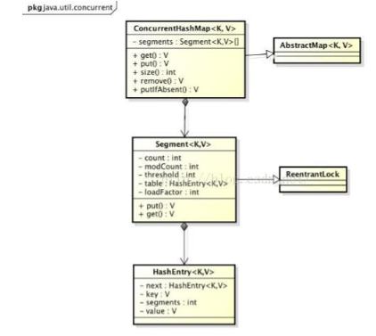

# ConcurrentHashMap的实现原理与使用
ConcurrentHashMap是线程安全且高效的HashMap.
## 为什么要使用ConcurrentHashMap?
+ $在并发编程中使用HashMap可能导致程序死循环；$  
HashMap在并发执行put操作时会引起死循环，是因为多线程会导致HashMap的Entry链表形成环形数据结构，一旦形成环形数据结构，Entry的next节点永远不为空，就会产生死循环获取Entry.
+ $使用线程安全的HashTable效率低下$  
HashTable容器使用synchronized来保证线程安全，但在线程竞争激烈的情况下，HashTable的效率非常低。因为当一个线程访问HashTable的同步方法，其它线程也访问HashTable的同步方法时，会进入阻塞或轮询状态。
+ $ConcurrentHashMap的锁分段技术可有效提升并发访问率$  
HashTable容器在竞争激烈的并发环境下表现出效率低下的原因是所有访问HashTable的线程都必须竞争同一把锁。ConcurrentHashMap使用的锁分段技术：假如容器里有多把锁，每一把锁用于锁容器其中一部分数据，那么当多线程访问容器里不同数据段的数据时，线程间就不存在锁竞争，从而可以有效提高并发访问效率。首先将数据分成一段一段的存储，然后给每一段数据配一把锁，当一个线程占用锁访问其中一个段数据时，其它段的数据也能被其它线程访问。
## ConcurrentHashMap的结构
  
ConcurrentHashMap是由Segment数组结构和HashEntry数组结构组成。Segment是一种可重入锁(ReentrantLock),在ConcurrentHashMap里扮演锁的角色；HashEntry则用于存储键值对数据。一个ConcurrentHashMap里包含一个Segment数组。Segment的结构和HashMap类似，是一组数组和链表结构。一个Segment里包含一个HashEntry数组，每个HashEntry是一个链表结构的元素，每个Segment守护着一个HashEntry数组里的元素，当对HashEntry数组的数据进行修改时，必须首先获得它的Segent锁。  
  
## ConcurrentHashMap的初始化
ConcurrentHashMap的初始化是通过initialCapacity、loadFactor和concurrencyLevle等几个参数来初始化Segment数组、段偏移量segmentShift、段掩码segmentMask和每个Segment里的HashEntry数组来实现的。 
### 初始化Segment数组
```java
    int sshift = 0;
    int ssize = 1;
    while (ssize < DEFAULT_CONCURRENCY_LEVEL) {
        ++sshift;
        ssize <<= 1;
    }
    int segmentShift = 32 - sshift;
    int segmentMask = ssize - 1;
    Segment<K,V>[] segments = (Segment<K,V>[])
    new Segment<?,?>[DEFAULT_CONCURRENCY_LEVEL];
    for (int i = 0; i < segments.length; ++i)
        segments[i] = new Segment<K,V>(LOAD_FACTOR);
    java.io.ObjectOutputStream.PutField streamFields = s.putFields();
    streamFields.put("segments", segments);
    streamFields.put("segmentShift", segmentShift);
    streamFields.put("segmentMask", segmentMask);
    s.writeFields();
```
segment数组的长度ssize是通过concurrentLevel计算得出的。为了能通过按位与的散列算法来定位segment数组的索引，必须保证segment的长度是2的N次方，所以必须计算出一个大于或等于concurrentLevel的最小的2的N次方值来作为segment数组的长度。  
### 计算segmentShift和segmentMask
这两个全局变量需要在定位segment时的散列算法里使用，sshift等于ssize从1向左移位的次数，在默认情况下，concurrentLevel等于16，1需要向左移位移动4次，所以sshift等于4.segmentShift用于定位参与散列运算的位数，segmetShift等于32-sshift,所以等于28，这里之所以用32是因为ConcurrentHashMap里的hash()方法输出的最大数是32位的。segmentMask是散列表运算的掩码，等于ssize减1，即15，掩码的二进制各个位的值都是1。因为ssize的最大长度是65536，所以，segmentShift最大值是16，segment最大值是65536，对应的二进制是16位，每个位是1.
### 初始化每个segment
jdk1.8之前的版本
```java
if(initialCapacity > MAXIMUM_CAPACITY) {
    initialCapacity = MAXIMUM_CAPACITY;
}
int c = initialCapacity / ssize;
if(c * ssize < initialCapacity) {
    ++c;
}
int cap = 1;
while(cap < c) {
    cap << 1;
}
for(int i = 0;i < this.segments.length;i++) {
    this.segments[i] = new Segment<K,V>(cap,loadFactor);
}
```
### 定位Segment
ConcurrentHashMap采用分段锁Segment来保护不同段的数据，那么在插入和获取元素的时候，必须先通过散列算法定位到Segment.
```java
private static final int tableSizeFor(int c) {
    int n = c - 1;
    n |= n >>> 1;
    n |= n >>> 2;
    n |= n >>> 4;
    n |= n >>> 8;
    n |= n >>> 16;
    return (n < 0) ? 1 : (n >= MAXIMUM_CAPACITY) ? MAXIMUM_CAPACITY : n + 1;
}
```
之所以进行再散列，目的是减少散列冲突，使元素能够均匀地分布在不同地Segment上，从而提高容器的存取效率。
# ConcurrentHashMap的操作
## get()操作
先经过一次再散列，然后使用这个散列值通过散列运算定位到Segment,再通过散列算法定位到元素。 
```java
public V get(Object key) {
    int hash = hash(key.hashCode());
    return segmentFor(hash).get(key,hash);
}
```
get操作的高效在于整个get操作过程不需要加锁，除非读到的值是空才会加锁重读。它的get()方法里将要使用的共享变量都定义成volatile类型。  
定义成volatile的变量，能够在线程之间保持可见性，能够被多线程同时读，并且保证不会读到过期的值，但是只能被单线程写(有一种情况是可以被多线程写，就是写入的值不依赖于原值)。之所以读到不会过期的值，是因为Java内存模型的happends-before原则，对volatile字段的写入操作先于读操作，即使两个线程同时修改和获取volatile变量，get操作也能拿到最新的值。
## put()操作
由于put方法里需要对共享变量进行写入操作，所以为了线程安全，在操作共享变量时必须加锁。put方法首先定位到Segment，然后再Segment里进行插入操作。插入操作需要经过两个步骤：第一步判断是否需要对Segment里的HashEntry数组进行扩容，第二步定位添加元素的位置，然后将其放在HashEntry数组里。  
1. 是否需要扩容  
在插入元素之前会先判断Segment里的HashEntry数组是否超过容量，如果超过阈值，则对数组进行扩容。Segment的扩容比HashMap更恰当。因为HashMap是在插入元素后判断元素是否已经到达容量的，如果到达了就进行扩容，但是很可能扩容之后没有新的元素插入，这时HashMap就进行了一次无效的扩容。  
2. 如何扩容？  
在扩容的时候，首先会创建一个容量是原来容量两倍的数组，然后将原数组里的元素进行再散列后插入到新的数组里。为了高效，ConcurrentHashMap不会对整个容器进行扩容，而只对某个Segment进行扩容。
## size()操作
如果要统计整个ConcurrentHashMap里元素的大小，就必须统计所有Segment里元素的大小后求和。Segment里的全局变量count是一个volatile变量，在多线程下，并不是把所有的Segment的count相加就会得到整个ConcurrentHashMap的大小，原因：虽然相加时可以获取每个Segment的count的最新值，但是可能累加前使用的count发生了变化，那么统计结果就不正确了。所有，最安全的做法是在统计size的时候把所有Segment的put()、remove()和clear()方法全部锁住，但是做法太低效了。  
在ConcurrentHashMap中如何判断在统计的时候容器是否发生变化？使用modCount变量，在put、remove和clear方法里操作元素前都会将变量modCount进行加1，那么在统计size前后比较modCount是否发生变化，从而得知容器地大小是否发生变化。
# JDK1.8实现原理
利用CAS+synchronized来保证并发更新的安全。  
底层使用数组+链表+红黑树来实现。  
