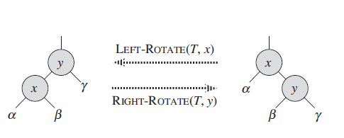

# 红黑树
+ R-B Tree，是一种特殊的二叉查找树。红黑树的每个节点上都有存储位表示节点的颜色。在二叉查找树的基础上额外添加了一个标记(颜色)，同时具有一定的规则。这些规则使红黑树保证了一种平衡、插入、删除、查找的最坏事件复杂度都是O(logn)
+ 红黑树的特性：
    + 每个节点或者是黑色，或者是红色；
    + 根节点是黑色；
    + 每个叶子节点是(NIL)是黑色。这里的叶子节点是指空的叶子节点。
    + 如果一个节点是红色的，则它的子节点必须是黑色的。
    + 从一个节点到该节点的子孙节点的所有路径上包含相同数目的黑节点。(必须确保没有一条路径会比其他路径长出两倍。因而，红黑树是相对最接近平衡的二叉树)。
+ 二叉排序树的性能取决于二叉树的层数：
    + 最好的情况是：O(logn),存在于完全二叉排序树的情况下，其访问性能近似于折半查找。
    + 最差的时候会是：O(n),比如插入的元素是有序的，生成的二叉排序树就是一个链表，这种情况下，需要遍历全部元素。
+ 黑色高度：从根节点到叶节点的路径上黑色节点的个数。
+ 红黑树的左旋右旋：
    + 红黑树的旋转是一种能保持二叉搜索树性质的搜索树局部操作。有左旋和右旋两种旋转，通过改变树中某些结点的颜色以及指针结构来保持对红黑树进行插入和删除操作后的红黑性质。
    + 左右旋的目的是：调整红黑节点结构，转移黑色节点位置，使其在进行插入、删除后仍能保持红黑树的5条性质。
    + 左旋：对某个结点x做左旋操作时，假设其右孩子为y而不是T.nil(哨兵，代表所有的NIL：所有的叶结点和根结点的父结点)：以x到y的链为“支轴”进行。<font color="red">使y成为该子树新的根结点，x成为y的左孩子，y的左孩子成为x的右孩子。</font>
    
    + 右旋：对某个结点x做右旋操作时，假设其左孩子为y而不是T.nil：以x到y的链为“支轴”进行。<font color="red">使y成为该子树新的根结点，x成为y的右孩子，y的右孩子成为x的左孩子。</font>
+ 红黑树的平衡插入：
    + 红黑树的插入主要分两步：
        + 首先和二叉查找树的插入一样，查找、插入
        + 然后调整结构，保证满足红黑树的状态：
            + 对节点进行重新着色；
            + 以及对树进行相关的旋转操作。
    + 调整思想：把插入的节点直接染成红色。染成红色后，我们只要关心父节点是否为红，如果是红的，就要把父节点进行变化，让父节点变成黑色，或者换一个黑色节点当父亲，这些操作同时不能影响不同路径上的黑色节点数一致的规则。
    + 插入、染红后的调整有两种情况：
        + 父亲节点和叔叔节点都是红的：
        + 父亲节点为红色，叔叔节点为黑色。
+ 红黑树的平衡删除：
    + 二叉查找树的删除：
    + 结构调整。
    + 二叉树查找树的删除：(分三种情况)
        + 要删除的节点正好是叶子节点，直接删除；
        + 只有左孩子或者右孩子，直接把这个孩子上移放到要删除的位置；
        + 有两个孩子，需要选一个合适的孩子节点作为新的根节点，该节点称为继承节点。
    + 删除后的结构调整：
        + 当前待删除节点是红色的，它被删除之后对当前树的特性不会造成任何破坏影响；
        + 当前待删除节点是黑色的，需要进一步调整：

# HashMap简介
HashMap是一个散列表，它存储的内容是键值对(key-value)映射。  
底层是数组+链表+红黑树。当链表中的元素超过8个之后，会将链表转换成红黑树。
底层实现：  
```java
//此类是用来实现数组及链表的数据结构
static class Node<K,V> implements Map.Entry<K,V> {
    final int hash;//保存节点的Hash值
    final K key;//保存节点的key值
    V value;//保存节点的value值
    Node<K,V> next;//指向链表结构下的当前节点的next节点。红黑树当中也有使用
    Node(int hash, K key, V value, Node<K,V> next) {
        this.hash = hash;
        this.key = key;
        this.value = value;
        this.next = next;
    }

    public final K getKey()        { return key; }
    public final V getValue()      { return value; }
    public final String toString() { return key + "=" + value; }

    public final int hashCode() {
        return Objects.hashCode(key) ^ Objects.hashCode(value);
    }

    public final V setValue(V newValue) {
        V oldValue = value;
        value = newValue;
        return oldValue;
    }
    //重写equals(),若不重写，则于'=='一样
    public final boolean equals(Object o) {
        //==判断的是内容和类型等
        if (o == this)
            return true;
            //判断是否为Map.Entry的实例，若key的值与value的值相等，则说明是相等的。
        if (o instanceof Map.Entry) {
            Map.Entry<?,?> e = (Map.Entry<?,?>)o;
            if (Objects.equals(key, e.getKey()) &&
                Objects.equals(value, e.getValue()))
                return true;
        }
        return false;
    }
}
```
此类是红黑树的数据结构实现：
```java
final TreeNode<K,V> find(int h, Object k, Class<?> kc) {
    TreeNode<K,V> p = this;
    do {
        int ph, dir; K pk;
        TreeNode<K,V> pl = p.left, pr = p.right, q;
        if ((ph = p.hash) > h)
            p = pl;
        else if (ph < h)
            p = pr;
        else if ((pk = p.key) == k || (k != null && k.equals(pk)))
            return p;
        else if (pl == null)
            p = pr;
        else if (pr == null)
            p = pl;
        else if ((kc != null ||
                    (kc = comparableClassFor(k)) != null) &&
                    (dir = compareComparables(kc, k, pk)) != 0)
            p = (dir < 0) ? pl : pr;
        else if ((q = pr.find(h, k, kc)) != null)
            return q;
        else
            p = pl;
    } while (p != null);
    return null;
}
``` 
//Node的get()
```java
final Node<K,V> getNode(int hash, Object key) {
    Node<K,V>[] tab; Node<K,V> first, e; int n; K k;
    if ((tab = table) != null && (n = tab.length) > 0 &&
        (first = tab[(n - 1) & hash]) != null) {
        if (first.hash == hash && // always check first node
            ((k = first.key) == key || (key != null && key.equals(k))))
            return first;
        if ((e = first.next) != null) {
            if (first instanceof TreeNode)
                return ((TreeNode<K,V>)first).getTreeNode(hash, key);
            do {
                if (e.hash == hash &&
                    ((k = e.key) == key || (key != null && key.equals(k))))
                    return e;
            } while ((e = e.next) != null);
        }
    }
    return null;
}
```   
HashMap继承了AbstractMap<K,V>,实现了Map<K,V>,Cloneable,Serializable接口。  
HashMap的实现不是同步的，即它不是线程安全的。它的Key、value都可以为null.此外，HashMap中的映射不是有序的。  
```java
 Map<String,Object> map = new HashMap<>(16);
        map.put(null,null);
        map.put("va",null);
        map.put(null,"ajk");
```
```
输出结果：
null===========ajk
va===========null
```
HashMap的两个实例有两个参数影响其性能:"初始容量"和"加载因子"。  
容量是哈希表中桶的数量，初始容量是哈希表在创建时的容量。  
加载因子是哈希表在其容量自动增加之前可以达到多满的一种尺度。当哈希表中的条目数超出了加载因子与当前容量的乘积时，则要对该哈希表进行rehash操作(即重建内部数据结构)，从而哈希表将具有大约两倍的桶数。  
## HashMap的构造函数
```java
//默认的构造方法
 public HashMap() {
        this.loadFactor = DEFAULT_LOAD_FACTOR; //默认的加载因子 为0.75
}
//给定初始容量的构造方法
//关于HashMap的初始容量 
//static final int DEFAULT_INITIAL_CAPACITY = 1 << 4; // aka 16
public HashMap(int initialCapacity) {
        this(initialCapacity, DEFAULT_LOAD_FACTOR);
}
//设置HashMap的初始容量和加载因子
public HashMap(int initialCapacity, float loadFactor) {
    //对初始容量进行判断 <0 就会抛出异常
    if (initialCapacity < 0)
        throw new IllegalArgumentException("Illegal initial capacity: " + initialCapacity);
    //如果初始容量>最大容量 最大容量为2^30  就把初始容量设置为最大容量
    if (initialCapacity > MAXIMUM_CAPACITY)
        initialCapacity = MAXIMUM_CAPACITY;
        //对加载因子的判断 若加载因子<=0或加载因子为整数时，抛出异常
    if (loadFactor <= 0 || Float.isNaN(loadFactor))
        throw new IllegalArgumentException("Illegal load factor: " +
                                            loadFactor);
    this.loadFactor = loadFactor;
    //threshold是HashMap所能容纳的最大数据量的Node(键值对)个数。
    //threshold = length * Load factor.即数组定义好长度之后，负载因子越大，所能容纳的键值对个数越多。如果超过定义好的threshold，就需要进行扩容。
    this.threshold = tableSizeFor(initialCapacity);
}
public HashMap(Map<? extends K, ? extends V> m) {
    this.loadFactor = DEFAULT_LOAD_FACTOR;
    putMapEntries(m, false);
}
```  
HashMap构造函数中的其他方法：
```java
//由于构造Hash时，需要保证初始容量为2^n，此函数就是为了将初始容量修剪称最接近的2^n数 HashMap中的初始容量为2^n的原因是：减少Hash冲突。
static final int tableSizeFor(int cap) {
    int n = cap - 1;
    n |= n >>> 1;
    n |= n >>> 2;
    n |= n >>> 4;
    n |= n >>> 8;
    n |= n >>> 16;
    return (n < 0) ? 1 : (n >= MAXIMUM_CAPACITY) ? MAXIMUM_CAPACITY : n + 1;
}
final void putMapEntries(Map<? extends K, ? extends V> m, boolean evict) {
    int s = m.size();
    if (s > 0) {
        if (table == null) { // pre-size
            float ft = ((float)s / loadFactor) + 1.0F;
            int t = ((ft < (float)MAXIMUM_CAPACITY) ?
                        (int)ft : MAXIMUM_CAPACITY);
            if (t > threshold)
                threshold = tableSizeFor(t);
        }
        else if (s > threshold)
            resize();
        for (Map.Entry<? extends K, ? extends V> e : m.entrySet()) {
            K key = e.getKey();
            V value = e.getValue();
            putVal(hash(key), key, value, false, evict);
        }
    }
}
```
## 为什么初始容量需要为2^n:
举例说明：初始长度为15和16时 Hash值为8和9时 hash&(cap-1)得到Hash位置
+ 初始长度为15，Hash为8,hash&(cap-1) 8&14 1000&1110  1000 
+ 初始长度为15，Hash为9,hash&(cap-1) 9&14 1001&1110  1000  
此时，8和9的位置发生了冲突  
+ 初始长度为16，Hash为8，hash&(cap-1) 8&15 1000&1111 1000
+ 初始长度为16，Hash为9，hash&(cap-1) 9&15 1001&1111 1001  
此时，8和9位置并没有发生冲突。  
这样，（1）在遍历时，初始长度为16的HashMap明显比15的时间复杂度低。也不需要进行冲突解决。（2）在初始容量为15时，最低位永远位0，会浪费掉hash值最低位为1的位置。而初始容量为16时，同时兼顾了最高位和最低位，不存在浪费。  
```java
static final int hash(Object key) {
    int h;
    return (key == null) ? 0 : (h = key.hashCode()) ^ (h >>> 16);
    //hashCode()是Object类中的方法 是一个native方法 本地方法 native方法主要用于加载文件和动态链接库 Native意味着与平台有关 可移植性不高。
    //^异或 相同为0 不同为1
}
```
# HashMap的默认长度为16的原因：
如果两个元素不相同,但是hash函数的值相同,这两个元素就是一个碰撞
因为把任意长度的字符串变成固定长度的字符串,所以存在一个hash对应多个字符串的情况,所以碰撞必然存在。  
为了减少hash值的碰撞,需要实现一个尽量均匀分布的hash函数,在HashMap中通过利用key的hashcode值,来进行位运算
公式:index = e.hash & (newCap - 1)  
举个例子:
1.计算"book"的hashcode
    十进制 : 3029737  
    二进制 : 101110001110101110 1001  
2.HashMap长度是默认的16，length - 1的结果  
    十进制 : 15  
    二进制 : 1111  
3.把以上两个结果做与运算  
    101110001110101110 1001 & 1111 = 1001
    1001的十进制 : 9,所以 index=9  
hash算法最终得到的index结果,取决于hashcode值的最后几位  
为了推断HashMap的默认长度为什么是16
现在,我们假设HashMap的长度是10,重复刚才的运算步骤:
hashcode : 101110001110101110 1001
length - 1 :                                     1001
index :                                            1001
再换一个hashcode 101110001110101110 1111 试试:
hashcode : 101110001110101110 1111
length - 1 :                                     1001  
index :                                            1001  
从结果可以看出,虽然hashcode变化了,但是运算的结果都是1001,也就是说,当HashMap长度为10的时候,有些index结果的出现几率
会更大而有些index结果永远不会出现(比如0111),这样就不符合hash均匀分布的原则  
反观长度16或者其他2的幂,length - 1的值是所有二进制位全为1,这种情况下,index的结果等同于hashcode后几位的值  
只要输入的hashcode本身分布均匀,hash算法的结果就是均匀的
所以,HashMap的默认长度为16,是为了降低hash碰撞的几率
# HashMap的遍历
# ConcurrentHashMap
# 线程池
