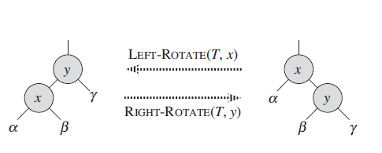

# 红黑树
+ R-B Tree，是一种特殊的二叉查找树。红黑树的每个节点上都有存储位表示节点的颜色。在二叉查找树的基础上额外添加了一个标记(颜色)，同时具有一定的规则。这些规则使红黑树保证了一种平衡、插入、删除、查找的最坏事件复杂度都是O(logn)
+ 红黑树的特性：
    + 每个节点或者是黑色，或者是红色；
    + 根节点是黑色；
    + 每个叶子节点是(NIL)是黑色。这里的叶子节点是指空的叶子节点。
    + 如果一个节点是红色的，则它的子节点必须是黑色的。
    + 从一个节点到该节点的子孙节点的所有路径上包含相同数目的黑节点。(必须确保没有一条路径会比其他路径长出两倍。因而，红黑树是相对最接近平衡的二叉树)。
+ 二叉排序树的性能取决于二叉树的层数：
    + 最好的情况是：O(logn),存在于完全二叉排序树的情况下，其访问性能近似于折半查找。
    + 最差的时候会是：O(n),比如插入的元素是有序的，生成的二叉排序树就是一个链表，这种情况下，需要遍历全部元素。
+ 黑色高度：从根节点到叶节点的路径上黑色节点的个数。
+ 红黑树的左旋右旋：
    + 红黑树的旋转是一种能保持二叉搜索树性质的搜索树局部操作。有左旋和右旋两种旋转，通过改变树中某些结点的颜色以及指针结构来保持对红黑树进行插入和删除操作后的红黑性质。
    + 左右旋的目的是：调整红黑节点结构，转移黑色节点位置，使其在进行插入、删除后仍能保持红黑树的5条性质。
    + 左旋：对某个结点x做左旋操作时，假设其右孩子为y而不是T.nil(哨兵，代表所有的NIL：所有的叶结点和根结点的父结点)：以x到y的链为“支轴”进行。使y成为该子树新的根结点，x成为y的左孩子，y的左孩子成为x的右孩子。
    
    + 右旋：对某个结点x做右旋操作时，假设其左孩子为y而不是T.nil：以x到y的链为“支轴”进行。使y成为该子树新的根结点，x成为y的右孩子，y的右孩子成为x的左孩子。
+ 红黑树的平衡插入：
    + 红黑树的插入主要分两步：
        + 首先和二叉查找树的插入一样，查找、插入
        + 然后调整结构，保证满足红黑树的状态：
            + 对节点进行重新着色；
            + 以及对树进行相关的旋转操作。
    + 调整思想：把插入的节点直接染成红色。染成红色后，我们只要关心父节点是否为红，如果是红的，就要把父节点进行变化，让父节点变成黑色，或者换一个黑色节点当父亲，这些操作同时不能影响不同路径上的黑色节点数一致的规则。
    + 插入、染红后的调整有两种情况：
        + 父亲节点和叔叔节点都是红的：
        + 父亲节点为红色，叔叔节点为黑色。
+ 红黑树的平衡删除：
    + 二叉查找树的删除：
    + 结构调整。
    + 二叉树查找树的删除：(分三种情况)
        + 要删除的节点正好是叶子节点，直接删除；
        + 只有左孩子或者右孩子，直接把这个孩子上移放到要删除的位置；
        + 有两个孩子，需要选一个合适的孩子节点作为新的根节点，该节点称为继承节点。
    + 删除后的结构调整：
        + 当前待删除节点是红色的，它被删除之后对当前树的特性不会造成任何破坏影响；
        + 当前待删除节点是黑色的，需要进一步调整：
