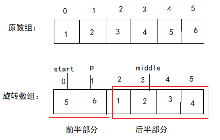

> 问题描述： 数组的旋转 把一个数组最开始的若干个元素搬到数组的末尾。输入一个递增排序的数组的一个旋转，输出旋转数组的最小值。  
  
分析：  
&emsp;&emsp;首先，可以看到题目中说输入的是递增的排序树组，说明旋转之后可以将其分成前、后两个子数组，并且两个子数组也为递增数组。  
   

可以看出，最小值刚好就在两个数组之间。  
此时，我们可以利用“二分查找”来找出最小的值  
   + a[start] > a[middle] ：说明最小值在start -- middle 之间  
   + 
