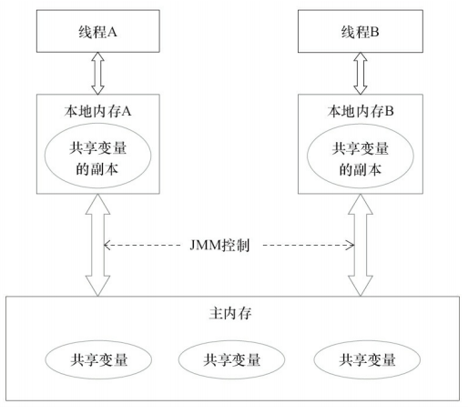

# Java内存模型的基础
并发编程需解决的问题：线程之间如何通信以及线程之间如何同步。  
+ 通信指线程之间以何种机制来交换信息；在命令式编程中，线程之间的通信机制有两种：共享内存和消息传递。  
    在共享内存的并发模型里，线程之间共享程序的公共状态，通过写-读内存中的公共状态进行隐式通信。在消息传递的并发模型里，线程之间没有公共状态，线程之间必须通过发送消息来显式进行通信。
+ 同步是指程序中用于控制不同线程间操作发生相对顺序的机制。在共享内存并发模型里，同步是显式进行的。  
Java的并发采用的是共享内存模型。Java线程之间的通信总是隐式进行。
## Java内存模型的抽象结构
在Java中，所有实例域、静态域和数组元素都存储在堆内存中，堆内存在线程之间共享。局部变量、方法定义参数和异常处理器参数不会在线程之间共享，他们不会有内存可见性问题，也不受内存模型的影响。  
Java内存模型的通信由Java内存模型(JMM)控制，JMM决定一个线程对共享变量的写入何时对一个线程可见。从抽象的角度看，JMM定义了线程和主内存之间的抽象关系：线程之间的共享变量存储在主内存中，每一个线程都有一个私有的本地内存，本地内存中存储了该线程以读/写共享变量的副本。本地内存是JMM的一个抽象概念，并不真实存在。它涵盖了缓存、写缓冲区、寄存器以及其它的硬件和编译器优化。
  
由图可知：  
线程A和线程B之间要通信的话，必须经历两个步骤：
+ 线程A把本地内存A中更新过的共享变量刷新到主内存中；
+ 线程B到主内存中去读线程A之前已更新过的共享变量。  
JMM通过控制主内存与每个线程的本地内存之间的交互，来为Java程序员提供可见性。 
## 从源代码到指令序列的重排序
在执行程序时，为了提高性能，编译器和处理器常常会对指令做重排序。重排序分为三种：
+ 编译器优化的重排序。编译器在不改变单线程程序语义的前提下，可以重新安排语句的执行顺序。
+ 指令级并行的重排序。现代处理器采用了指令级并行技术来将多条指令重叠执行。如果不存在数据依赖性，处理器可以改变语句对应机器指令的执行顺序。
+ 内存系统的重排序。由于处理器使用缓存来读/写缓冲区，这使得加载和存储操作看上去可能在乱序执行。  
Java源代码到最终实际执行的指令序列的过程：
  
这些重排序可能会导致线程程序出现内存可见性问题。
+ 对于编译器，JMM的编译器重排序规则会禁止特定类型的编译器重排序。
+ 对于处理器重排序，JMM的处理器重排序规则会要求Java编译器在生成指令序列时，插入特定类型的内存屏障指令，通过内存屏障指令来禁止特定类型的处理器重排序。  
JMM属于语言级别的内存模型，它确保在不同的编译器和不同的处理器平台上，通过禁止特定类型的编译器重排序和处理器重排序，为程序员提供一致的内存可见性保证。
## 并发编程模型的分类
现代的处理器使用写缓冲区临时保存向内存写入的数据。写缓冲区可以保证指令流水线持续运行，他可以避免由于处理器停顿下来等待向内存写入数据而产生的延迟。同时，通过以批处理的方式刷新缓冲区，以及合并写缓冲区中对同一内存地址的多次写，减少对内存总线的占用。但每个处理器上的写缓冲区，仅仅对它所在的处理器可用。这个特性会对内存操作的执行顺序产生重要的影响：处理器对内存的读/写操作的执行顺序，不一定与内存实际发生的读/写顺序一致。  
处理器的重排序规则：
<table border="2">
    <tr>
        <th>规则
处理器</th>
        <th>Load-Load</th>
        <th>Load-Store</th>
        <th>Store-Store</th>
        <th>Store-Load</th>
        <th>数据依赖</th>
    </tr>
    <tr>
        <td align="center">SPARC-TSO</td>
        <td align="center">N</td>
        <td align="center">N</td>
        <td align="center">N</td>
        <td align="center">Y</td>
        <td align="center">N</td>
    </tr>
    <tr>
        <td align="center">X86</td>
        <td align="center">N</td>
        <td align="center">N</td>
        <td align="center">N</td>
        <td align="center">Y</td>
        <td align="center">N</td>
    </tr>
    <tr>
        <td align="center">IA64</td>
        <td align="center">Y</td>
        <td align="center">Y</td>
        <td align="center">Y</td>
        <td align="center">Y</td>
        <td align="center">N</td>
    </tr>
    <tr>
        <td align="center">PowerPC</td>
        <td align="center">Y</td>
        <td align="center">Y</td>
        <td align="center">Y</td>
        <td align="center">Y</td>
        <td align="center">N</td>
    </tr>
</table>

## happends-before简介
happends-before来阐述操作之间的内存可见性。  
在JMM中，如果一个操作执行的结果需要对另一个操作可见，那么这两个操作之间必须要存在happends-before关系。这两个操作，可以在一个线程之内，也可以在不同线程之间。  
happends-before相关规则：
+ 程序顺序规则：一个线程中的每个操作，happends-before于该线程中的任意后续操作。
+ 监视器锁规则：对一个锁的解锁，happends-before于随后对这个锁的加锁。
+ volatile变量规则：对一个volatile域的写，happends-before于任意后续对这个volatile域的读。
+ 传递性：如果A happends-before B,且B happends-before C,那么A happends-before C。  
两个操作之间具有happends-before关系，并不意味着前一个操作必须要在后一个操作之前执行！happends-before仅仅要求前一个操作(执行的结果)对后一个操作可见，且前一个操作操作按顺序排在第二个操作之前。  
一个happends-before规则对应于一个或多个编译器和处理器重排序规则。
# 重排序
重排序是指编译器和处理器为了优化程序性能而对指令顺序进行重新排序的一种手段。
## 数据依赖性
如果两个操作访问同一个变量，且这两个操作中有一个为写操作，此时这两个操作之间存在数据依赖性。  
## as-if-serial语义
意思是：不管怎么重排序(编译器和处理器为了提高并行度)，(单线程)程序执行的结果不能被改变。编译器、runtime、处理器都必须遵守as-if-serial语义。   
为了遵守as-if-serial语义，编译器和处理器不会对存在数据依赖关系的操作做重排序，因为这种重排序会改变执行结果。  
## 控制依赖关系
当代码中存在控制依赖性时，会影响指令序列执行的并行度。为此，编译器和处理器会采用$猜测$执行来克服控制相关性对并行度的影响。然后把结果存入一个叫做重排序缓冲的硬件缓存中。  
在单线程程序中，对存在控制依赖的操作重排序，不会改变执行结果；但在多线程程序中，对存在控制依赖的操作重排序，可能会改变程序的执行结果。
# 顺序一致性
顺序一致性模型是一个理论参考模型。
## 数据竞争与顺序一致性
当程序未正确同步时，就可能存在数据竞争。Java内存模型规范对数据竞争的定义：  
在一个线程中写一个变量。  
在另一个线程读同一个变量。  
而且写和读没有通过同步来排序。  
当代码中包含数据竞争时，程序的执行往往产生违反直觉的结果。如果一个多线程程序能正确同步，这个程序将是一个没有数据竞争的程序。  
JMM对正确同步的多线程程序的内存一致性作了如下保证：如果程序是正确同步的，程序的执行将具有顺序一致性。即程序的执行结果与该程序在顺序一致性内存模型中的执行结果相同。
## 顺序一致性内存模型
顺序一致性内存模型的两大特性：
+ 一个线程中的所有操作必须按照程序的顺序来执行。
+ (不管程序是否同步)所有线程都只能看到一个单一的操作执行顺序。在顺序一致性模型里，每个操作都必须原子执行且立刻对所有线程可见。  
在概念上，顺序一致性模型有一个单一的全局内存，这个内存通过一个左右摆动的开关可以连接到任意一个线程，同时每一个线程必须按照程序的顺序来执行内存读/写操作。在任意一个时间点，只能有一个线程可以连接到内存。  
未同步程序在JMM中不但整体的执行顺序是无序的，而且所有线程看到的操作执行顺序也可能不一致。
## 同步程序的顺序一致性效果
顺序一致性模型中，所有操作完全按程序的顺序串行执行。而在JMM中，临界区内部代码可以重排序。  
JMM在具体实现上地基本方针是：在不改变(正确同步地)线程执行结果的前提下，尽可能地为编译器和处理器地优化打开方便大门。
## 未同步程序地执行性
对于未同步或未正确同步的多线程程序，JMM只提供最小安全性：线程执行时读取到的值，要么是之前某个线程写入的值，要么是默认值，JMM保证线程读操作读取到的值不会无中生有的冒出来。为了实现最小安全性，JVM在堆上分配对象时，首先会对内存空间进行清零。然后才会在上面分配对象。因此，在已清零的内存空间分配对象时，域的默认初始化已经完成了。  
JMM不保证未同步程序的执行结果与该程序在顺序一致性模型中的执行结果一致。因为如果
# volatile的内存语义