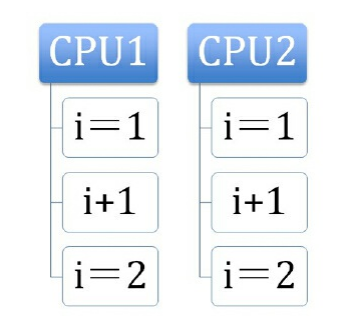

原子本意是“不能被进一步分割的最小粒子”，而原子操作意为“不可被中断的一个或一系列操作”。  
# 处理器如何实现原子操作
处理器提供总线锁定和缓存锁定两个机制来保证复杂内存操作的原子性。  
+ 使用总线锁保证原子性。  
如果多个处理器同时对共享变量进行读改写操作(比如i++)，那么共享变量就会被多个处理器同时进行操作，这样读改写操作就不是原子的，操作完之后共享变量的值回和期望的不一致。  
如下例：i=1，我们进行两次i++操作，期望的结果是3，但是有可能结果是2.
  
出现的原因：可能是多个处理器同时从各自的缓存中读取变量i,分别进行加1操作，然后分别写入系统内存中。那么，想要保证读改写共享变量的操作是原子的，就必须保证CPU1读改写共享变量的时候，CPU2不能操作缓存了该共享变量内存地址的缓存。  
处理器使用总线锁就可以解决此问题。所谓总线锁就是使用处理器提供的一个LOCK#信号，当一个处理器在总线上输出此信号时，其它处理器的请求将被阻塞住，那么该处理器可以独占共享内存。
+ 通过缓存锁保证原子性。  
在同一时刻，我们只需保证对某个内存地址的操作是原子性的即可，但总线锁定把CPU和内存之间的通信锁住了，这使得锁定期间，其它处理器不能操作其它内存地址的数据，所以总线锁定的开销比较大，目前处理器在某些场合下，使用缓存锁代替总线锁来进行优化。  
所谓“缓存锁定”是指内存区域如果被缓存在处理器的缓存行中，并且在Lock操作期间被锁定，那么当它执行锁操作回写到内存时，处理器不在总线上声言LOCK#信号，而是修改内部的内存地址，并允许它的缓存一致性机制来保证操作的原子性，因为缓存一致性机制会阻止同时修改由两个以上处理器缓存的内存区域数据，当其它处理器回写已被锁定的缓存行数据时，会使缓存行无效。  
## 处理器不会使用缓存锁定的情况：
+ 当操作的数据不能被缓存在处理器内部，或操作的数据跨多个缓存行时，则处理器会调用总线锁定；
+ 有些处理器不支持缓存锁定。
# Java实现原子操作
在Java中可以通过锁和循环CAS的方式实现原子操作。  
+ 使用循环CAS操作来实现。  
Java中的CAS操作利用了处理器提供的CMPXCHG指令实现的。自旋CAS实现的基本思路就是循环进行CAS操作直至成功为止。
+ CAS实现原子操作的三大问题。  
    + ABA问题  
    因为CAS需要在操作值的时候，检查值有没有发生变化，如果没有发生变化则更新，但是如果一个值原来是A，变成了B，又变成了A，那么使用CAS进行检查时，会发现它的值没有发生变化，但是实际上却变化了。ABA问题解决的思路就是使用版本号。在变量前面追加上版本号，每次变量更新的时候，把版本号加1。在JDK1.5之后，Atomic包里提供了一个类AtomicStampedReference来解决ABA问题。这个类的compareAndSet方法的作用就是首先检查当前引用是否等于预期引用，并且检查当前标志是否等于预期标志，如果全部相等，则以原子方式将该引用和该标志的值设置为给定的更新值。
    + 循环时间长，开销大  
    自旋CAS如果长时间不成功，会给CPU带来非常大的执行开销。如果JVM支持处理器提供的pause指令，那么效率一定会有提升。pause指令有两个作用：
        + 可以延迟流水线执行指令，使CPU不会消耗过多的执行资源，延迟的时间取决于具体实现的版本，在一些处理器上延迟时间是0；
        + 可以避免在退出循环的时候因内存顺序冲突而引起CPU流水线被清空，从而提高CPU的执行效率。
    + 只能保证一个共享变量的原子操作  
    当对一个共享变量执行操作时，我们可以使用循环CAS的方式来保证原子操作，但是对多个共享变量操作时，循环CAS就无法保证操作的原子性，这个时候就可以用锁。还有一个方法就是把多个共享变量合并成一个共享变量来操作。
+ 使用锁机制来实现  
锁机制保证了只有获得锁的线程才能够操作锁定的内存区域。
# 缓存一致机制
# CAS操作
CAS指令需要有三个操作数，分别是内存位置(在Java中可以理解为常量的内存地址，V)、旧的预期值(A)、新值(B).CAS指令执行时，当且仅当V符合旧预期值A时，处理器用新值B更新V的值，否则他就不执行更新，但是无论是否更新了V的值，都会返回V的旧值。  
在JDK1.5之后，Java程序中才可以使用CAS操作，该操作由sun.misc.Unsafe类里面的compareAndSwapInt()和compareAndSwapLong()等几个方法包装提供。