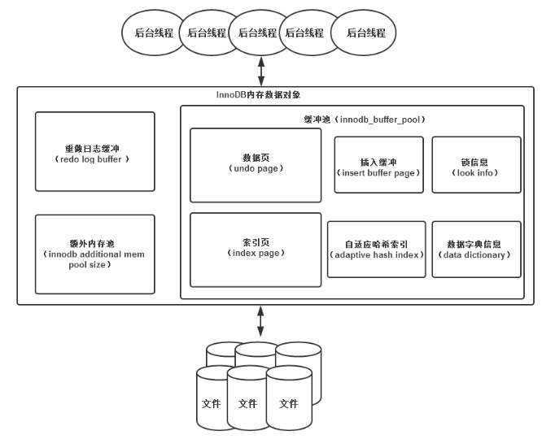

# InnoDB存储引擎
## 数据库和实例
+ 数据库：物理操作系统文件或其他形式文件类型的集合。
+ 实例：MySQL数据库由后台线程以及一个共享内存区组成。共享内存可以被运行的后台线程所共享。
+ <font color="red">数据库实例才是真正用于操作数据库文件的</font>
+ MySQL:单进程多线程数据库。也就是说<font color="red">MySQL数据库实例在系统上的表现就是一个进程。</font>
## MySQL体系结构
+ MySQL由以下几部分组成：
    + 连接池组件；
    + 管理服务和工具组件；
    + SQL接口组件；
    + 查询分析器组件；
    + 优化器组件；
    + 缓冲组件；
    + 插件式存储引擎；(是区别于其他数据库的一个重要特征)
    + 物理文件；
+ <font color="red">存储引擎是基于表的，而不是数据库的。</font>
## InnoDB存储引擎介绍
+ InnoDB存储引擎支持事务，其设计目标主要是面向在线事务处理的应用。其特点是：行锁设计，支持外键，并支持类似Oracle的非锁定锁，即默认读取不会产生锁。
+ InnoDB存储引擎将数据放在一个逻辑的表空间中，这个表空间就像黑盒一样由InnoDB存储引擎自身进行管理。InnoDB存储引擎支持裸设备用来建立其表空间。
+ InnoDB通过使用多版本并发控制来获得高并发性，并且实现了SQL标准的4种隔离级别。默认为REPEATABLE级别。同时，使用一种被称为next-key locking的策略来避免幻读现象的产生，除此之外，InnoDB存储引擎还提供了插入缓冲、二次写、自适应哈希索引、预读等高性能和高可用的功能。
+ 对于表中数据的存储，InnoDB存储引擎采用了聚集的方式，因此每张表的存储都是按主键的顺序进行存放。如果没有显式地在表定义时指定主键，InnoDB存储引擎会为每一行生成一个6字节的ROWID，并以此作为主键。
## MySQL搜索引擎比较
+ InnDB:支持事务，行锁设局，支持外键
+ MyISAM:不支持事务，表锁设计，支持全文索引 缓冲池只缓冲索引文件，而不缓冲数据文件。
+ NDB:集群存储引擎。特点是数据全部放在内存中。但是,NDB存储引擎的连接操作是在MySQL数据库层完成的，而不是在存储引擎层。
+ Memory:将表中数据放在内存中，如果数据库重启或发生崩溃，表中的数据都将消失。非常适合与存储临时数据的临时表，以及数据仓库中的维度表。(默认Hash索引)
+ Archive
+ Federated
+ Maria
## 连接MySQL
+ 连接MySQL操作是一个连接进程和MySQL数据库实例进行通信。
+ TCP/IP
    + 在TCP/IP连接上建立一个基于网络的连接请求，一般情况下，客户端在一台服务器上，MySQL实例在一台服务器上，两台机器通过TCP/IP网络连接。
    ```
    mysql -h 192.168.0.0.1 -u root -p
    ```
    + <font color="red">在通过TCP/IP连接到MySQL实例时，MySQL数据库会先检查一张权限视图，用来判断发起请求的客户端ip是否允许连接到MySQL实例。即user表</font>
+ 命名管道和共享内存
    + 如果两个需要进程通信的进程在同一台服务器上，那么可以使用命名管道；
    + 共享内存  
    在配置文件中添加
    ```
    --shared-memory 
    ```
    在连接时，还必须使用--protocol=memory选项
+ UNIX域套接字
    + 在Linux和Unix环境下使用。其实不是一个网络协议。所以只能在MySQL客户端和数据库实例在一台服务器上使用的情况下使用。
    ```
    show variables like 'socket'
    mysql -u root -s
    ```
## InnoDB存储引擎(是事务安全的存储引擎)

+ InnoDB存储引擎有多个内存块，可以认为这些内存块组成了一个大的内存池，负责工作：
    + 维护所有进程/线程需要访问的多个内部数据结构
    + 缓存磁盘上的数据，方便快速的读取，同时在对磁盘文件的数据修改之前在这里缓存；
    + 重做日志缓冲。
+ 后台线程的主要作用是：负责刷新内存池中的数据，保证缓冲池中的内存缓存是最近的数据。此外，将已修改的数据文件刷新到磁盘文件，同时保证在数据库发生异常的情况下InnoDB能恢复到正常运行状态。
+ 后台进程：  
    InnoDB存储引擎是多线程的模型，因此后台有多个不同的后台线程，负责处理不同的任务。
    + Master Thread
    + IO Thread
    + Purge Thread
    + Page Clear Thread