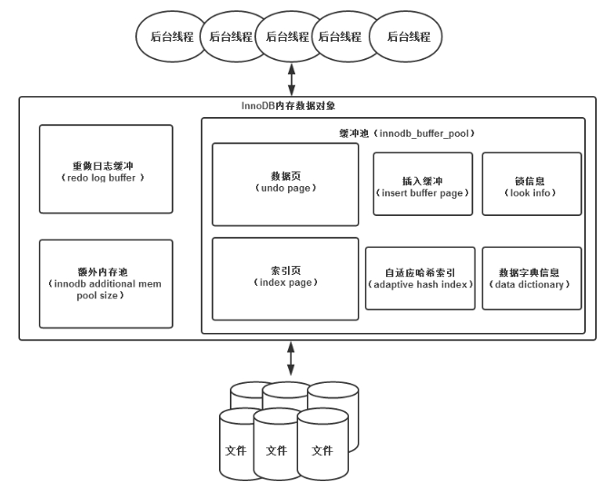
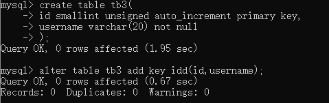
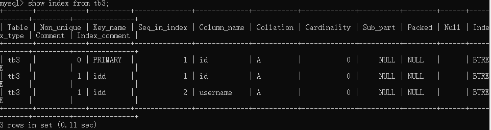
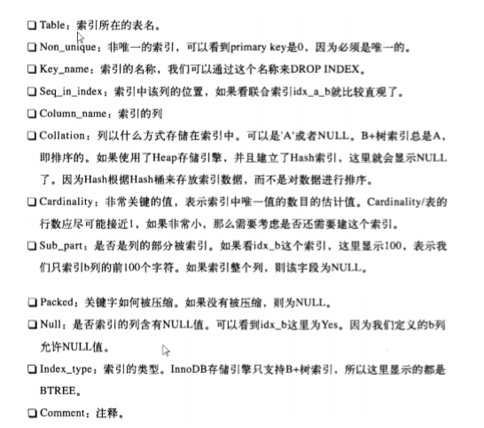

+ MySql
    + 删除命令的区别
    + jdbc
    + mysql的锁
    + mysql多数据源
    + sql调优
    + 三范式和反范式
    + mysql优化
    + 数据库索引
    + 查询类型
    + 程序、进程、线程
    + having、where区别
    + Innodb
    + 事务 
    + 游标  数据膨胀的解决办法 数据库的分表、分库的时机
# InnoDB存储引擎
+ 数据库和实例
    + 数据库：物理操作系统文件或其他形式文件类型的集合。
    + 实例：MySQL数据库由后台线程以及一个共享内存区组成。共享内存可以被运行的后台线程所共享。
    + <font color="red">数据库实例才是真正用于操作数据库文件的</font>
    + MySQL:单进程多线程数据库。也就是说<font color="red">MySQL数据库实例在系统上的表现就是一个进程。</font>
+ MySQL体系结构
    + MySQL由以下几部分组成：
        + 连接池组件；
        + 管理服务和工具组件；
        + SQL接口组件；
        + 查询分析器组件；
        + 优化器组件；
        + 缓冲组件；
        + 插件式存储引擎；(是区别于其他数据库的一个重要特征)
        + 物理文件；
    + <font color="red">存储引擎是基于表的，而不是数据库的。</font>
+ InnoDB存储引擎介绍
    + InnoDB存储引擎支持事务，其设计目标主要是面向在线事务处理的应用。其特点是：行锁设计，支持外键，并支持类似Oracle的非锁定锁，即默认读取不会产生锁。
    + InnoDB存储引擎将数据放在一个逻辑的表空间中，这个表空间就像黑盒一样由InnoDB存储引擎自身进行管理。InnoDB存储引擎支持裸设备用来建立其表空间。
    + InnoDB通过使用多版本并发控制来获得高并发性，并且实现了SQL标准的4种隔离级别。默认为REPEATABLE级别。同时，使用一种被称为next-key locking的策略来避免幻读现象的产生，除此之外，InnoDB存储引擎还提供了插入缓冲、二次写、自适应哈希索引、预读等高性能和高可用的功能。
    + 对于表中数据的存储，InnoDB存储引擎采用了聚集的方式，因此每张表的存储都是按主键的顺序进行存放。如果没有显式地在表定义时指定主键，InnoDB存储引擎会为每一行生成一个6字节的ROWID，并以此作为主键。
+ MySQL搜索引擎比较
    + InnDB:支持事务，行锁设局，支持外键
    + MyISAM:不支持事务，表锁设计，支持全文索引 缓冲池只缓冲索引文件，而不缓冲数据文件。
    + NDB:集群存储引擎。特点是数据全部放在内存中。但是,NDB存储引擎的连接操作是在MySQL数据库层完成的，而不是在存储引擎层。
    + Memory:将表中数据放在内存中，如果数据库重启或发生崩溃，表中的数据都将消失。非常适合与存储临时数据的临时表，以及数据仓库中的维度表。(默认Hash索引)
    + Archive
    + Federated
    + Maria
+ 连接MySQL
    + 连接MySQL操作是一个连接进程和MySQL数据库实例进行通信。
    + TCP/IP
        + 在TCP/IP连接上建立一个基于网络的连接请求，一般情况下，客户端在一台服务器上，MySQL实例在一台服务器上，两台机器通过TCP/IP网络连接。
        ```
        mysql -h 192.168.0.0.1 -u root -p
        ```
        + <font color="red">在通过TCP/IP连接到MySQL实例时，MySQL数据库会先检查一张权限视图，用来判断发起请求的客户端ip是否允许连接到MySQL实例。即user表</font>
    + 命名管道和共享内存
        + 如果两个需要进程通信的进程在同一台服务器上，那么可以使用命名管道；
        + 共享内存  
        在配置文件中添加
        ```
        --shared-memory 
        ```
        在连接时，还必须使用--protocol=memory选项
    + UNIX域套接字
        + 在Linux和Unix环境下使用。其实不是一个网络协议。所以只能在MySQL客户端和数据库实例在一台服务器上使用的情况下使用。
        ```
        show variables like 'socket'
        mysql -u root -s
        ```
+ InnoDB存储引擎(是事务安全的存储引擎)
    
    + InnoDB存储引擎有多个内存块，可以认为这些内存块组成了一个大的内存池，负责工作：
        + 维护所有进程/线程需要访问的多个内部数据结构
        + 缓存磁盘上的数据，方便快速的读取，同时在对磁盘文件的数据修改之前在这里缓存；
        + 重做日志缓冲。
    + 后台线程的主要作用是：负责刷新内存池中的数据，保证缓冲池中的内存缓存是最近的数据。此外，将已修改的数据文件刷新到磁盘文件，同时保证在数据库发生异常的情况下InnoDB能恢复到正常运行状态。
    + 后台进程：  
        InnoDB存储引擎是多线程的模型，因此后台有多个不同的后台线程，负责处理不同的任务。
        + Master Thread
        + IO Thread
        + Purge Thread
        + Page Clear Thread
+ 文件
+ 表
+ 索引与算法
    + InnoDB存储引擎表是索引组织表，即表中数据按照主键顺序存放。
    + InnoDB存储引擎支持常见的索引：
        + B+树索引:  
        根据键值快速找到数据，由平衡二叉树演化而来。  
        <font color="red">B+树索引并不能找到一个给定键值的具体行，B+树树索引能找到的只是被查找数据行所在的页。然后数据库通过把页读入到内存，再在内存中进行查找，最后得到要查找的数据。</font>
        + 全文索引:  
        + 哈希索引:  
        是自适应的，InnoDB存储引擎会根据表的使用情况自动为表生成哈希索引，不能认为干预是否在一张表中生成哈希索引
## 数据结构与算法
### 二叉查找树和平衡二叉树
+ B+树是通过二叉树，再由平衡二叉树，B树演化而来。
+ 二叉查找树
    + 深度平均值O(logN)
    + 二叉树实际上是图
    + 使二叉树成为二叉查找树的性质：对于树中的每个节点X，它的左子树中所有关键字值小于X的关键字值，而他的右子树中所有关键字值大于X的关键字值。
    + 对二叉树进行中序遍历得到的就是一个有序的序列。
+ 平衡二叉树(AVL树)
    + 前提是符合二叉查找树的定义，必须满足任何节点的两个子树的高度最大差为1。
    + 但是维护平衡二叉树的代价较大。
+ B+树
    + B+树由B树和索引顺序访问方法演化而来。
    + B+树是为磁盘或其他直接存取辅助设备设计的一种平衡二叉树。在B+树，所有记录节点都是按照键值的大小顺序存放在同一层的叶子节点上，由个叶子节点指针进行连接。
    + B+树的插入操作
        + B+树的插入必须保证插入后叶子节点中的记录仍然有序，每种情况都可能会导致不同的插入算法。
        + B+树插入的3种情况：
        <table border="2">
            <tr>
                <th align="center">Leaf Page满</th>
                <th align="center">Index Page满</th>
                <th align="center">操作</th>
            </tr>
            <tr>
                <td align="center">No</td>
                <td align="center">No</td>
                <td align="center">直接将记录插入到叶子节点</td>
            </tr>
            <tr>
                <td align="center">Yes</td>
                <td align="center">No</td>
                <td align="center">
                1)拆分Leaf Page  
                2)将中间的节点放入index Page中
                3)小于中间节点的记录放左边
                4)大于或等于中间节点的记录放右边
                </td>
            </tr>
            <tr>
                <td align="center">Yes</td>
                <td align="center">Yes</td>
                <td align="center">
                1)拆分Leaf Page  
                2)小于中间节点的记录放左边
                3)大于或等于中间节点的记录放右边
                4)拆分Index Page  
                5)小于中间节点的记录放左边
                6)大于或等于中间节点的记录放右边
                7)中间节点放入上一层Index Page
                </td>
            </tr>
        </table>
    + B+树的旋转
        + 为了保持平衡对于新插入的键值可能需要做大量的拆分页操作，因为B+树结构主要用于磁盘，页的拆分意味着磁盘的操作，所以，应该在可能的情况下，尽量减少页的拆分操作。
        + 旋转发生在Leaf Page已满，但是其的左右兄弟节点没有满的情况下，这时B+树并不会急于做拆分页的操作，而是将记录移到所在页的兄弟节点上。在通常情况下，左兄弟会被首先检查用来做检查。
        + 采用旋转操作使B+树减少了一次页的拆分操作，同时这棵B+树的高度不变。
    + B+树的删除
        + B+树使用填充因子来控制树的删除变化，50%是填充因子可设的最小值。B+树的删除操作必须保证删除后叶子节点中的记录依然排序。
        + B+树删除的三种情况：
        <table border="2">
            <tr>
                <th align="center">叶子节点小于填充因子</th>
                <th align="center">叶子节点大于填充因子</th>
                <th align="center">操作</th>
            </tr>
            <tr>
                <td align="center">No</td>
                <td align="center">No</td>
                <td align="center">直接将记录从叶子节点删除，如果该节点还是Index Page的节点，用该节点的右节点代替</td>
            </tr>
            <tr>
                <td align="center">Yes</td>
                <td align="center">No</td>
                <td align="center">
                合并叶子节点和它的兄弟节点，同时更新Index Page
                </td>
            </tr>
            <tr>
                <td align="center">Yes</td>
                <td align="center">Yes</td>
                <td align="center">
                1)合并叶子节点和它的兄弟节点 
                2)更新Index Page
                3)合并Index Page和它的兄弟节点
                </td>
            </tr>
        </table>
    + B+树索引
        + B+树索引的本质就是B+树在数据库中的实现。但是B+索引在数据库中有一个特点是高扇出性，因此在数据库中，B+树的高度一般都在2~4层。
        + 数据库中的B+树索引可以分为聚集索引和辅助索引。
        + 聚集索引和辅助索引不同的是：叶子节点存放的是否是一整行的信息。
        + 聚集索引：
            + 聚集索引就是按照每张表的主键构造一棵B+树，同时叶子节点中存放的即为整张表的行记录数据，也将聚集索引的叶子节点称为数据页。聚集索引的这个特性决定了索引组织表中数据也是索引的一部分。每个数据页都通过一个双向链表来进行链接。
            + 由于实际的数据页只能按照一棵B+树进行排序，因此每张表只能拥有一个聚集索引，在多数情况下，查询优化器倾向于采用聚集索引。因为聚集索引能够在B+树索引的叶子节点上直接找到数据。此外，由于定义了数据的逻辑顺序，聚集索引能够特别快地访问针对范围值的查询。查询优化器能够快速发现某一段范围的数据页需要扫描。
            + 数据页上存放的是完整的每行的记录，而在非数据页的索引页中，存放的仅仅是键值及指向数据页的偏移量，而不是一个完整的行记录。
            + 聚集索引的存储并不是物理上连续的，而是逻辑上连续的。这其中有两点：
                + 页通过双向链表连接，页按照主键的顺序排序；
                + 每个页中的记录也是通过双向链表进行维护的，物理存储上可以同样不按照主键存储。
            + 聚集索引的好处：
                + 对于主键的排序查找和范围查找速度非常快，叶子节点的数据就是用户所要查询的数据。
        + 辅助索引(非聚集索引)
            + 叶子节点并不包含行记录的全部数据。叶子节点除了包含键值以外，每个叶子节点中的索引行中还包含了一个书签。该书签是用来告诉InnoDB存储引擎哪里可以找到与索引相对应的行数据。由于InnoDB存储引擎表示索引组织表，因此InnoDB存储引擎的辅助索引书签就是相应行数据的聚集索引键。
            + 辅助索引的存在并不影响数据在聚集索引中的组织。因此，每张表上可以有多个辅助索引。
            + 当通过辅助索引来寻找数据时，InnoDB存储引擎会遍历辅助索引并通过叶级别指针获得指向主键索引的主键，然后再通过主键索引来找到一个完整的记录。
    + B+树索引的分裂
        + B+树索引页的分裂并不总是从页的中间记录开始，这样可能会导致页空间的浪费。
        + InnoDB存储引擎的Page Header中有以下几个部分用来保存插入的顺序信息：
            + PAGE_LAST_INSERT
            + PAGE_DIRECTION
            + PAGE_N_DIRECTION
            + 通过这些信息，InnoDB存储引擎可以决定是向左还是向右进行分裂，同时决定将分裂点记录为哪一个。
            + InnoDB存储引擎定位到的记录为带插入记录的前一条记录。
    + B+树索引的管理
        + 索引管理
            + 索引的创建和删除可以通过两种方法：
                + ALTER TABLE
                ```
                alter table user add key uid(user_id)
                //只索引部分部分字段：
                alter table user add key uid(user_id(100))
                alter table user drop key uid
                ```
                + CREATE DROP INDEX
                ```
                create index uname on users(username)
                drop index uname on users
                ```
                </img>
            + 用户可以设置对整个列的数据进行索引，也可以只索引一个列的开头部分数据。
            + 查看表中索引的信息，可以使用SHOW INDEX。查看的应该是指定表的索引信息。
            </img>
            </img>
            + Cardinaality值非常关键，优化器会根据这个值来判断是否选择索引。但是这个值并不是实时更新的，即并非每次索引的更新都会更新该值，因为这样代价过大。
            + Cardinality:表示索引中不重复记录数量的预估值。表示选择性。
            + Cardinality统计：放在存储引擎层进行。通过采样方法来完成。
    + B+树索引的使用：
        + 什么时候使用B+树？高选择，取出表中少数数据  
           取值范围广，且访问表中很少一部分时。 
           <font color="red">取值范围广，但取出的数据占据了表中的大部分时，也不适用。当取出的数据量超过超过表中得20%，优化器就不会使用索引，而是在全表中查找。</font>
        + 顺序读、随机读、预读取
            + 顺序读：根据索引的叶节点顺序就能顺序的读取所需的行数据(逻辑顺序)
            + 随机读：指访问辅助索引页节点不能得到所有结果，需要根据辅助索引叶节点的主键去找实际的行数据；
            + 预读取：提高读取的速率
                + 随机预读取：当一个区中(64个连续页)13个页也在缓冲区中，且该页被频繁的访问，则InnoDB会将该区中剩余的所有页都预读到缓冲区。
                + 线性预读取：基于缓冲池中页的访问模式，而不是数量，如果一个区的24个区都被顺序的访问了，则InnoDB会读取下一个区的所有页。
        + 辅助索引的优化使用：
            + InnoDB会从辅助索引的叶节点判断是否能得到所需的数据。
+ 哈希索引
    + InnoDB存储引擎使用哈希算法来对字典进行查找，其冲突机制采用链表方式，哈希函数采用除法散列。
    + 自适应哈希索引经哈希函数映射到一个哈希表中，因此对字典查找相当快。
# 锁
+ 什么是锁？
    + 锁机制用于管理对共享资源的并发访问。InnDB存储引擎会在行级别上对表数据上锁。数据库系统使用锁是为了支持对共享资源进行并发访问，提供数据的完整性和一致性。
    + InnoDB存储引擎提供一致性的非锁定读、行级锁支持。行级锁没有相关额外的开销，并可以同时得到并发性和一致性。
+ lock和latch
    + latch一般称为闩锁(轻量级得锁)，因为其要求锁定的时间必须非常短。若持续的时间长，则应用的性能会非常差。在InnoDB存储引擎中，latch又可以分为mutex(互斥量)和rwlock(读写锁).其目的是用来保证并发线程操作临界资源的正确性，并且通常没有死锁检测的机制。
    + lock的对象时数据，用来锁定的是数据库中的对象，如表、页、行。并且一般lock的对象仅在事务commit或rollback后进行释放(不同事务隔离级别释放的时间可能不同)。Lock是有死锁机制的。
  <table border="2">
    <tr>
        <th></th>
        <th align="center">lock</th>
        <th align="center">latch</th>
    </tr>
    <tr>
        <td  align="center">对象</td>
        <td  align="center">事务</td>
        <td  align="center">线程</td>
    </tr>
     <tr>
        <td  align="center">保护</td>
        <td  align="center">数据库内容</td>
        <td  align="center">内存数据结构</td>
    </tr>
     <tr>
        <td  align="center">持续时间</td>
        <td  align="center">整个事务过程</td>
        <td  align="center">临界资源</td>
    </tr>
     <tr>
        <td  align="center">模式</td>
        <td  align="center">行锁、表锁、意向锁</td>
        <td  align="center">读写锁、互斥量</td>
    </tr>
     <tr>
        <td  align="center">死锁</td>
        <td  align="center">通过waits-for graph、time out等机制进行死锁检测和处理</td>
        <td  align="center">无死锁检测与处理机制。仅通过应用程序加锁的顺序保证无死锁的情况发生</td>
    </tr>
     <tr>
        <td  align="center">存在于</td>
        <td  align="center">Lock Mananger的哈希表中</td>
        <td  align="center">每个数据结构的对象中</td>
    </tr>
  </table>
  
  + InnoDB存储引擎中的锁
    + InnoDB存储引擎实现了如下两种标准的行级锁：
        + 共享锁：允许事务读一行数据
        + 排他锁：允许事务删除或更新一行数据
    + 共享锁和排他锁的兼容性：
       <table border="2">
            <tr>
                <th></th>
                <th>X</th>
                <th>S</th>
            </tr>
            <tr>
                <td>X</td>
                <td>不兼容</td>
                <td>不兼容</td>
            </tr>
             <tr>
                <td>S</td>
                <td>不兼容</td>
                <td>兼容</td>
            </tr>
       </table> 
       X锁与其他锁都不兼容，而S锁仅与S锁兼容。  
       <font color="red">S和X锁都是行锁，兼容是指对同一记录锁的兼容性情况。</font>
    + InnoDB支持多粒度锁定，这种锁定允许事务在行级别上的锁和表级别上的锁同时存在。InnoDB支持一种额外的锁方式，称之为意向锁。意向锁是将锁定的对象分为多个层次，意向锁意味着事务希望在更细粒度上进行加锁。
    + 一致性非锁定读：
        + 一致性非锁定读是指InoDB存储引擎通过行多版本控制的方式来读取当前执行时间数据库中行的数据。如果读取的行正在执行DELETE或UPDATE操作，这时读取操作不会因此去等待行上锁的释放。相反的，InnoDB会去读取行的一个快照数据。
        + 快照数据是指该行的之前的版本的数据，该实现是通过undo段来完成，而undo用来在事务中回滚数据，因此快照数据本身是没有额外的开销。此外，读取快照数据是不需要上锁的，因为没有事务需要对历史的数据进行修改操作。
        + 非锁定读机制极大地提高了数据库的并发性。
        + 行多版本技术：快照数据其实就是当前行数据之前的历史版本，每行记录可能有多个版本。一个行记录可能有不止一个快照数据。
        + 在默认配置下，即事务的隔离级别为REPEATABLE READ模式下，InnoDB的select操作使用一致性非锁定读。
        + MVCC(多版本并发控制)
            + 原因：并发读写数据库得时候，可能会发生脏读，传统的加锁方式将读写操作串行化后保证了读写的一致性，但读操作可能会被写操作阻塞，性能较低。
            + 优势：多版本并发控制技术使得大部分支持行锁的事务引擎不再单纯的使用行锁来进行数据库的并发控制，取而代之的是把数据库的行锁与行的多个版本结合起来，只需要很小的开销，就可以实现非所锁定读，从而大大提高数据库系统的并发性能。
            + 主要是为Repeatable-Read事务隔离级别做的，在此隔离级别下，多个客户端所展示得数据相互隔离，互相更新不可见。
            + InnoDB实现MVCC:
                + InnoDB会为每一行添加两个字段，分别表示该行创建的版本和删除的版本，填入的是事务的版本号，这个版本号随着事物的创建不断递增。
                + 各种数据库操作的实现：
                    + select:满足以下两个条件InnoDB会返回该行数据：
                        + 该行的创建版本号小于等于当前版本号，用于保证select操作之前所有的操作已经执行落地；
                        + 该行的删除版本号大于当前版本号或者为空。删除版本号大于当前版本号意味着有一个并发事务将该行删除了。
                    + insert:将新插入的行的创建版本号设置为当前系统的版本号；
                    + delete:将要删除的行的删除版本号设置为当前系统的版本号；
                    + update:不执行原地update,而是转换成insert+delete.将旧的删除版本号设置为当前版本号，并将新行insert同时设置创建版本号为当前版本号。
                    + 其中，写操作(insert、delete和update)执行时，需要将系统版本号递增。
                + 由于旧数据并不真正的删除，所以必须对这些数据进行清理，InnoDB会开启一个后台线程执行清理工作，具体的规则是将版本号小于当前系统版本的行删除，这个过程叫做purge.
                + 总结：通过MVCC很好的实现了事务的隔离性，可以达到repeatale-read级别，但要实现serializable则必须加锁。
    + 一致性锁定读：
+ 自增长与锁
    + 在InnoDB存储引擎的内存结构中，对每个含有自增长值的表都有自增长计数器。当对含有自增长的计数器的表进行插入操作时，这个计数器会被初始化，执行如下语句来得到计数器的值：
    ```
    select max(auto_inc_col) from t for update
    ```
    + 插入操作会依据这个自增长的计数器值加1赋予自增长列。这个实现方式称作AUTO-INC Locking.这种锁其实是采用一种特殊的表锁机制，为了提高插入的性能，锁不是在一个事务完成后才释放，而是在完成对自增值插入SQL语句后立即释放的。
    + 虽然AUTO_INC Locking从一定程度上提高了并发插入的效率，但还是存在性能上的问题。首先，对于有自增长值的列的并发插入性能较差，事务必须等待前一个插入的完成；其次，对于INSERT...SELECT的大数据量的插入会影响插入的性能，因为另一个事务中的插入会被阻塞。
+ 外键和锁
    + 外键主要用于引用完整性的约束检查。
    + 在InnoDB存储引擎中，对于一个外键列，如果没有显式地对这个列加索引，InnoDB存储引擎会自动的对其加一个索引，因为这样可以避免表锁。
    + 对于外键值的插入或更新，首先需要查询父表中的记录，即SELECT 父表。但是对于父表的SELECT操作。不是使用一致性非锁定读的方式，因为这样会发生数据不一致的问题，因此此时使用的是select ... lock in share mode方式，即主动对父表加一个S锁，如果此时父表上已经这样加X锁，子表上的操作会被阻塞。
+ 锁问题
    + 脏读：就是在不同的事务下，当前事务可以读到另外事务未提交的数据。就是可以读到脏数据。
        + 脏数据：事务对缓冲池中行记录的修改，并且还没有被提交。
        + 脏页：指的是在缓冲池中已经被修改的页，但是还没有刷新到磁盘中，即数据库实例内存中的页和磁盘中的页的数据是不一样的
    + 不可重复读：是指在一个事务内多次读取同一数据集合。在这个事务还没有结束时，另外一个事务也访问该同一数据集合，并做了一些DML操作。
        + 不可重复读与脏读的区别：
            + 脏读是得到未提交数据，而不可重复读读到的是已提交的数据。但是违反了事务一致性的要求。
    + 丢失更新
    + 幻读
+ 阻塞
+ 死锁
+ 锁升级
# 事务
+ 事务是访问并更新数据库中各种数据项的一个程序执行单元。
+ 事务的四大特性：
    + 原子性：是指整个数据库事务是不可分割的工作单位。只有使事务中所有的数据库操作都执行成功，
    + 一致性：
    + 隔离性：
    + 持久性：
## MySQL存储过程
