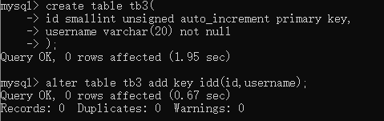

# 索引与算法
+ InnoDB存储引擎表是索引组织表，即表中数据按照主键顺序存放。
+ InnoDB存储引擎支持常见的索引：
+ B+树索引:  
根据键值快速找到数据，由平衡二叉树演化而来。  
<font color="red">B+树索引并不能找到一个给定键值的具体行，B+树树索引能找到的只是被查找数据行所在的页。然后数据库通过把页读入到内存，再在内存中进行查找，最后得到要查找的数据。</font>
+ 全文索引:  
+ 哈希索引:  
是自适应的，InnoDB存储引擎会根据表的使用情况自动为表生成哈希索引，不能认为干预是否在一张表中生成哈希索引
# B+树索引
+ B+树索引的本质就是B+树在数据库中的实现。但是B+索引在数据库中有一个特点是高扇出性，因此在数据库中，B+树的高度一般都在2~4层。
+ 数据库中的B+树索引可以分为聚集索引和辅助索引。
## 聚集索引与非聚集索引
+ 聚集索引和辅助索引不同的是：叶子节点存放的是否是一整行的信息。
  
### 聚集索引：
+ 聚集索引就是按照每张表的主键构造一棵B+树，同时叶子节点中存放的即为整张表的行记录数据，也将聚集索引的叶子节点称为数据页。聚集索引的这个特性决定了索引组织表中数据也是索引的一部分。每个数据页都通过一个双向链表来进行链接。
+ 由于实际的数据页只能按照一棵B+树进行排序，因此每张表只能拥有一个聚集索引，在多数情况下，查询优化器倾向于采用聚集索引。因为聚集索引能够在B+树索引的叶子节点上直接找到数据。此外，由于定义了数据的逻辑顺序，聚集索引能够特别快地访问针对范围值的查询。查询优化器能够快速发现某一段范围的数据页需要扫描。
+ 数据页上存放的是完整的每行的记录，而在非数据页的索引页中，存放的仅仅是键值及指向数据页的偏移量，而不是一个完整的行记录。
+ 聚集索引的存储并不是物理上连续的，而是逻辑上连续的。这其中有两点：
    + 页通过双向链表连接，页按照主键的顺序排序；
    + 每个页中的记录也是通过双向链表进行维护的，物理存储上可以同样不按照主键存储。
+ 聚集索引的好处：
    + 对于主键的排序查找和范围查找速度非常快，叶子节点的数据就是用户所要查询的数据。
### 辅助索引(非聚集索引)
+ 叶子节点并不包含行记录的全部数据。叶子节点除了包含键值以外，每个叶子节点中的索引行中还包含了一个书签。该书签是用来告诉InnoDB存储引擎哪里可以找到与索引相对应的行数据。由于InnoDB存储引擎表示索引组织表，因此InnoDB存储引擎的辅助索引书签就是相应行数据的聚集索引键。
+ 辅助索引的存在并不影响数据在聚集索引中的组织。因此，每张表上可以有多个辅助索引。
+ 当通过辅助索引来寻找数据时，InnoDB存储引擎会遍历辅助索引并通过叶级别指针获得指向主键索引的主键，然后再通过主键索引来找到一个完整的记录。
## B+树索引的分裂
+ B+树索引页的分裂并不总是从页的中间记录开始，这样可能会导致页空间的浪费。
+ InnoDB存储引擎的Page Header中有以下几个部分用来保存插入的顺序信息：
    + PAGE_LAST_INSERT
    + PAGE_DIRECTION
    + PAGE_N_DIRECTION
    + 通过这些信息，InnoDB存储引擎可以决定是向左还是向右进行分裂，同时决定将分裂点记录为哪一个。
    + InnoDB存储引擎定位到的记录为带插入记录的前一条记录。
## B+树索引的管理
+ 索引管理
    + 索引的创建和删除可以通过两种方法：
        + ALTER TABLE
        ```
        alter table user add key uid(user_id)
        //只索引部分部分字段：
        alter table user add key uid(user_id(100))
        alter table user drop key uid
        ```
        + CREATE DROP INDEX
        ```
        create index uname on users(username)
        drop index uname on users
        ```
        </img>
    + 用户可以设置对整个列的数据进行索引，也可以只索引一个列的开头部分数据。
    + 查看表中索引的信息，可以使用SHOW INDEX。查看的应该是指定表的索引信息。
    </img>
    </img>
    + Cardinaality值非常关键，优化器会根据这个值来判断是否选择索引。但是这个值并不是实时更新的，即并非每次索引的更新都会更新该值，因为这样代价过大。
    + Cardinality:表示索引中不重复记录数量的预估值。表示选择性。
    + Cardinality统计：放在存储引擎层进行。通过采样方法来完成。
## B+树索引的使用：
+ 什么时候使用B+树？高选择，取出表中少数数据  
    取值范围广，且访问表中很少一部分时。 
    <font color="red">取值范围广，但取出的数据占据了表中的大部分时，也不适用。当取出的数据量超过超过表中得20%，优化器就不会使用索引，而是在全表中查找。</font>
## 顺序读、随机读、预读取
+ 顺序读：根据索引的叶节点顺序就能顺序的读取所需的行数据(逻辑顺序)
+ 随机读：指访问辅助索引页节点不能得到所有结果，需要根据辅助索引叶节点的主键去找实际的行数据；
+ 预读取：提高读取的速率
    + 随机预读取：当一个区中(64个连续页)13个页也在缓冲区中，且该页被频繁的访问，则InnoDB会将该区中剩余的所有页都预读到缓冲区。
    + 线性预读取：基于缓冲池中页的访问模式，而不是数量，如果一个区的24个区都被顺序的访问了，则InnoDB会读取下一个区的所有页。
## 辅助索引的优化使用：
InnoDB会从辅助索引的叶节点判断是否能得到所需的数据。
# 哈希索引
+ InnoDB存储引擎使用哈希算法来对字典进行查找，其冲突机制采用链表方式，哈希函数采用除法散列。
+ 自适应哈希索引经哈希函数映射到一个哈希表中，因此对字典查找相当快。