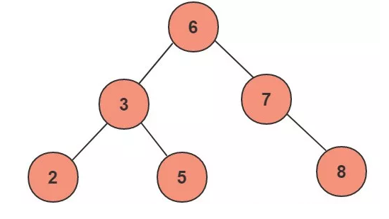
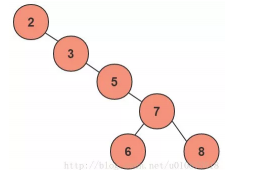
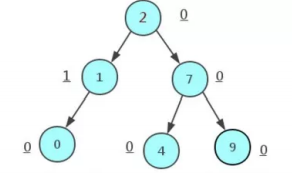
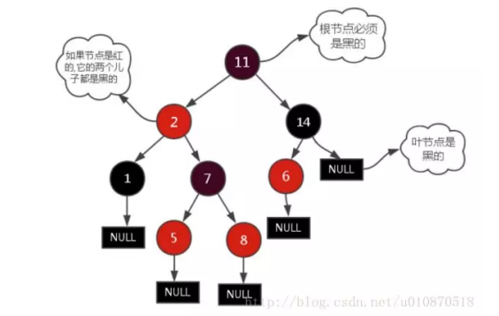

https://www.cnblogs.com/tiancai/p/9024351.html
# 二叉查找树
## 二叉树简介
二叉查找树也称为有序二叉查找树，满足二叉树的一般性质，是指一颗空树具有如下性质：
+ 任意节点左子树不为空，则左子树的值均小于根节点的值；
+ 任意节点右子树不为空，则右子树的值均大于根节点的值；
+ 任意节点的左右子树也分别是二叉查找树；
+ 没有键值相等的节点。
  
### 局限性和应用
一个二叉树是由n个节点随机生成的，所以，对于某些情况，二叉查找树会退化成一个有n个节点的线性链。  
  
若果根节点选择的是最小或者最大值，那么二叉查找树就完全退化成了线性结构。此时的二叉查找的平均查找次数就跟顺序查找差不多。显然这个二叉查找的查询效率就很低，因此若想最大性能的构造一个二叉查找树。需要这个二叉树的平衡的。
# AVL(平衡二叉树)
## 简介
AVL树是带有平衡条件的二叉查找树，一般是用平衡因子差值判断是否平衡并通过旋转来实现平衡，左右子树树高不超过1，和红黑树相比，它是严格的平衡二叉树，平衡条件必须满足(所有节点的左右子树高度差不超过1).不管我们执行插入还是删除操作，只要不满足上面的条件，就要通过旋转来保持平衡，而旋转是非常耗时的，由此我们可以知道AVL树适合用于插入次数比较少，但查找多的情况。  
  
## 局限性
由于维护这种高度平衡所付出的代价比从中获得的效益收益还大，故而实际的应用不多，更多的地方是用追求局部而不是非常严格整体平衡的红黑树。当然，如果应用场景中对插入删除不频繁，只是对查找要求较高，那么AVL还是较优于红黑树。
## 应用
Windows NT内核中广泛应用
# 红黑树
## 简介
一种二叉查找树，但在每个节点增加一个存储位表示节点的颜色，可以是red或black.通过对任何一条从根到叶子节点的路径上的各个节点着色方式的限制，红黑树确保没有一条路径会比其它路径长出两倍。它是一种弱平衡二叉树(由于是弱平衡，可以推出，相同的节点情况下，AVL树的高度低于红黑树)，相对于要求严格的AVL树来说，它的旋转次数变少，所以对与搜索、插入、删除操作较多的情况下，使用红黑树。
## 性质
+ 每个节点非红即黑；
+ 根节点是黑色的；
+ 每个叶节点(叶节点即树尾端NULL指针或NULL节点)都是黑的；
+ 如果一个节点是红的，那么它的两儿子都是黑的；
+ 对于任意节点而言，其到叶子节点树NULL指针的每条路径都包含相同数目的黑节点；
+ 每条路径都包含相同的黑节点。  
  
## 应用
+ 广泛应用于C++的STL中，Map和Set都是用红黑树实现的；
+ 著名的Linux进程调度Completely Fair Scheduler，用红黑树管理进程控制块，进程的虚拟内存区域都存储在一棵红黑树上，每个虚拟地址区域都对应红黑树的一个节点，左指针指向相邻的地址虚拟存储区域，右指针指向相邻的高地址虚拟地址空间；
# B/B+树
## 简介
我们在MySQL中的数据一般是放在磁盘中的，读取数据的时候肯定会有访问磁盘的操作，磁盘中有两个机械运动的部分，分别是盘片旋转和磁臂移动。盘片旋转就是我们在市面上所提到的多少转每分钟，而磁盘移动则是在盘片旋转到指定位置以后，移动磁臂后开始进行数据的读写。那么这就存在一个定位到磁盘中的块的过程，而定位是磁盘的获取中花费时间比较大的一块，那么这就存在一个定位到磁盘中的块的过程，而定位是磁盘的存取中花费时间比较大的一块，毕竟机械运动花费的时间远远大于电子运动的时间。当大规模数据存储到磁盘中的时候，显然定位是一个非常花费时间的过程，但是我们可以通过B树进行优化，提高磁盘读取时定位的效率。  
为什么B类树可以进行优化呢？我们可以根据B类树的特点，构造一个多阶的B类树，然后在尽量多的在结点上存储相关的信息，保证层数尽量的少，以便我们后面可以更快的找到信息，磁盘的IO操作也少一些，而且B类树是平衡树，每个节点到叶子节点的高度都是相同，这也保证了每个查询是稳定的。  
总的来说。B/B+树是为了磁盘或其它存储设备而设计的一种平衡多路查找树(相对于二叉，B树每个内节点有多个分支)，与红黑树相比，在相同的节点的情况下，一颗B/B+树的高度远远小于红黑树的高度.B/B+树上操纵的时间通常由存取磁盘的时间和CPU计算时间这两部分构成，而CPU的速度非常快，所以B树的操作效率取决于访问磁盘的次数，关键字总数相同的情况下B树的高度越小，磁盘IO所花的时间越少。  
## B树的性质
+ 定义任意非叶子节点最多只有M个儿子，且M>2;
+ 根节点的儿子数为[2,M];
+ 除根节点以外的非叶子节点的儿子树为[M/2,M];
+ 每个节点存放至少M/2-1(取上整)和至多M-1个关键字；(至少两个关键字)
+ 非叶子节点的关键字个数 = 指向儿子的指针个数 - 1；
+ 非叶子节点的关键字：K[1],K[2],……，K[M-1],且K[i] < K[i+1];
+ 非叶子节点的指针：P[1],p[2],……，P[M];其中P[1]指向关键字小于K[1]的子树，P[M]指向关键字属于(K[i-1],K[i])的子树；
+ 所有叶子节点位于同一层。  
  
上面的图中比如节点35，35代表一个key(索引)，而小黑块代表的是这个key所指向的内容在内存中实际的存储位置，是一个指针。 
# B+树
## 简介
B+树是应文件系统所需而产生的一种B树的变形树(文件的目录一级一级索引，只有最底层的叶子节点(文件)保存数据)，非叶子节点只保存索引，不保存实际的数据，数据都保存在叶子节点中。  
## B+树的性质(与B+不相同的性质)
+ 非叶子节点的子树指针与关键字个数相同；
+ 非叶子节点的子树指针p[i],指向关键字[k[i],k[i+1]]的子树。(B树是开区间，也就是说B树不允许关键字重复，B+树允许重复)；
+ 为所有叶子节点增加一个链指针；
+ 所有关键字都在叶子节点中出现(稠密索引).(且链表中的关键字恰好是有序的)；
+ 非叶子节点相当于是叶子节点的索引(稀疏索引))，叶子节点相当于是存储(关键字)数据的数据层；
+ 更适合于文件系统。

# B/B+树的性能分析
n个节点的平衡二叉树的高度为H(即log(n)),而n个节点的B/B+树的高度为logt((n+1)/2)+1;若要作为内存中的查找表，B树确不一定比平衡二叉树好，尤其当m较大时更是如此。因为查找操作CPU的时间在B树上是O(mlogtn) = O(lgn(mlgt)),而m/lgt>1;所以m较大时O(mlogtn)比平衡树操作时间大得多，因此在内存中使用B树必须取最小的m.
# 为什么说B+树比B树更适合数据库索引？
+ B+树的磁盘读写代价更低：B+树的内部节点并没有指向关键字具体信息的指针，因此其内部节点相对B树更小，如果把所有同一内部节点的关键字存放在同一盘块中，那么盘块所能容纳的关键字数量也越多，一次性读入内存的需要查找的关键字也就越多，相对IO读写次数就降低了。
+ B+树的查询效率更加稳定：由于非终结点并不是最终指向文件内容的节点，而只是叶子节点中关键字的索引，所以任何关键字的查找必须走一条从根节点到叶子节点的路。所以关键字查询的路径长度相同，导致每一个数据的查询效率相当。
+ 由于B+树的数据都存储在叶子节点中，分支节点均为索引，方便扫库，只需要扫一遍叶子节点即可。但是B树因为其分支节点同样存储着数据，我们要找到具体的数据，需要进行一次中序遍历按序来扫，所以B+树更加适合在区间查询的情况，所以通常B+树用于数据库索引。  
他们认为数据库索引采用B+树的主要原因是：B树在提高了IO性能的同时并没有解决元素遍
历的我效率低下的问题，正是为了解决这个问题，B+树应用而生。B+树只需要去遍历叶子节
点就可以实现整棵树的遍历。而且在数据库中基于范围的查询是非常频繁的，而B树不支持
这样的操作或者说效率太低。