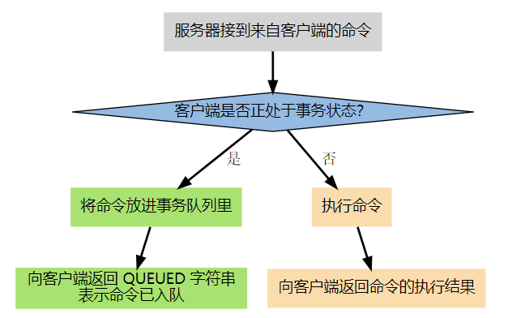
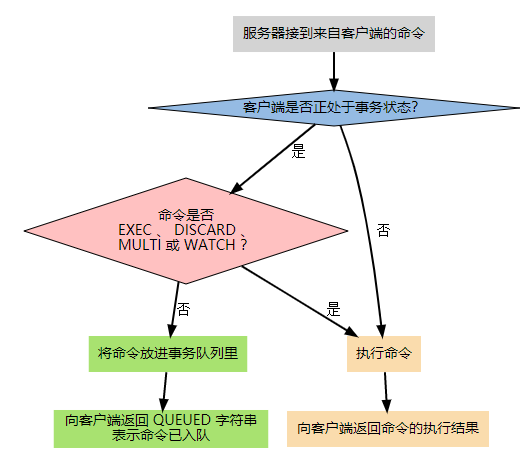
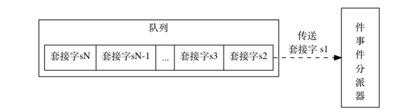
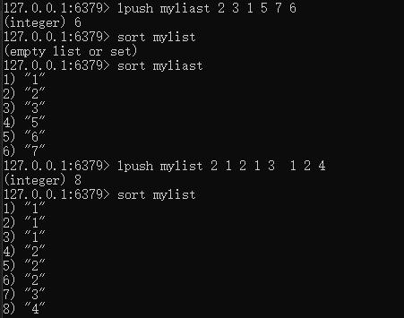
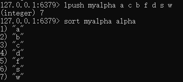
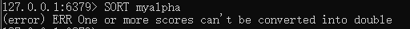
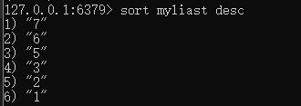
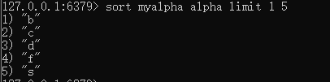
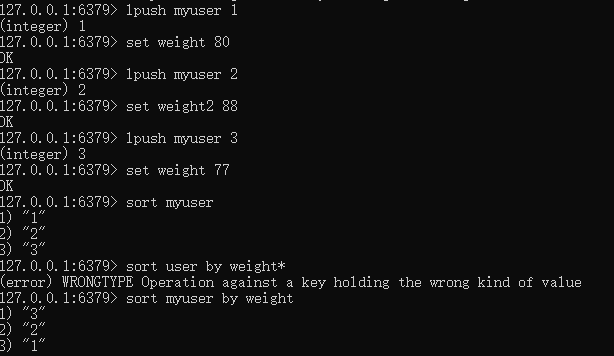
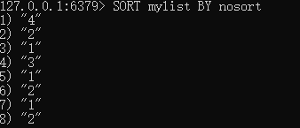

# Redis基础
+ 介绍
    + 远程数据服务(Remote Dictionary Server)
    + 内存高速缓存数据库
    + 使用C编写,为key-value的数据模型
    + 支持的value类型：String,Hash,list(链表),set,有序set
    + 为了保证效率，数据都是缓存在内存中，也可以周期性的把更新的数据写入磁盘，或者把修改操作写入追加的记录文件。
    + 出现的原因：mysql是持久化在磁盘里，所以cpu访问会很慢，而redis是在内存中，将redis作为MySQL的本地缓存。效率将会提升，有效缓解数据库压力。
+ 特点：
   + 高速读取数据
   + 减轻数据库负担
   + 有集合计算功能
   + 多种数据结构支持
+ redis的优势：
    + 性能极高 – Redis能读的速度是110000次/s,写的速度是81000次/s 。
    + 丰富的数据类型 – Redis支持二进制案例的 Strings, Lists, Hashes, Sets 及 Ordered Sets 数据类型操作。
    + 原子 – Redis的所有操作都是原子性的，意思就是要么成功执行要么失败完全不执行。单个操作是原子性的。多个操作也支持事务，即原子性，通过MULTI和EXEC指令包起来。
    + 丰富的特性 – Redis还支持 publish/subscribe, 通知, key 过期等等特性
+ 与其他key-value存储结构的不同：
    + Redis有着更为复杂的数据结构并且提供对他们的原子性操作，这是一个不同于其他数据库的进化路径。Redis的数据类型都是基于基本数据结构的同时对程序员透明，无需进行额外的抽象。
    + Redis运行在内存中但是可以持久化到磁盘，所以在对不同数据集进行高速读写时需要权衡内存，因为数据量不能大于硬件内存。在内存数据库方面的另一个优点是，相比在磁盘上相同的复杂的数据结构，在内存中操作起来非常简单，这样Redis可以做很多内部复杂性很强的事情。同时，在磁盘格式方面他们是紧凑的以追加的方式产生的，因为他们并不需要进行随机访问。
+ 数据类型
    + 字符串：  
        Redis最基本的数据类型.<font color="red">可以包含任何数据类型，包含jpg图片和序列化的对象</font>单个value值得最大上限是1G，如果只用String类型，则人为redis加上了持久化特性（重启服务器之后，数据不消失）。
         + set 键名称 值 设置值 (重新设置则直接覆盖)
        + get 键名称 取值 (如果key不存在，则返回nil)
        + incr 键名称 对key的值做++操作，并返回一个新的值，每执行一次，值+1，值类型要是数据类型。
        + incrby 键名称 执行加法的操作，可以指定相加的值。
        + setnx 键 值 分布式锁
        + expire 键 时间 设置过期时间
        + del 键 删除 
    + Hash：  
       可以用来存储对应的MySQL中一行的数据，类似于关联数组。
         + hset 哈希的名称(键名称) field(字段名称)   value 将对应的值设置进Hash表中
        ```
        hset user:id:1 name xxx
        :就表示一个普通符号，没有特殊含义
         ```
        + hget 哈希的名称(键名称) field(对应的字段名)
        + hmset 哈希名称(键名称) field1 value1 field2 value2 ...  一次性设置多个filed和value
        + hmget 哈希的名称 value1 value2... 一次性获取多个field的value
        + hgetall 哈希的名称 获取指定哈希中的所有field和value <font color="yellow">指定获得的是指定字段的键和值，而不是此表的所有信息</font>
        + hscan 键 游标 
    + 链表
        + List类型其实就是一个双向链表，通过pop、push操作从链表的头部或尾部添加或删除元素，<font color="red">这使得链表既可以用作栈，也可以用作队列</font>
        + 上进上出：栈 特点：数据 先进后出(从链表的头部添加元素)
        + 上进下出：队列 特点： 数据 先进先出(从链表的尾部添加元素)
        + lpush 链表名称(键的名称) 元素 从链表的头部添加元素
        + lrange 链表的名称 开始下标 结束下标 <font color="red">如果开始下标是0，结束下标是-1，则表示返回链表的所有元素；链表里面的元素是序号的(从0开始)，l类似于索引数组</font>(先进后出)
        + rpush 链表的名称(键的名称) 元素 从链表的尾部插入数据(先进先出) 
        + ltrim 链表的名称(键名称) 开始下标 结束下标 保留指定范围的元素
        + lpop 链表的名称 从链表的头部删除一个元素
    + 集合(无序性、唯一性)
        + 是String类型的无序集合
        + set元素可以包含(2^32-1)个元素
        + set集合可以进行简单的增、删外，还可以取交、并、差集。
        + <font color="red">每个集合中的元素不能重复</font>
        + sadd 集合名称(键名称) 元素名 向集合中添加元素
        + smembers 集合名 获取集合中的元素
        + sdiff 集合1 集合2 获取集合中的差集(在集合1中存在，但在集合2中不存在的元素) 应用：推荐好友
        + sinter 集合1 集合2 求两个集合的交集(在集合1和集合2中都存在) 应用：共同好友
        + sunion 集合1 集合2 求两个集合的并集(两个集合重复后，去掉重复的元素，留一个重复元素)
        + scard 集合名称 获取集合中元素的个数
    + 有序集合
        + 集合的升级版本,在set的基础上，添加了一个顺序属性，这一属性在添加和修改元素的时候可以指定，每次指定后，zset会自动重新按新的值调整顺序。
        + 操作中的key可以理解为zset的名字。
        + 元素由两部分组成：序号 值 
        + 取出有序集合里面的元素时，是根据序号排序后，取出的 
        + zadd 集合名 序号 内容 向有序集合中添加元素，如果元素存在，则更新其顺序
        + zrange 集合名称 开始下标 结束下标 按序号升序获取有序集合中的内容 <font color="red">开始下标、结束下标为排好序的一个索引</font>
        + zrevrange 集合名 开始下标(索引) 结束下标(索引) 按序号降序获取有序集合中的内容
    + HyperLogLog数据结构：用来做基数统计的算法
        + 优点：在输入元素的数量或者体积非常非常大时，计算基数所需要的空间总是固定的，并且是很小的。
        + 缺点： HyperLogLog 只会根据输入元素来计算基数，而不会储存输入元素本身，所以 HyperLogLog 不能像集合那样，返回输入的各个元素。
        + 	PFADD key element [element ...]  添加指定元素到HyperLogLog中
        + PFCOUNT key [key...] 返回给定HyperLogLog的技术估计值
        + PFMERGE destkey sourcekey [sourcekey...] 将多个HyperLogLog合并为一个HyperLogLog
+ 常用命令：
    + 键值相关命令：
        + keys返回当前数据库里的键，可以使用通配符,*表示任意多个,？表示任意一个字符。
        + exists 键名称 判断一个键是否存在 返回1表示此键存在，0表示此键不存在
        + del 键名称 删除指定的键 键存在则返回1，不存在则返回0
        + expire key 有效期(秒数)  设置键的有效期 失效之后，返回的是nil
        + ttl key 返回一个键剩余的过期时间 
        + type key 返回键的数据类型
        + select 数据库的编号 切换数据库 选择数据库 在redis里面 默认有0-15号数据库，默认是0号数据库 可以在redis.conf里面进行设置
        + dbsize 返回当前数据库里面键的个数
        + flushdb 清空当前数据库里面所有的键
        + flushall 清空所有数据库里的所有的键
    + 服务器相关命令
        + redis启动：  
            + 安装目录下: redis-server.exe Redis.windows.conf
            + 新打开一个命令框: redis-cli.exe -h 127.0.0.1 -p 6379
            + 设置服务：redis-server --service-install redis.windows.conf --loglevel verbose
        + 卸载服务：redis-server --service-uninstall
        + 开启服务：redis-server --service-start
        + 停止服务：redis-server --service-stop
        
+ 安全验证
    + 设置客户端连接后进行任何其他操作都需要使用的密码
        + #requirepass 此时设置的密码是明文的，因此需要对配置文件进行严格的权限控制。
        + 设置密码后 需要使用密码来连接redis 登录到服务器之后 语句：auth 密码
# 发布订阅
+ 一种消息通信模式。发送者发送信息，接收者订阅信息。
+ Redis客户端可以订阅任意数量的频道。
+ 相关命令
    + 在一个客户端 负责订阅信息 SUBSCRIBE 频道名
    + 重开一个客户端 负责发布信息 PUBLISH 频道名 消息
    + PUBSUB subcommand 查看订阅与发布系统状态
    + PUNSUBSCRIBE 频道名 退订所有给定模式的频道
    + PSUBSCRIBE pattern 订阅一个或多个符合给定模式的频道
    + UNSUBSCRIBE 频道名 退订给定频道
+ 发布/订阅与key所在空间没有关系，它不会受任何级别的干扰，包括不同数据库编码。
+ 模式匹配订阅
    + 客户端可以订阅全风格的模式以便接收所有来自能匹配到给定模式的频道的消息。
    + 取消订阅匹配该模式的客户端，这个调用不影响其他订阅。
    + 消息类型是：pmessage
+ 同时匹配模式和频道订阅的消息  
    客户端可能多次接收一个消息，如果他订阅的多个模式匹配了同一个发布的消息，或者他订阅的模式和频道同时匹配到一个消息。
+ java代码实现发布订阅
    + 订阅端
    ```java
    public class Subscribe_Client {
        public static void main(String[] args) {
            Jedis jedis = new Jedis("127.0.0.1",6379);
            jedis.auth("123456789");
            Subscribe subscribe = new Subscribe();
            jedis.subscribe(subscribe,"liang");
        }
    }
    //消息展示 主要是通过重写JedisPubSub的onMessage()方法来实现
    public class Subscribe extends JedisPubSub {
        @Override
        public void onMessage(String s,String s1) {
            System.out.println(s+"==========="+s1);
        }
    }
    ```
    + 发布端
    ```java
    public class Subscribe_Server {
        public static void main(String[] args) {
            Jedis jedis = new Jedis("127.0.0.1",6379);
            jedis.auth("123456789");
            jedis.publish("liang","欢迎您！");
        }
    }
    ```
    客户端发布一条消息时，订阅它的服务端就会同时收到所发布的信息.
    + 发布订阅思想的重要性：  
        应用场景
        + 注册发短信
        + 抢单：用户发起打车请求，将打车信息发给每个订阅的司机
# Redis事务  
<font color="red">事务里边的数据类型必须是String类型的，如果出现其他类型，将会出现错误，但不会发生回滚</font>
+ Redis事务可以一次执行多个命令，并且带有以下保证：
    + 批量操作在发送EXEC命令前被放入队列缓存；
    + 收到EXEC命令后进入事务执行，事务中任意命令执行失败，其余的命令依然被执行；
    + 在事务执行过程，其他客户端提交的命令请求不会插入到事务执行命令序列中。
+ 一个事务从开始到执行会经历以下阶段：
    + 开始事务；
    + 命令入队；
    + 执行事务。
+ 单个Redis命令的执行是原子性的，但Redis没有在事务上增加任何维持原子性的机制，所有，Redis事务的执行并不是原子性的。
+ 事务可以理解为一个打包的批量执行脚本，但批量指令并非原子化的操作，中间某条指令的失败不会导致前面已做指令的回滚，也不会造成后续的指令不做。
+ 事务命令：
    + MULTI 标志一个事务块的开始
    + EXEC 执行所有事务块内的命令 返回的是一个数组
    + DISCARD 取消事务，放弃执行事务块内的所有命令
    + WATCH 键名 监视一个或多个key,如果在事务执行之前这个或这些key被其他命令所改动，那么事务将被打断<font color="yellow"> 只能在WATCH域内修改数据，其他事务不能修改被WATCH的数据(相当于加了锁)，除非将键unwatch.</font>
    + UNWATCH 取消WATCH命令对所有key的监视
+ Redis事务执行流程  
</img>
+ 注意：但并不是所有的命令都会被放进事务队列，其中的例外就是EXEC、DISCARD、MULTI、WATCH，当这四个命令从客户端发送到服务器时，它们会像客户端处于非事务状态一样，直接被服务器执行。
</img>
如果客户端正处于事务状态，那么当EXEC命令执行时，服务器根据客户端所保存的事务队列，以先进先出的方式执行事务队列中的命令，最先入队的命令最先执行，而最后入队的命令最后执行。  当事务队列里的所有命令被执行完之后，EXEC命令会将回复队列作为自己的执行结果返回给客户端，客户端从事务状态返回到非事务状态，至此，事务执行完毕。
+ Redis不支持回滚的原因：
    + 只有当被调用的Redis命令有语法错误时，这条命令才会执行失败(在将这个命令放入事务队列期间，Redis才会发现此类问题),或者对某个键执行不符合其数据类型的操作；实际上，这就意味着只有程序错误才会导致Redis命令执行失败，这种错误很有可能在程序开发期间发现，一般很少在生产环境发现。Redis已经在系统内部进行功能简化，这样可以确保更快的运行速度，因为Redis不需要事务回滚功能。
+ 事务中的乐观锁和悲观锁
    + 悲观锁：每次拿数据的时候都会认为别人会修改，所以每次拿数据的时候都会上锁，这样别人拿数据的时候就会一直block直到拿到锁；
    + 乐观锁(使用check-and-set)：每次拿数据的时候都认为别人不会修改，所以不会上锁，但是每次更新的时候都会判断一下在此期间有没有别人去更新数据、使用版本号等机制。乐观锁适用于多读的应用类型,这样可以提高吞吐量。
+ 事务中的错误(两种)：
    + 事务在执行EXEC之前，入队的命令可能会出错。
    + 命令可能在EXEC调用之后失败。
# Redis脚本
+ Redis脚本使用Lua解释器来执行脚本
    + 常用命令:
        + EVAL script(lua脚本) numkeys(key的个数) key... arg0...执行lua脚本
        + EVALSHA sha1 numkeys key... arg... 根据sha的校验码，执行缓存在redis中的lua脚本
        + SCRIPT LOAD script 将脚本添加到redis缓存，但不立即执行
        + SCRIPT EXISTS script [script ...]  查看指定的脚本是否已经被保存在缓存当中。
        + SCRIPT FLUSH 从脚本缓存中移除所有脚本。
        + SCRIPT KILL  杀死当前正在运行的 Lua 脚本。
# Redis持久化
+ 什么是持久化：
    + 就是将数据放在断电后不会丢失的设备上。
+ Redis持久化策略(RDB持久化和AOF持久化)
    + RDB持久化(是指在指定的时间间隔内将内存中的数据集快照写入磁盘，是默认的持久化方法，这种方式就是将内存中数据以快照的方式写入到二进制文件中，默认名是dump.rdb)
        + 可以通过配置设置自动做快照持久化的方式。我们可以设置Redis在n秒内如果超过m个key被修改就自动做快照。默认的快照保存配置如下：
        ```
        save 900 1 #900秒内，如果超过1个key被修改，就发起快照保存。
        ```
        + 快照过程：
            + Redis使用fork函数复制一份当前进程(父进程)的副本(子进程);
            + 父进程继续接收并处理客户端发来的命令，而子进程开始将内存中的数据写入硬盘中的临时文件；
            + 当子进程写入完所有的数据后会用该临时文件替换旧的RDB文件。
        + 优点：整个过程中，主线程不进行任何IO操作，性能高
        + 缺点：最后一次持久化的数据可能会丢失掉。
        + 使用情况：大规模数据要恢复，对于精度要求不高，RDB比AOF高效。
        + fork
            + 作用：复制一个与当前进程一样的进程，新进程所有数值与数据一致，作为一个全新的原进程的子进程。
            + 执行fork时，操作系统会使用写时复制(copy-on-write)策略,即fork函数发生的一刻，父子进程共享同一内存数据，当父进程要更改其中某片数据时，操作系统会将该片数据复制一份以保证子进程的数据不受影响，所以，新的rdb文件存储的是执行fork一刻的内存数据。
                + 写时复制策略(copy-on-write):
                    + 一种并发设计策略，基本思路是：多线程同时共享同一个内容，当某个线程想要修改这个内容的时候，才会真正的把内容copy出去形成一个新的内容然后修改，其他的线程继续旧的内容，直至修改完成。是一种延时懒惰策略。
                    + 应用场景：
                        + Linux系统中内存的管理和分配
                        + Redis快照持久化时，
                        + jdk1.5引入了juc包下CopyOnWriteArrayList和CopyOnWriteArraySet
        + 触发快照的情况
            + 根据配置规则进行自动快照
            + 用户执行save和bgsave命令
            + 执行flushall命令
            + 执行复制(replication)时
        + 快照信息
            + rdb保存的是dump.rdb文件
                + 何时触发rdb?
                    + 根据默认规则进行自动快照
                        ```
                        sava 时间  写操作次数
                         ```
                    + 用户执行save或bgsave命令
                        + save:只管保存，其他不管，全部阻塞
                        + bgsave:Redis会在后台异步进行快照操作，快照同时还可以响应客户端请求，可以通过lastsave命令获取最后一次成功执行快照的时间。
                        + 如何恢复？
                            + 将备份文件(dump.rdb)移动到redis安装目录并启动服务即可。
                            + CONFIG GET dir 获取目录
                        + 优点：适合大规模的数据恢复，对数据一致性的完整性要求不高。
                        + 缺点：redis意外down掉，就会丢失最后一次快照后的所有修改，fork的时候，内存中数据被克隆了一份，大致2倍的膨胀性需要考虑。
                        + save:执行save命令后，Redis同步进行快照操作
                            + 缺点：在快照执行过程中，会阻塞所有来自客户端的请求，数据过大情况下会导致Redis长时间没有响应。
                        + bgsave:执行bgsave命令后,Redis在后台异步进行快照操作
                            + 优点：在执行快照的同时，还可以继续响应来自客户端的请求
                            + 执行结果：执行bgsave后Redis立即返回ok表示开始执行快照操作
                            + 查看快照是否完成：lastsave命令 获取最近一次成功执行快照的时间  返回结果 unix时间戳
                        + 禁用save:
                            + 如果禁用RDB持久化策略，只要不设置任何的save命令 或者save后传入空的字符串。
                        + 当紧急数据需要直接刷入硬盘，立即备份，直接使用save命令保存。
                    + 执行flushall命令
                        + 执行flushall会清除数据库中所有的数据 执行flushall命令，也会产生dump.rdb文件，但文件是空的，无意义。
                        + <font color="red">在数据库清空操作过程中，触发了自动快照的条件，只要自动快照条件不为空，Redis就会执行一次快照操作，那么如果没有定义自动快照条件，执行flushall不会进行快照。</font>
                    + 执行复制(主从复制)
                        + 设置主从模式时，Redis会在复制初始化时进行自动快照；
                        + 当使用复制操作时，即使没有定义自动快照条件，并且没有手动执行快照操作，也会生成RDB快照文件
                + 快照配置文件参数
                    + Stop-write-on-bgsave-error 默认是yes，如果修改成no,表示不在乎数据不一致或者其他的手段发现或控制
                    + rdbcompression rdb文件是经过压缩的二进制格式，占用空间小于内存数据大小，更有利于传输。    对于存储到磁盘中的快照，可以设置是否进行压缩存储，如果是的话，redis会采用LZF算法进行压缩，如果不想消耗CPU来压缩，可以选择关闭此功能。
                    + rdbchecksum:在存储快照后，在存储快照后，还可以让redis使用CRC64算法来进行数据校验，但是这样做会增加大约10%的性能消耗，如果希望获取到最大的性能提升，可以关闭此功能。
                    + rdbfilename dump.rdb文件
                    + dir 列出目录
                + 如何停止？
                    + 动态停止所有RDB保存规则的方法：redis-cli config set save
    + AOF持久化策略(Append Only File)
        + 以日志的形式来记录每个写操作。将Redis的所有写指令记录下来(读操作不记录)，每执行一条更改命令都会将该命令写入到硬盘中的aof文件。
        + 只许追加文件，但不可以改写文件，Redis启动之初就会读取该文件重新构建数据。
        + 总结：Redis重启的话，就会根据日志文件的内容将写指令从前到后执行一次以完成数据的恢复工作。
        + <font color="red">默认redis没有开启AOF，可通过append only yes参数启用。</font>AOF保存的是appendonly.aof文件。
        + AOF的实现：
            + 记录命令并且到一定条件时，Redis自动重写AOF文件(重写--去冗余，优化文件)
            + 参数：  
                + auto-aof-rewriter-percentage 100  
            当前AOF文件大小超过上一次重写时的AOF文件大小的百分之多少就会再次进行重写，如果没有重写过，就以启动时的AOF文件大小为依据； 
                + auto-aof-rewriter-min-size 64mb  
                限制了允许重写的最小AOF文件大小，文件很小的时候，就算有很多冗余的命令也不会重写，手动输入bgrewriteraof命令来重写aof文件。
            + AOF同步硬盘数据
                + 由于操作系统的缓存机制，每次执行更改数据库内容的操作时，aof将命令记录在aof文件中但并未真正写入硬盘，而是进入了系统的硬盘缓存，默认30秒会执行一次同步操作。
                + 设置appedefsync参数设置同步时机：
                    + appedefsync always:每次执行写入都要同步，速度最慢
                    + appedefsync everysec:Redis默认，1秒1次
                    + appedefsync no:不主动进行同步操作，全部交由系统进行，即30秒1次
                + aof的修复：
                    redis-check-aof --fix appendonly.aof
            + Rewrite
                + 概述：  
                    AOF采用文件追加方式，文件会越来越大，为避免出现这种情况，新增了重写机制，当AOF文件的大小超过所设定的阈值时，Redis就会启动AOF文件的内容压缩，只保留可以恢复数据的最小指令集，可以使用命令bgrewriteaof
                + 重写原理：  
                    AOF文件持续增长而过大时，会fork出一条新进程来将文件重写(也是先写临时文件最后再rename)，遍历新进程中的内存中数据，每条记录有一条set语句，重写aof文件的操作，并没有读取旧的aof文件，而是将整个内存中的数据库内容用命令的方式重写了一个新的aof文件。
                + 触发机制：  
                    redis会记录上次重写时的AOF大小，默认配置是当AOF文件大小是上次rewrite后大小的一倍且文件大于64M时触发。
            + 优点：
                + 每秒同步：appedefsync always 同步持久化，每次发生数据变更会立即记录到磁盘 性能较差但数据完整性比较好
                + 每修改同步：appedefsync everysec 异步操作，每秒记录，如果1秒内宕机，有数据丢失
                + 不同步：appedefsync no 从不同步
            + 缺点：
                + 相同数据集的数据而言，aof文件要远大于rdb文件，恢复速度慢于rdb;
                + aof运行效率要慢于rdb，每秒同步策略较好，不同步效率和rdb相同。
     + 官网建议：
        + RDB持久化方式能够在指定的时间间隔能对你的数据进行快照存储；
        + AOF持久化方式记录每次对服务器写的操作，当服务器重启的时候会重新执行这些命令来恢复原始的数据，AOF命令以redis协议追加保存每次写的操作到文件末尾。Redis还能对AOF文件进行后台重写，使得AOF的体积不至于过大。
        + 只做缓存：如果希望数据在服务器运行的时候存在，也可以不使用任何持久化方式。
        + 同时开启两种持久化方式：在这种情况下，当redis重启时，会优先载入AOF文件来恢复原始的数据。因为在通常情况下，AOF文件保存的数据集比RDB文件保存的数据集要完整。
                    
# Redis集群
+ 集群是一个提供在多个redis间节点间共享数据的程序集。
+ redis集群并不支持处理多个keys的命令，因为这需要在不同的节点间移动数据，从而达不到像Redis那样的性能，在高负载的情况下可能会导致不可预料的错误。
+ redis集群通过分区来提供一定程度的可用性，在实际环境中，当某个节点宕机或者不可达的情况下继续处理命令，Redis集群的优势：
    + 自动分割数据到不同的节点上；
    + 整个集群的部分节点失败或者不可达的情况下能够继续处理命令。
+ Redis集群的数据分片
    + Redis集群没有使用一致性hash算法，而是引入了哈希槽的概念。
    + redis集群有16384个哈希槽，每个key通过CRC16校验后对16384取模来决定放置哪个槽。集群的每个节点负责一部分hash槽。
## Redis集群的主从复制模型
+ 为了使在部分节点失败或者大部分节点无法通信的情况下集群仍然可用，所以集群使用了主从复制模型，每个节点都会有N-1个复制品。
+ 主机数据更新后根据配置和策略，自动同步到备机的master/slaver机制。master以写为主，slaver以读为主。
+ 作用：读写分离，容灾恢复。
+ 用法： 
    + 配从(库)不配主(库)：
    + 从库配置：slaveof 主库ip 主库端口  
    每次与master断开之后，都需要重新连接，除非配置进redis.windows.conf.
    + 修改配置文件细节：
        + 拷贝多个redis.windows.conf文件
        + 开启daemonize yes
        + Pid文件名字
        + 指定端口
        + Log文件名字
        + Dump.rdb名字
    + 常用三招：
        + 一主二仆
            + init
            + 一个master两个slave
            + 日志查看
            + 主从问题演示
                + 情况1：主机down掉，从机原地待命，等主机重新打开依旧可以维持主从复制机制；
                + 情况2：从机down掉就会和master断掉，则当其重新打开之后就会以新的master库的身份运行而跟之前的主库并无任何关系。再次执行slaveof命令连接一次即可。
        + 薪火相传
            + 上一个slave可以是下一个slave的master,slave同样可以接收其他slaves的连接和同步请求，那么该slave作为了链条中的下一个master,可以有效减轻master的写压力。
            + 中途变更转向：会清除之前的数据，重新建立拷贝最新的  slaveof 新主库ip 新主库端口
        + 反客为主
            + 当主机挂掉之后，从机原地待命，导致无法进行写操作。解决方法：反客为主机制  slaveof no one 命令 设置一个从机为主机
    + 命令：
        + info replication 命令查看当前客户端状态
        + slaveof 主库ip 主库端口 命令设置从机备份
+ 哨兵模式：
    + 概述：后台监控主机是否故障，如果主机发生故障，会自动根据票数将从库转换为主库。
    + <font color="red">注意：</font>
        + 启动哨兵：redis-sentinel 文件目录/sentinel.conf(sentinel.conf文件是自己写的)
        + 挂掉的主机重新开启后会变成当前更改后的主机的从机。
+ 复制的缺点：  
    由于写操作是先在master上操作再同步更新后slave上,所以从master同步到slave机器有一定的延迟，当系统很繁忙的时候，延迟问题会更加严重，slave机器数量的增加也会使这个问题更严重。
+ Redis一致性保证
    + Redis并不能保证数据的强一致性，这意味着这在实际中集群在特定的条件下可能会丢失写操作。
    + 第一个原因是因为集群是用了异步复制，写操作过程：
        + 客户端向主节点写入一条命令；
        + 主节点向客户端回复命令状态；
        + 主节点将写操作复制给他的从节点。
    + 主节点对命令的复制工作发生在返回命令回复之后，因为如果每次处理命令请求都需要等待复制操作完成的话，那么主节点处理命令请求的速度将极大的降低--我们必须在性能和一致性之间权衡。
    + Redis集群另外一种可能会丢失命令的情况是集群出现了网络分区，并且一个客户端与至少包括一个主节点在内的少数实例被孤立。<font color="red">在网络分裂出现期间，客户端可以向主节点发送写命令的最大时间是有限制的，这一时间限制称为节点超时时间，是Redis集群的一个重要的配置选项。</font>
# Redis线程模型
+ redis是单进程、单线程(不存在线程同步、线程安全问题)
+ Redis基于Reactor模式开发了自己的网络事件处理器：这个处理器被称为文件事件处理器
    + 文件事件处理器使用I/O多路复用程序来同时监听多个套接字，并根据套接字目前执行的任务来为套接字关联不同的事件处理器。
    + 当被监听的套接字准备好执行连接应答、读取、写入、关闭等操作时，与操作相对应的文件事件就会产生，这时文件事件处理器就会调用套接字之前关联好的事件处理器来处理这些事件。
+ 虽然文件事件处理器以单线程方式运行，但通过使用I/O多路复用程序来监听多个套接字，文件事件处理器既实现了高性能的网络通信模型，又可以很好地与redis服务器中其他同样以单线程运行的模块进行对接，这又保持了Redis内部线程设计的简单性。
  </img>
    因为一个服务器通常会连接多个套接字，所以，多个文件事件有可能会并发地出现。  
    I/O多路复用程序负责监听多个套接字，并向文件事件分派器传送那些产生了事件的套接字。  
    尽管多个文件可能会并发的出现，w但I/O多路复用程序总是会将所有产生事件的套接字都入队到一个队列里面，然后通过这个队列，以有序、同步、每次一个套接字的方式向文件事件分派器传送套接字：当上一个套接字产生的事件被处理完毕之后(该套接字为事件所关联的时间处理器执行完毕)，I/O多路复用程序才会继续向文件事件分派器传送下一个套接字。
</img>
# Redis缓存
+ 限制redis能够使用修改配置文件的maxmemory参数，限制redis最大可用内存大小(单位是字节),超出限制就会maxmemory-policy参数指定的策略来删除不需要的键直到Redis占用小于指定内存。
+ maxmemory-policy支持的规则表(LRU -- 最早、最少使用)  
    (就是使用这些规则去进行内存占用过大之后的操作。)
<table border="2">
    <tr>
        <th>规则</th>
        <th>说明</th>
    </tr>
    <tr>
        <td>volatile-lru</td>
        <td align="center">使用LRU算法删除一个键(只对设置了过期时间的键)</td>
    </tr>
     <tr>
        <td>allkeys-lru</td>
        <td  align="center">使用LRU算法删除一个键</td>
    </tr>
     <tr>
        <td>volatile-random</td>
        <td  align="center">随机删除一个键(只对设置了过期时间的键)</td>
    </tr> 
       <tr>
        <td>allkeys-random</td>
        <td  align="center">随机删除一个键</td>
    </tr>
     <tr>
        <td>volatile-ttl</td>
        <td  align="center">删除过期时间最近的一个键</td>
    </tr>
      <tr>
        <td>noeviction</td>
        <td  align="center">不删除键，只返回错误</td>
    </tr> 
</table>

# 排序
+ 有序集合的排序
    + 集合类型时无序的，如果要排序就要利用有序集合类型。
    + sort命令  
        对列表类型(list)、集合类型(set)、有序集合类型(sort set)键进行排序，并且可以完成与关系数据库中的连接查询相类似的任务。
        + 对列表排序：
        </img>  
        <font color="red">对有序集合类型排序，会忽略元素的分数，只针对元素自身的值进行排序</font>
        + <font color="yellow">alpha参数实现按照字典顺序排列非数字元素</font>  
        </img>  
        <font color="red">没有alpha参数的话，sort命令会尝试将所有元素转换成双精度浮点数来比较，无法转换则会提示错误</font>
        </img>
    + 排序中的参数
        + desc---降序  
        </img>
        + limit---指定规定范围的结果  
        </img>
        + by参数(参考键，一个sort命令只能有一个by参数) sort命令对每个元素使用元素的值替换参考件中的第一个*并获取其值，然后依据该值对元素排序。
            + 情况1：没有*符号(即常量键名，与元素值无关)
            + 情况2：如果几个元素的参考键值相同，则sort命令会再比较元素本身的值来决定元素的顺序
            + 情况3：当某个元素的参考键不存在时，会默认参考键的值为0
            + 情况4：参考键虽然支持散列类型，但是*号只能放在->前面，即参考键by只对键名部分才有用，对后面常量键名(字段名本身)不起作用。
        </img> 
        <font color="red">参考键的使用应该是在list或set上，且不能为空。个人理解为：换一个排序的参考标准</font>
          
        <font color="red">by选项可以是一个并不存在的key,这会导致sort命令跳过排序操作。</font>
        + get参数(一个命令可以拥有多个get参数)
            + 不影响排序，作用是使sort命令的返回结果不再是元素自身的值，而是get参数中指定的值。
            + <font color="yellow">注意：</font>参考键虽然支持散列类型和字符串类型，使用*作为占位符。
            + 作用：如果按照id排序但是想获得具体内容则可以使用get参数直接得到键值
            + 特殊情况：如果有n个get参数，并且还需要获得id,则get # (会返回元素本身的值) 
            + get选项可多次使用，以获取每一个原始列表、集合、有序集合的key.
        + store参数  
            + 排序后直接把结果保存在sort.result键中，保存后键的类型是列表类型，键存在则覆盖store集合expire命令缓存排序结果(设置保存时间),加上store参数后，sort命令返回值是结果的个数。
            + 可以将排序后的结果存储于一个特定的列表，以代替返回到客户端。
            + sort...store应用模式：是联合expire超时命令返回key,以便在应用中可以缓存sort操作的返回结果。其他客户端将会使用已缓存的列表，代替每个请求的sort调用，当Key即将过期时，一个更新版本的缓存将会通过sort...store再次创建。
            + <font color="yellow">注意：</font>为了正确实现这种模式，要防止多个客户端重建缓存。
    + 性能优化
        + sort命令的时间复杂度：O(n+mlog(m))
        + 当n较大时，则严重影响性能
        + 优化：
            + 尽可能减少带排序键中元素的数量(减小n)；
            + 使用limit参数值获取需要的数据(减小m)
            + 如果要排序的数据量较大，则尽可能使用store参数将结果缓存。
    + 补充：  
        在by和get上使用hash
        ```
        sort 集合名 by 属性_* -> 哈希属性名 get 属性名_*->哈希属性名 
        ```
        字符串->用于区分key名称和哈希属性的名称。key被替换为上面所记录的，结果key中存储的hash用于获取特定hash得属性。
# 普通哈希算法和一致性哈希算法
+ 普通哈希算法  
    一个ip对应的哈希值不变，也就是每次访问的服务器也是固定的，一旦宕机，服务器总数减1，hashcode%num就会发生变化，就会导致所有的请求分发发生偏离。
+ 一致性哈希算法  
    将key通过一定算法映射到一个圆环上，某一台宕机，就会将key就近分配到别的服务器。
# Redis淘汰机制
# Redis过期策略
# Spring继承Redis
