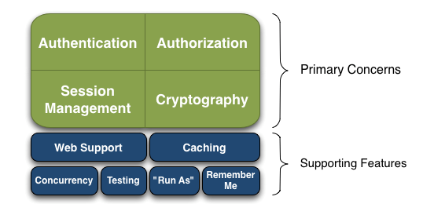
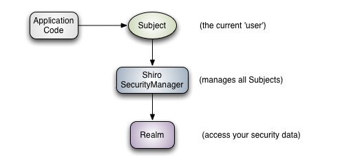
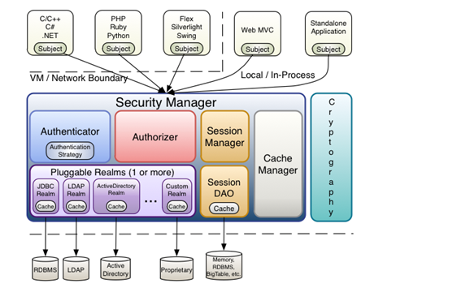

# Shiro框架
+ Java的一个安全框架。
+ shiro可以帮助我们完成：认证、授权、加密、会话管理、与Web集成、缓存等。
</img>
+ Authentication:身份认证、登录，验证用户是不是拥有相应的身份
+ Authorization:授权，即权限验证，验证某个已认证用户是否拥有某个权限；即判断用户是否能做事情。
+ Session Manager:会话管理，即用户登录后就是一次会话，在没有退出之前，它的所有信息都在会话中；会话可以是JavaSE环境的，也可以是Web环境的；
+ Cryptography:加密，保护数据的安全性，如密码加密存储到数据库，而不是明文存储；
+ Web Support:Web支持
+ Caching:缓存
+ Concurrency:shiro支持多线程应用的并发验证，即如在一个线程开启另一个线程，能把权限自动传播过去；
+ Testing:提供测试支持
+ Run As:允许一个用户假装为另一个用户的身份进行访问；
+ Remember Me:记住我。即一次登录之后，下次再来就不用登录了。  
<font color="red">Shiro不会去维护用户、维护权限；这些需要我们自己去设计/提供；然后通过相应的接口注入给Shiro即可。</font>
+ shiro的架构：
    + 外部架构
    </img>
        + 每个API含义：
            + Subject:主体。代表了当前"用户"，这个用户不一定是具体的人，与当前应用交互的任何东西都是Subject，即一个抽象概念，所有Subject都绑定到SecurityManager,与Subject的所有交互都会委托给SecurityManager；可以把Subject认为是一个门面，SecurityManager才是实际的执行者。
            + SecurityManager：安全管理器。即所有与安全有关的操作都会与SecurityManager交互；且它管理者所有的Subject;是Shiro的核心，负责与其他组件进行交互。
            + Realm:域。Shiro从Realm获取安全数据(如角色、用户、权限等),就是说SecurityManager要验证用户身份，那么它需要从Realm获取相应的用户进行比较以确定用户身份是否合法；也需要从Realm得到用户相应的角色/权限进行验证用户能否进行操作；可以当做是DataSource，即安全数据源。
        + 也就是说：最简单的Shiro应用
            + 应用代码通过Subject来进行授权和认证，而Subject又委托给SecurityManager；
            + 我们需要给Shiro的SecurityManager注入Realm，从而让SecurityManager能得到合法的用户及其权限进行判断。
        + Shiro不仅不提供维护用户/权限，而且通过Realm让开发人员自己注入。
    + 内部架构：
        + </img>
            + Subject:主体，主体可以是任何可以与应用交互的"用户";
            + SecurityManager:Shiro的心脏。所有的交互都是通过SecurityManager进行控制；管理着所有的Subject、且负责进行认证和授权、及会话、缓存的管理。
            + Authenticator:认证器。负责主体认证的，如果用户觉得Shiro默认的不好，可以自定义实现，需要认证策略，即什么情况下算用户认证通过了
            + Authrizer:授权器，或者访问控制器，用来决定主体是否有权限进行相应的操作，即控制着用户能访问应用中的哪些功能
            + Realm:可以有一个或多个Realm,可以认为是安全实体数据源，即用于获取安全实体的；可以是JDBC实现，也可以是LDAP实现，或者内存实现等等。
            + SessionManager:如果写过 Servlet 就应该知道 Session 的概念，Session 呢需要有人去管理它的生命周期，这个组件就是 SessionManager；而 Shiro 并不仅仅可以用在 Web 环境，也可以用在如普通的 JavaSE 环境、EJB 等环境；所有呢，Shiro 就抽象了一个自己的 Session 来管理主体与应用之间交互的数据；这样的话，比如我们在 Web 环境用，刚开始是一台 Web 服务器；接着又上了台 EJB 服务器；这时想把两台服务器的会话数据放到一个地方，这个时候就可以实现自己的分布式会话（如把数据放到 Memcached 服务器）；
            + SessionDAO:DAO 大家都用过，数据访问对象，用于会话的 CRUD，比如我们想把 Session 保存到数据库，那么可以实现自己的 SessionDAO，通过如 JDBC 写到数据库；比如想把 Session 放到 Memcached 中，可以实现自己的 Memcached SessionDAO；另外 SessionDAO 中可以使用 Cache 进行缓存，以提高性能；
            + CacheManager:缓存控制器，来管理如用户、角色、权限等的缓存的；因为这些数据基本上很少去改变，放到缓存中后可以提高访问的性能
            + Cryptography:密码模块，Shiro 提高了一些常见的加密组件用于如密码加密 / 解密的.
    + Demo
    ```ini
    [users]
    lr=123456
    xuan=1234567
    ```
    ```java
    public class App {
        public static void main( String[] args ) {
        //读取配置文件 获取SecurityManager工厂
       Factory<SecurityManager> factory =  new IniSecurityManagerFactory("classpath:shiro.ini");
       //得到SecurityManager实例，并绑定给SecurityUtils
       SecurityManager securityManager =  factory.getInstance();
       SecurityUtils.setSecurityManager(securityManager);
       //得到Subject及创建用户名/密码身份验证token（即用户身份/凭证）
        Subject subject = SecurityUtils.getSubject();
        //若username password与所要求的的相匹配，则登录成功 否则，登录失败
        UsernamePasswordToken token = new UsernamePasswordToken("akak","123456");
       try{
           //进行身份验证
           subject.login(token);
           System.out.println("登录成功！");
       }catch (AuthenticationException e) {
           System.out.println("身份验证失败");
       }
       //退出
       subject.logout();
    }
    }
    ```
# Shiro使用Redis做缓存
