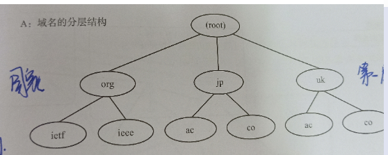

# 应用层
1. 定义：应用层位于网络体系结构最高层。
2. 网络应用程序：
    1. 应用程序：窗口系统、文件系统和用户交互等部分。
    2. 应用层协议：与其他端系统中的应用层实体交互的规则。  
    定义了运行在不同端系统上的应用程序进程之间如何相互传递报文，为某一类应用进程提供了通信服务的规则。
3. 网络应用的特点：
    1. 主要共性：
        + 运行在端系统上的软件程序；
        + 分布式程序，涉及多个端系统；
        + 交互被套接字屏蔽，进程间交互由运输层支撑；
        + 所有网络应用都承载在尽力而为的ip之上。
    2. 分类方法：
        + 较新应用基于多媒体的，具有时延敏感和容忍丢包特点；(网络 视频)
        + 传统应用基于文本的，具有丢包敏感和时延容忍特点；
        + 同步的，如网络电话
        + 异步的，如电子邮件
        + 面向用户的，如WEB
        + 面向其他目的，如dns
# 域名的构成
域名的出现是为了代替IP地址  
URL(同一资源定位符)：协议+域名+端口号+虚拟路径  
域名定义：为了识别主机名称和组织机构名称的一种具有分层的名称。由英文字符用点符号连接而成。  
主机名称后可以加域名 主机名+域名  
域名的分层结构：树形结构

第二层代表国家  
下面代表特定领域的域名  
### 域名服务器
+ 域名服务器指管理域名的主机和相应的软件，它可以管理所在的域的相关信息；其所管理的层叫做ZONE(区)
+ 各个域的分层上都有各自的域名服务器
+ 各个层的域名服务器都了解该层以下分层中所有域名服务器的IP地址
+ 根部所设置的DNS叫做根域名服务器，根域名服务器中注册着根以下第一层域名服务器的IP地址。  
每一层的域名服务器都注册着下一层域名服务器的IP地址。  
所有域名服务器都必须注册根域名服务器。  
解析器：进行DNS查询的主机和软件叫做域名解析器。
# DNS查询
查询过程：pepper 访问www.baidu.com的过程
+ 向域名服务器进行查询处理；
+ 自己的服务区并不知道www.baidu.com的IP地址，他向根域名服务器请求进行查询；
+ 根域名服务器知道www.baidu.com的IP地址，并将地址返回；
+ 向baidu.com的服务器查询www.baidu.com的IP地址；
+ 将查到的IP地址返回到客户端；
+ pepper开始与www.baidu.com进行通信。

