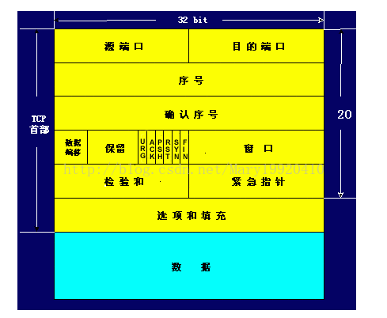

# TCP与UDP协议的区别(传输层)
+ TCP:面向有连接的，可靠的流协议  可靠的原因：实行"顺序控制"或"重发控制"机制
+ UDP:面向无连接的，不可靠的协议
# 端口号
+ 定义：用来识别计算机正在进行通信的不同应用程序，也被称为程序地址
+ 根据端口号识别应用
+ "源IP地址","目标IP地址","协议号","源端口号","目标端口号"，只要有一个不相同，就认为是其他通信。
+ 端口号的确定：
    + 标准既定的端口号(知名端口号)，该方式也叫静态方式
    + 时序分配法(动态分配)此时服务器端必须要监听端口号  操作系统为每个应用程序分配互不冲突的端口号(49152-65535)
+ 端口号与协议
    + 端口号是由其使用的传输层协议确定的；
    + 不同的传输协议可以使用相同的端口号；
    + 知名端口号与使用的协议并无关系
# UDP的特点
+ 特点：面向无连接的，不可靠的传输协议；
+ 应用场合：
    + 包总量较少的通信；
    + 视频、音频等多媒体通信(即时通信)
    + 广播通信
# TCP简介
+ 连接：是指各种设备、线路或网络中进行通信的两个应用程序为了传递消息而专有的、虚拟的通信线路。也叫虚拟电路。
+ TCP特点：面向有连接，可靠的流传输协议；
+ TCP的目的：TCP通过检验和序列号，确认应答，重发控制，连接管理以及窗口控制，流量控制，拥塞控制等机制实现可靠传输。
# TCP通过序列号和确认应答实现可靠传输
+ 确认应答：在TCP中，当发送端的主机到达接收主机时，接收端主机会返回一个已接受到消息的通知。这个消息叫做确认应答。
+ 针对重发控制，重复控制等问题，通过序列号可以解决
+ 序列号：按顺序给发送数据的每一个字节都标上号码的编号
+ 实现：接收端查询接收数据TCP首部中的序列号和数据的长度，将自己下一步应该接收的序列号作为确认应答返回给客户端。
# 重发超时
指在重发数据之前，等待确认应答的那个特定的时间间隔，若超过了这个时间，就会进行数据重发。
# 连接管理
+ TCP面向有连接的传输协议，是指在数据开始通信之前先做好通信两端之间的准备工作；
+ 在进行数据通信之前，通过TCP首部发送一个SYN包作为建立连接请求，等待确认，若对端发来确认应答，就认为可以进行数据通信；
+ 在通信结束时会进行断开连接的处理(FIN包)
# TCP以段为单位发送数据
+ 建立连接的同时，确认发送数据包的单位，即最大消息长度(MMS)
+ 最大消息长度是在三次握手的过程中建立，在两端主机之间计算得出。  
在建立连接时，在TCP首部写入MMS选项，会在两台主机之间给出的值中选择较小的使用。
# 利用窗口控制提高传输速度
+ TCP以段位单位发送数据，效率低下，因为发送一次数据都要进行确认应答的处理，为了解决该问题，出现了窗口控制机制(由接收端确定)
+ 窗口控制机制：
    + 窗口大小：是指无需等待确认应答而可以继续发送数据的最大值
    + 窗口控制机制需要设置缓冲区，来解决数据丢包之后重发数据的问题。
# 窗口控制与重发控制
在使用窗口控制中，若出现丢包现象的处理：当发送端主机连续收到3次相同的响应应答的时候，就会进行数据重发。
# 流量控制(流控制)
+ 出现：为了避免重发机制，无端的浪费网络流量，出现了流控制；
+ 定义：让发送端根据接收端的实际接受能力控制发送的数据量，从而避免数据的丢失；
+ 具体操作：接收端的主机向发送端的主机通知自己可以接受数据的大小，发送端就不会发送超过这个大小的数据，该大小限度称为窗口大小(由接收端决定)
+ 在TCP首部，专有一个字段存放窗口大小的值，接收端可以将自己可以接受的缓冲区大小发给发送端，当缓冲端溢出时，缓冲区的大小就会被设置成一个更小的值发给发送端，从而控制数据发送量。
# TCP首部格式

源端口号：表示发送端端口号 16位  
目标端口号：表示接收端端口号 16位  
序列号：指发送数据的位置 32位  在建立连接时生成初始值，随机生成  
确认应答号：下一次应收到数据的序列号，32位  
数据偏移：TCP所传输的数据部分应该从发TCP哪个包的哪个位开始计算，4位  
保留：为了以后扩展使用 4位    
控制位：CWR、ECE、URG、ACK、PSH、RST、SYN、FIN 8位  
ACK：确认应答    
SYN：用于建立连接，SYN=1建立连接，并在其序列号的字段进行序列号初始值的设定    
FIN：用于断开连接，FIN=1表示不会再有数据发送，希望断开连接  
窗口大小：从相同的TCP首部的确认应答号所指位置开始能够接受数据的大小 16位 若窗口大小=0，表示可以发送窗口探测  
检验和  
紧急指针：表示本报文字段中有紧急数据的指针 16位  
选项：用于TCP的传输性能