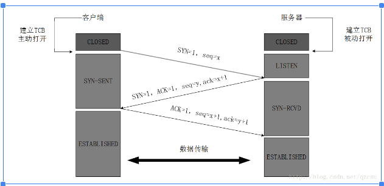
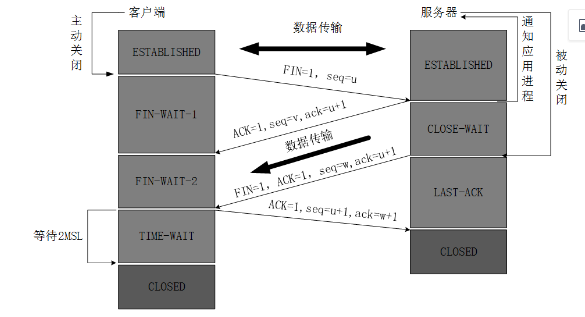

# 简介
最开始客户端与服务器端都是CLOSED的，主动建立连接的是客户端，被动建立连接的是服务器。
# 三次握手建立连接
  

## 实现过程
### 第一次握手
+ TCP服务器进程先创建传输控制块TCB，随时准备接收服务器端的连接请求，此时TCP服务器就进入监听状态。
+ TCP客户进程也会创建传输控制块TCB,向服务器发送请求连接的报文，报文中包含SYN=1(请求连接)  SYN用于建立连接。并在其序列号的字段进行序列号初始值的设定。  
初始序列号seq=x(x是随机生成的)，此时TCP客户端就进入同步已发送(SYN-SEND)状态。  
SYN报文段不能携带数据，但是会消费掉一个序列号。  
### 第二次握手
+ TCP服务器端接收到请求报文后，若同意建立连接，就会发送确认报文，确认报文中应该包含ACK=1(确认应答位)，SYN=1(请求连接位)  
seq=y(TCP服务器初始序列号)，ack=x+1(确认序列号)；此时，TCP服务器进程就进入SYN-RCVD(同步接收)状态。  
该报文也不能够传输数据，但是也会消费掉一个序列号。
### 第三次握手
+ TCP客户进程接收到TCP服务器端的确认报文后，会再次向TCP服务器进程发送确认报文。  
确认报文中包含：ACK=1,seq=x+1,ack=y+1(确认序列号)，TCP建立连接，TCP客户端就进入ESTABLISHED状态。  
ACK报文可以传输数据，不传输数据序列号就不会发生变化。
+ TCP服务器端接收到TCP客户端的确认应答后，建立TCP连接，TCP服务端也进入ESTABLISHED状态。  
双方可以进行通信。
## 相关概念
+ 序号：Seq序号 占32位
+ 确认序号：ACK 32位，之后ACK标志位为1时，确认序号才有效，ACK=SEQ+1
+ ACK标志位：确认序号有效
+ 传输控制块TCB：存储每一次连接的重要信息
## 为什么使用三次握手
+ 一次握手：TCP面向有连接，客户端会发送SYN,但是不会收到应答，不确定是否建立连接，不能保证连接成功；
+ 二次握手：为了防止已经失效的请求报文又突然传送到了服务器端，导致不必要的资源浪费；  
模拟情景：  
客户端第一次发送请求报文SYN，等待ACK，该SYN因为网络问题没有到达服务器端，所以客户端在一段时间内没有收到ACK，就会再次发送一个SYN，这次请求收到了服务器端ACK，而客户端第一次发送的SYN到达服务器端，对B来说，又是一个新的请求，又需要申请资源，导致资源浪费。
## SYN攻击
通常在服务器ACK-SYN过程中发生SYN攻击(第二次握手过程中)  
简介：  
攻击客户端，在短时间内伪造大量的IP地址向服务器端发送SYN，服务器回复确认包，服务器端就会等待客户端的确认回复，由于客户端是不存在的，所以服务器就会不断地重发直至超时，由于客户端伪造地SYN包就会长时间的占用未连接的队列，浪费资源，严重更会导致系统瘫痪。
# TCP的四次挥手(终止TCP连接)
  

## 实现原理
客户端主动关闭，服务器被动关闭
### 第一次挥手
TCP客户端与TCP服务器端都是ESTABLISHED状态，客户端发出FIN包，并且停止传输数据，FIN(释放报文)。首部包含FIN=1，seq=u(u为客户端上一次的序列号+1)，客户端进入FIN-WAIT 1(终止等待1)状态  
FIN报文不能携带数据，也需要消费一个序列号。
### 第二次挥手
服务器端收到FIN(释放)报文，发出确认报文，释放报文首部包含:ACK=1,seq=u,ack=u+1(确认序列号)；服务器就进入了关闭等待(CLOSED-WAIT)状态  
此时，客户端已经不会发送数据了，而服务器端还是可以向客户端发送数据，此时处于一个半关闭状态。
### 第三次挥手
客户端接收到服务器端的确认报文后，就会进入FIN-WAIT 2(终止等待2)状态，等待服务器端的连接释放报文，服务器端发送连接释放报文，报文首部包含ACK=1,FIN=1,ack=u+1,seq=w,服务器端就进入了LAST-ACK(最后确认)状态，等待客户端的确认。  
### 第四次挥手
客户端收到服务器端的连接释放报文后，必须发出确认ACK=1，seq=u+1,ack=w+1;客户端就进入了TIME-WAIT(时间等待状态)  
此时TCP连接还没有释放，必须经过2*MSL(最长报文段寿命)，当客户端撤销响应的TCB后，才会进入CLOSED状态，服务器只要收到了客户端的确认应答后，就进入CLOSED状态，撤销TCB后就结束了TCP连接。  
由此可以看来服务器端比客户端要更早结束TCP连接。
# 为什么客户端还要等待2MSL(最长报文段寿命)
+ 保证客户端的最后一个ACK报文可以到达服务器端，因为报文在发送过程中可能会出现丢包，服务器端就会以为是客户端没有接收到自己的ACK+FIN报文，就会在一次发送ACK+FIN报文，而客户端就会在两个MSL时间内重新接收到服务器端发送的ACK+FIN报文，会再次给出确认应答，同时重启2MSL.
+ 防止已经实现的连接报文出现在本链接中，客户端发送完最后一个确认报文后，就会在2MSL时间内就可以是本链接持续的时间内所产生的报文段从网络中消失，这样新的连接就不会出现在请求报文中。
# 为什么是四次挥手？
+ 为了保证数据的完整性
+ TCP是面向有连接的，可靠的，基于字节流的传输层协议，而且是全双工的(客户端在给服务器端发送数据的同时，服务器端也可以给客户端发送数据)，是由双方端开才能释放本次连接；
+ 客户端发出FIN报文，变成FIN-WAIT 1状态，收到服务器端的ACK，此时客户端不能发送数据给服务器端，但是服务器端还是可以给客户端发送数据的，此时客户端处于一个半封闭状态，只有当服务器也彻底断开连接之后，才能释放本次连接。
