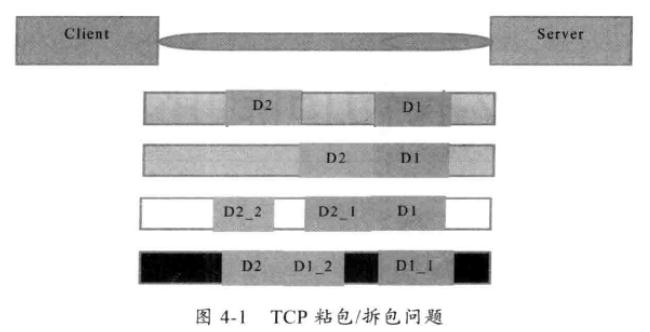

## 拆包与粘包概述
客户端向服务器端发送两个数据包D1,D2  
  
+ 情况一：(未发生拆包与粘包) 服务端接收到两个数据报，分别为D1,D2，没有发生拆包与粘包现象  
+ 情况二：(粘包) 服务器总共收到一个数据包，是D1和D2的完整信息，但是服务器端不知道D1从哪里结束，D2从哪里开始，就发生了粘包线性
+ 情况三：(拆包) 服务器一共收到了两个数据包，分别是D1和D2的前半部分，和D2的后半部分，服务器端不知道D2是从哪里开始的，发生了拆包现象。  
+ 情况四：(拆包) 服务器端一共收到了两个数据包，分别是D1的前半部分和D1的后半部分+D2的完整数据，服务器不知道D1是从哪里结束的，发生了拆包现象。
## TCP拆包与粘包出现的原因
TCP是基于字节流的，TCP将字节流看成是一连串无结构的字节流，没有边界，传输的最小单位是一个报文段。  
TCP在首部结构中，是没有表示数据长度的字段，通过MTU(传输数据最大限制)来传输数据，一旦超过该限制，就要分成多个报文段，TCP为提高性能，发送端将发送的数据发送到缓冲区，缓冲区满了之后，再将缓冲区的数据发送给接收方，同样，接收方也有数据缓冲区机制，用来接收数据。  
常见原因：
+ 发送的数据大于TCP发送缓冲区的剩余时间，将会发生拆包现象；
+ 待发送的数据大于MMS(最大传输报文长度)，TCP在传输时，进行拆包
+ 待发送的数据小于TCP发送端缓冲区的大小，TCP将多次写入缓存区的数据一起发送，会产生粘包现象。
+ 结束数据端的应用层没有及时去读接收缓冲区的数据，发生粘包现象。
## TCP粘包与拆包的解决办法
因为是基于流的操作，无法避免拆包与粘包的问题，只能在应用层数据协议上加以控制。  
+ 使用带有消息头的协议，协议头存储消息：开始标识及消息长度信息，服务端获取消息头的时候，可以解析出消息长度，然后向后读取长度的内容；
+ 设置定长消息，服务端每次读取既定长度的内容作为一条完整信息。
+ 设置边界消息，服务端每次从网络流中按消息编辑分离出消息内容个数；
## UDP是否会出现粘包或拆包现象？
不会。UDP是基于报文发送的，其报文首部采用16bit来指示UDP数据报文的长度，因此在应用层能很好的将不同的数据报文区分开，从而避免拆包和粘包的问题。