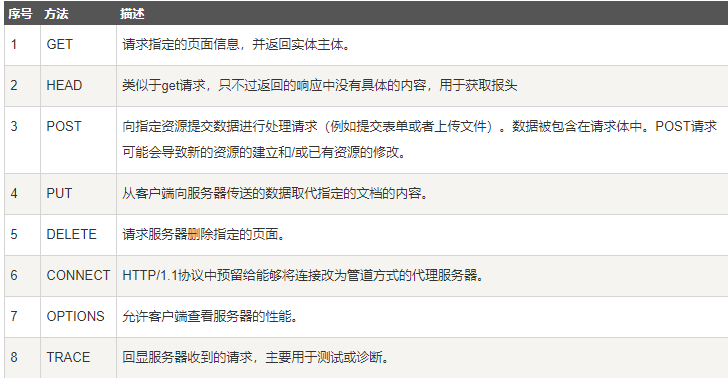
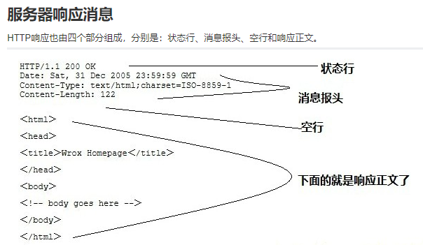
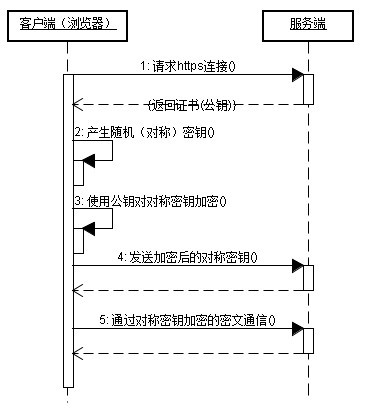
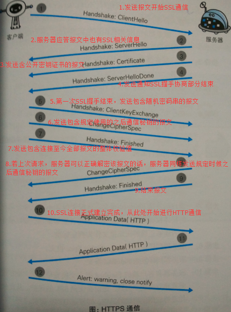

# HTTP
1. 是一种基于请求-响应模式的、无连接的(每次连接只处理一个请求，服务器处理完客户的请求，并收到客户的应答后，即断开连接)、无状态的协议(对于事务处理没有记忆能力)、应用层的协议。
2. HTTP基于TCP连接，但是通信双方交换HTTP报文之前不需要建立HTTP连接。
3. HTTP的两个版本：
    1. RFC1945 HTTP/1.0
    2. RFC2616 HTTP/1.1
4. HTTP是面向事务的，且每一个事务都是独立地进行处理。  
面向事务：指一系列的信息交换，而这一系列的信息交换是一个不可分割的整体，即要么所有信息交换都完成，要么一次交换都不进行。
5. 得到目标地址ip地址后，浏览器向服务器交互的七个过程：
    1. 建立TCP连接：在HTTP工作开始之前，Web浏览器首先要通过网络与Web服务器建立连接，该连接是通过TCP来完成的，该协议与Ip协议共同构建Internet.
    2. Web浏览器向Web服务器发送命令请求：一旦建立了TCP连接，Web浏览器就会向Web服务器发送请求命令。
    3. Web浏览器发送请求头信息：浏览器发送其请求命令之后，还要以头信息的形式向Web服务器发送一些别的信息，之后浏览器发送了一空白行来通知服务器，它已经结束了该头信息的发送。
    4. Web服务器应答：
    5. Web服务器发送应答头信息：
    6. WeB服务器向浏览器发送数据：
    7. Web服务器关闭TCP连接：
# HTTP简介
+ 定义：HTTP是超文本传输协议，用于从万维网服务器传输超文本到本地浏览器的协议。  
HTTP通过统一资源标识符URI来传输数据，建立连接(应用层)
+ HTTP的工作原理
    + HTTP协议工作于服务器/客户端的网络架构上，默认端口是80
    + HTTP协议是基于TCP，TCP是一个端对端的面向连接的协议，端到端可以理解为进程到进程之间的通信，所以在HTTP传输数据之前，需要建立TCP连接，需要进行三次握手；
    + 原理实现：(在地址栏输入一个www.163.com)
        + 浏览器分析超链接指向页面的URL;
        + 浏览器向DNS(域名解析器)请求解析www.163.com的IP地址；
        + DNS解析出网易WEB服务器地IP地址，并告知浏览器；
        + 浏览器与网易WEB服务器建立连接(TCP连接)；
        + 浏览器发出文件命令(请求) GET/news/today.html
        + 网易的WEB服务器把today.html页面发送给浏览器
        + 释放两者之间的连接(断开连接)；
        + 浏览器显示页面的内容。
# HTTP的请求消息
  
+ 请求行 请求方法+URL(请求地址)+协议版本
+ 请求头部
+ 空行
+ 请求参数  
  
# HTTP的响应消息

HTTP的响应由4个部分组成,状态行、消息报头、空行和响应正文。  
响应正文的开始行就是空行。  
+ 状态行：协议版本，状态码+状态码的含义
+ 响应头部
+ 空行
+ 响应正文
# HTTP的状态码
状态码分类：  
1xx:信息，服务器接收到请求，需要请求者(客户端)继续进行操作；  
2xx:表示成功，操作被成功处理并处理；  
3xx:重定向，需要进一步操作才能完成处理；  
4xx:客户端发生错误，请求包含语法错误或无法完成请求  
5xx:服务器端发生错误，服务器在处理请求的过程中发生了错误。  
状态码大全链接:
<a href="http://blog.csdn.net/neoma_tay/article/details/79226200">http://blog.csdn.net/neoma_tay/article/details/79226200</a>

# HTTP1.0和HTTP1.1的区别 
HTTP1.0每请求一次就需要建立一次连接，有几次握手的时间花销  
HTTP1.1采用持续链接，所谓持续链接就是服务器在发生响应后在一段时间保持这条连接，使得后续的请求和响应报文都在这条连接上进行。
# HTTP协议的特点
+ (HTTP1.0)HTTP是无协议的：限制每次连接值处理一个请求，服务器处理完请求，并收到客户端的应答，就断开连接。
+ HTTP协议是媒体独立的，意思是只要服务器端和客户端知道如何处理数据，就可以通过HTTP传输协议，通过Content-Type来确定数据类型，灵活(传输任意的数据类型)
+ HTTP协议是无状态的，是指对于事务处理没有记忆功能。  
+ 简单快速，每次请求只需要给出请求方式以及路径；
+ 支持服务器/客户端架构
# HTTP协议的缺点
+ 窃听风险
+ 篡改风险
+ 冒充风险
# HTTPS协议
+ HTTPS = HTTP+加密+认证+完整性保护
+ HTTPS的安全基础是SSL,在HTTP的下层添加了SSL/TLS协议
+ SSL：安全套接字
+ 默认端口：443
+ 两种加密算法
    + 对称加密:密钥只有一个，加密解密都是用同一个密钥，加密解密速度快；  
      
       + SSL客户端通过TCP和服务器建立连接之后(443端口)，并且在一般的TCP连接协商(握手)过程申请证书。即客户端发出一个消息给服务器，这个消息里面包含了自己可实现的算法列表和其它一些需要的消息，SSL的服务器端会回应一个数据包，这里面确定了这次通信所需要的算法，然后服务器向客户端返回证书(证书里面包含了服务器信息：域名。申请证书的公司，公共密钥)；
        + Client在收到服务器返回的证书后，判断签发的这个证书是公共签发机构，并使用这个机构的公共密钥确认签名是否有效，客户端还会确保书中列出的域名就是它正在连接的域名；
        + 如果确认证书有效，那么生成对称密钥并使用服务器的公共密钥进行加密。然后发送给服务器。服务器使用它的私钥对它进行解密，这样两台计算机可以开始进行对称加密进行通信。
    + 非对称加密:使用两个密钥，公有密钥和私有密钥，私有密钥一般由一方密码保存(一般是服务器端保存)，另一方任何人都可以获得共有密钥(公钥加密需要私钥解密，私钥解密需要公钥加密，加密解密速度慢)
    
+ 实现过程(工作原理)：
    + 客户端发起HTTPS请求：客户端加密列表+客户端生成的随机数
    + 服务器端同意请求，返回证书：服务器生成的随机数+SSL数字证书(公钥+网络地址)
    + 客户端解析证书，检验证书是否有效+产生对称密钥+HASH握手信息
    + 客户端使用公钥对对称密钥进行加密，向服务器端发送加密之后的对称密钥
    + 服务器端获取密文，使用服务器端的密钥对密文进行解密，验证HASH值是否一致，若一致，给浏览器返回信息
    + 服务器端与浏览器端开始通信。
 