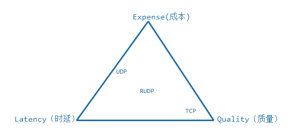

# 为什么要保证UDP实现可靠传输？
TCP的传输不是在网络的要求下，就是成本太高，所以我们在保证通信的时延和质量的条件下，尽量降低成本从而改造UDP。  
实现思想：向TCP实现可靠性传输的方式上靠拢，同时也具有传输快。传输量大的特点。
# 实现重传机制
+ 发送者发起重传机制(接收者接到报文后要向发送者发送确认消息)  
缺点：对于发送者发起的方式，一般情况下接收者会发送一个包的确认，发送者维护一个计时器并重传那些在某个确定的时间段里没有收到确认的消息包，这种情况容易引起发送者溢出，因为要确认每一个发送的消息包，这种溢出现象称为发送者内爆。
+ 发起者发起重传机制(接收者通过序列号检查有没有丢失报文，若有，让发送者重传)  
对于接收者发起的方式，通信双方的接受者负责检测错误，在这个方式里，序列号用于检测消息包的丢失，当检测到消息包丢失，接收者请求发送者重传消息包，采用这种方式，若消息包没有到达任何一个接收者，发送者容易因为NACK(否认确认应答)溢出，这会引起发送者的负载过高和过多的重传，这种现象被称为NACK内爆，可以利用定时器来限制消息包的重传，从而避免NACK内爆。
+ RUDP  
三角平衡关系：实时通信中存在的三角平衡关系。  
  
+ 尽力可靠：通信的接收方要求发送方的数据尽量完整到达，但业务本身的数据是可以允许缺失的。
+ 无序可靠：通信的接收方要求发送方的数据必须完整到达，但可以不管到达先后顺序。例如：文件传输、白板书写、图形实时绘制数据、日志型追加数据等；
+ 有序可靠：通信接收方要求发送方的数据必须按顺序完整到达。  
RUDP根据这三类需求以及制约关系来确定自己的通信模型和机制，找到通信的平衡点。  