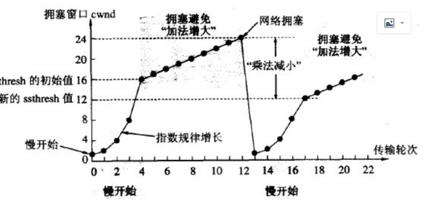

# 拥塞控制
+ 出现的目的：为了解决在网络拥堵时，突然发送一个较大的数据，从而导致整个网络的瘫痪问题。
+ 拥塞窗口：发送端调节所要发送数据的量
+ 实现：
    + 在慢启动时，将拥塞窗口的大小设置为一个数据段发送数据，每次收到确认应答就将拥塞窗口的值加1；
    + 在发送数据包时，将拥塞窗口的大小与接收端设置的窗口大小进行对比，选出最小值，发送比最小值还要小的数据量；
    + 若重发采用超时机制，那么拥塞窗口可以设置为1以后在进行慢启动修正；
    + 为了防止拥塞窗口以指数倍增长，导致拥堵状况激增，从而使网络瘫痪的问题，引入了慢启动阈值，拥塞窗口的值超出该慢启动阈值，在每次收到确认应答，只允许以以下比例放大拥塞窗口：  
  (一个数据段的字节数/拥塞窗口)*(一个数据段字节数)
    + 慢启动阈值是在重发采用超时机制才会设置为当时拥塞窗口的一半。
+ 拥塞窗口：发送端缓冲区的大小
+ 作用：防止过多的数据注入到网络中，使网络的负载过大，导致网络瘫痪。
+ 控制方法：
  + 接收窗口(rwnd)：根据接收方自身读取速度以及接受缓存的大小设定(在缓冲区存在)
  + 拥塞窗口(cwnd)：发送端根据自己的网络拥塞程度来设定窗口只(实际上不存在)
  + 设置原则：
    + 网络没有拥塞，拥塞窗口设置大一些，保证更多的数据再网络好的时候发送出去
    + 网络出现阻塞，拥塞窗口就小一些；
  + 发送窗口的上限值=min[rwnd,cwnd]
    + 当Rwin < CWin时，是接收端的接收能力限制发送窗口的最大值；
    + 当RWin > CWin时，是网络的拥塞情况限制发送窗口的最大值。
+ 具体实现
  + 慢启动算法：刚开始发送端并不清楚网络的情况，就会先发送一个数据段，没接收到一个确认应答，就会按指数倍增加发送的数据段；
  + 避免拥塞算法：让拥塞窗口缓慢增大，每次+1(线性增大)
  + 具体实现：  
    
  一开始，慢启动的拥塞窗口增长速度是很可怕的，所以需要设置一个门限(慢启动阈值)ssthresh=16;  
  当cwnd < ssthresh，就启动慢启用  
  当cwnd > ssthresh，就停止使用慢启动算法使用避免拥塞方法  
  当cwnd = ssthresh，可使用慢启动算法，也可使用避免拥塞算法。  
  无论是慢启动还是避免拥塞算法，只要发送方没有收到确认应答，就认为拥塞，就要把拥塞窗口设置为发送方窗口的一半。 
  + 快重传：指发送端连续接到3次相同的ACK，不需要等到重传定时器就要重新发送；
  + 快恢复：指快速重传以后，走的不是慢启动，而是避免拥塞算法。