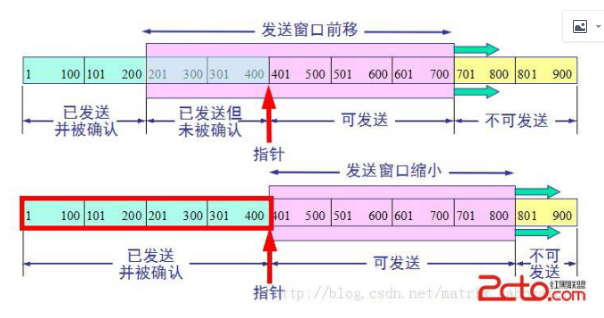
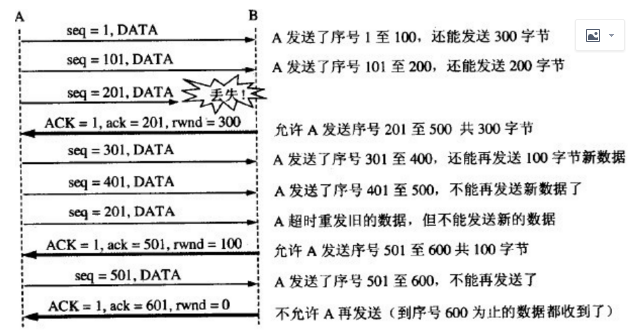

# 流量控制
TCP的两端都有发送/接收缓存和发送/接收窗口。
## 简述
给返回报文中添加一个流量窗口大小的字段，从而告诉发送方，下一次发送数据的时候需要根据流量窗口的大小来发送数据，从而防止发送方发送数据过快而导致接收方接收不过来或者数据丢失的问题。
## 流量控制的实现
+ 利用滑动窗口来实现流量控制；
+ 接收方会在返回的ACK报文中包含自己的接收窗口大小，以控制发送方的数据发送，发送方数据的大小不能超过接收方的窗口大小。
## 相关概念
滑动窗口：发送方的缓冲区一部分是窗口，窗口里存放的是允许发送的数据的已发送但未确认的数据，一旦发送并确认，窗口就会向发送方向移动，一般发送下一个数据。
  
接收方的缓冲区同样有一部分是窗口，窗口里存放的是允许接收和已经接收但还没有确认的数据，一旦接收并确认，接收窗口就会向发送方方向(与自身方向相反)滑动。
## 实现流量控制

  
+ 发送窗口满就停止：当接收方一直不确认，发送方就发送允许发送的数据，发送窗口中就全部是已发送但是还有确认的数据，发送窗口就会变满，此时就停止发送。
+ 接收方接收能力弱：接收方来不及接收数据就会通知发送方窗口缩小；
+ 解决报文乱序：当接收方收到乱序的报文就会先将他存在窗口中并启动超时重传，等待发送方发送缺少的数据，最后再进行重组；
+ 解决报文丢失：发送过程中，报文丢失，接收方就无法确认，那发送方就会一直发送，直到发送窗口变满，就会将丢失的报文重新发送一遍。
## 出现的问题
接收端的rwnd(窗口大小)=0，就代表已经不能接收数据了，接收端向发送端发送零窗体报文，然后发送端就会等待接收端的非零窗体报文，过段时间之后，接收方又有了一些缓存空间，就会向发送端发送rwnd报文，但是该报文在传输的过程中丢失，发送端就会一直等待接收端的非零窗口报文，而接收端也在一直等待发送端的数据，就出现了思死锁现象，怎么办？
### 持续计数器
原理：TCP为每一个连接都创建了一个持续计数器，只要一方接收到另一方的零窗口通知，他就会启动持续计数器，周期性的向对方零窗口探测报文段，对方就会在确认该报文的时候给出自己的窗口大小。
