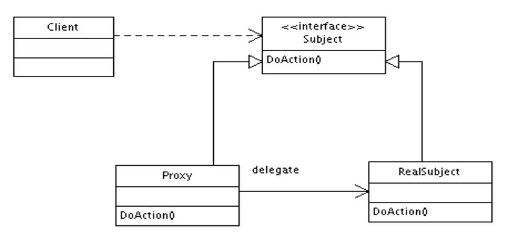

# 代理模式  
+ 构造型（结构型）设计模式
+ 代理模式的UML图：  
      
    + Subject : <b>该接口同抽象角色。是由一个真实角色实现的接口（RealSubject），并能够表示真实角色的功能。时也必须由代理角色(Proxy)所实现。</b>  
    + Proxy:  代理角色。代理角色与真实角色实现了同一个接口。根据代理的类型，还可以负责其他的职责。
    + RealSubject: 真实角色。代理角色所代表的真实对象。
+ 关于代理模式的总结：  
   + 在写代码之前，一定要分清楚代理类与被代理类。 
   + 代理类与被代理类必须实现同一个代理接口
   + 代理接口中定义了代理类与被代理类相同的操作
   + 代理类中，可以有除代理类的其他操作，但是，必须创建一个被代理类的对象来调用被代理类与代理类相同的方法。即，二者相同的方法只能被重写一次，在代理类中的实现，只是调用被代理类的实现。<font color="yellow"> 注意：在代理类中创建被代理类的对象时，一定不能让被代理类的对象为空，否则，会报空指针异常。</font>
```java
    //手动的创建了一个代理类
    public class Bookshop implements Proxy {
    private  Publish publish;
    /**
     * 此时的代理类卖书，应该是被代理类的卖书方法。
     * */
    @Override
    public void sailBook() {
        sail();
        if (publish == null ) {
            publish = new Publish();
        }
        //调用被代理类的sailBook方法
        this.publish.sailBook();
        discount();
    }
    /**
     * 此时书店是作为被代理对象的，还可以有除与代理对象共同的部分外，自己的方法。比如书店可以有促销活动
     * */
    public void  sail() {
        System.out.println("书店打折促销");
    }

    public void discount() {
        System.out.println("书店赠送优惠券");
    }
```
# 动态代理  
在程序运行过程中产生的这个对象。  
本质：程序运行过程中产生的对象就是反射的内容。动态代理其实就是反射生成的一个代理。  
JDK提供的代理只能针对接口做代理，依靠Proxy类和InvocationHandler接口。
+ InvocationHandler ： 是代理实例的调用处理程序实现的接口。 
    + invoke()方法：在代理实例上处理方法调用并返回结果。   
+ proxy - 在其上调用方法的代理实例
    + method - 对应于在代理实例上调用的接口方法的 
    + Method 实例。Method 对象的声明类将是在其中声明方法的接口，该接口可以是代理类赖以继承方法的代理接口的超接口。
    + args - 包含传入代理实例上方法调用的参数值的对象数组，如果接口方法不使用参数，则为 null。基本类型的参数被包装在适当基本包装器类（如 java.lang.Integer 或 java.lang.Boolean）的实例中。
关于动态代理的总结：  
 相对于代理模式，动态代理是JDK实现了自动生成代理类，但是<font color="yellow">在实现动态代理时，委托代理一定要是一个接口,且被代理类一定要实现此接口</font>  
 ```java
 //自动生成的代理类
 @Override
public Object invoke(Object proxy, Method method, Object[] args) throws Throwable {
    Object result;

    sail();
    result = method.invoke(publish,args);
    discount();
    return result;
}
//注意：Proxys是接口，并且被代理类一定要实现此接口
Proxys p = (Proxys) Proxy.newProxyInstance(Publish.class.getClassLoader(), pub
 ```