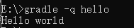

# Gradle
基于JVM的富有突破性构建工具。
+ Gradle的特性：
    + 基于声明的构建和基于约定的构建
    + 为以依赖为基础的编程方式提供语言支持
    + 构建结构化
    + 深度API
    + Gradle的扩展
    + 多项目构建
    + 多种方式管理依赖
    + Gradle是第一个构建继承工具
    + 易于移植
    + Groovy
    + The Gradle Wrapper
    + 自由和开源
+ 安装
    + 配置环境变量
    + 测试 gradle -v
    + JVM参数设置
        + Gradle运行时的JVM参数可以通过GRADLE_OPTS或JAVA_OPTS来设置。JAVA_OPTS设置的参数将会同其他JAVA应用共享。
        + 典型例子：可以在JAVA_OPTS中设置代理和GARDLE_OPTS中设置内存参数。同时这些参数也可以在gradle或者gradle脚本文件的开头进行设置。
+ Gardle构建基础
    + Projects和tasks
        + 任何一个Gradle构建都是由一个或多个projects组成。每个project包括许多可构建组成部分。这完全取决于你要构建些什么。一个project不必描述它只能进行构建操作，也可以部署或搭建环境。
        + 每个projects都由多个tasks组成，每个task都代表了构建执行过程中的一个原子性操作，如：编译、打包、生成javadocs、发布到某个仓库等操作。
    + Hello world
        + 第一个gradle脚本
        ```gradle
        task hello{
            doLast{
                 println"Hello world";
            }
        }
        ```
        + 在命令行编译  
            </img>  
        + <font color="yellow">-q参数的作用：</font>该参数用来控制gradle的日志级别，可以保证只输出我们需要的内容。
        + 快速定义任务：(采用闭包的方式来定义这个任务)
        ```gardle
        task hello<<{
            printf 'Hello gradle';
        }
        ```
        + 代码即脚本
        ```gradle
        //代码示例 在Gradle任务中采用groovy
        task upper << {
            String someString = "mY_nAmE";
            println "Original:"+someString;
            println "Upper Case:"+someString.toUpperCase()
        }
        task count << {
            4.times{
                print "$it";
            }
        } 
        ```
        + 任务依赖
            + 在两个任务中指明依赖关系
            ```gradle
            task hello{
                doLast{
                    println"Hello world";
                }
            }
            task hellos(dependsOn:hello) <<{
                printf 'Hello gradle';
            }
            ```
        在执行时，先执行的是依赖项，然后才是被依赖项。<font color="red">添加依赖task也可以不必首先声明被依赖的task</font>
        + 延时依赖：注意 当引用的任务尚未定义的时候，不可使用短标记法($)来运行任务。
        + 动态任务
        ```gradle
        4.times { counter->
            task "task$counter" << {
                println "I am task number $counter";
            }
        }
        ```
        个人理解：动态任务相当于做一个循环，number.times表示循环次数为number次，$counter表示当前为第$counter循环。counter->表示用counter来控制循环次数，即counter为循环变量。
        + 任务操纵
            + 一旦任务被创建后，任务之间可以通过API进行相互访问。
                + 通过API进行任务之间的通信-增加依赖(为已存在的任务添加行为)
                ```gradle
                4.times { counter->
                    task "task$counter" << {
                        println "I am task number $counter";
                    }
                }
                task0.dependsOn task2,task3
                ```
                + 通过API进行任务之间的通信 - 增加任务行为
                ```gradle
                task hello1 << {
                    println "Hello Earth";
                }
                hello1.doFirst{
                    println "Hello Venus";
                }
                hello1.doLast{
                    println "Hello Mars";
                }
                hello1 << {
                    println "Hello Jupiter";
                }
                ```
                doFirst和doLast可以进行多次调用，他们分别被添加在任务的开头和结尾。当任务执行开始时，这些动作会按照既定顺序进行。其中 << 操作符是doLast的简写方式。
            + 短标记法  
            <font color="pink">每个任务都是一个脚本的属性</font>  
                + 以属性的方式直接访问
                ```gradle
                task hello1 << {
                    println "Hello Earth";
                }
                hello1.doLast{
                    println "Hello Mars";
                }
                ```
                + 增加自定义属性
                + 为任务增加自定义属性
                    + 可以为一个任务添加额外的属性。ext.新建属性名
                    ```gradle
                    task myTask{
                        ext.myProperty="myValue";
                    }
                    task printTaskProperty << {
                        println myTask.myProperty
                    }
                    ```
    + 调用Ant任务
        + Ant任务是Gradle的一等公民。Gradle借助Groovy对Ant任务进行了优秀的整合。Gradle自带了一个AntBuilder,在Gradle中调用Ant任务比在build.xml中调用更加的方便和强大。
            + 利用AntBuilder执行ant.loadfile
            ```gradle
            task loadfile << {
                def files = file('../antLoadfileResources').listFiles().sort()
                files.each{ File file -> 
                    if(file.isFile()) {
                    ant.loadfile(srcFile:file,property:file.name)
                    println "*** $file.name ***";
                    println "${ant.properties[file.name]}";
                    }
                } 
            }
            ```
    + 方法抽取
        + 利用方法组织脚本逻辑
    + 定义默认任务(Gradle允许在脚本中定义多个默认任务)
        ```gradle
        defaultTasks 'clean','run'
        task clean << {
            println "Default Cleaning";
        }
        task run << {
            println "Default Running";
        }
        task other << {
            println "nononono";
        }
        ```